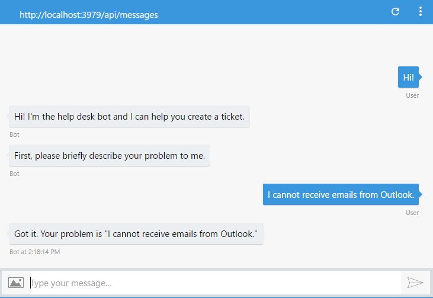
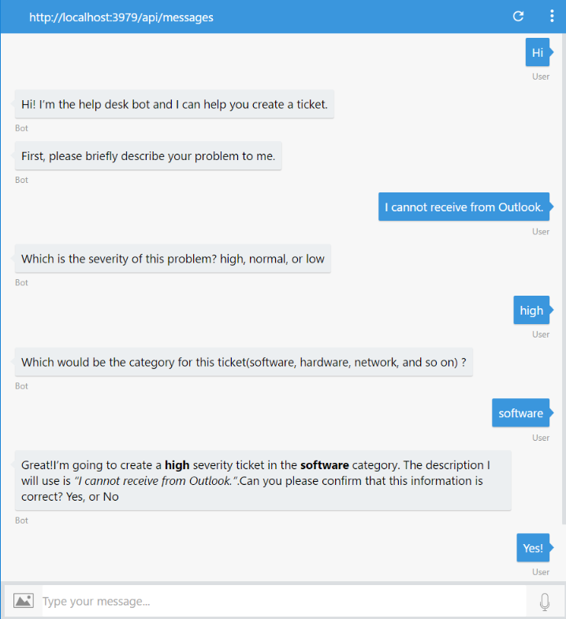
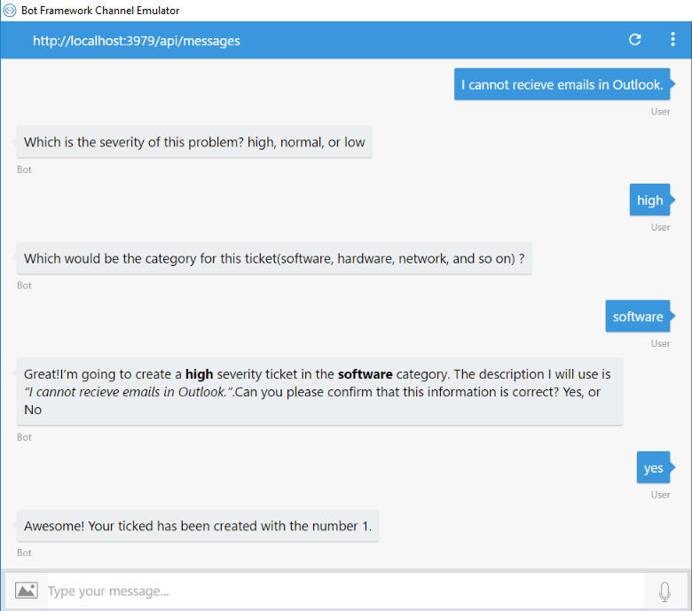
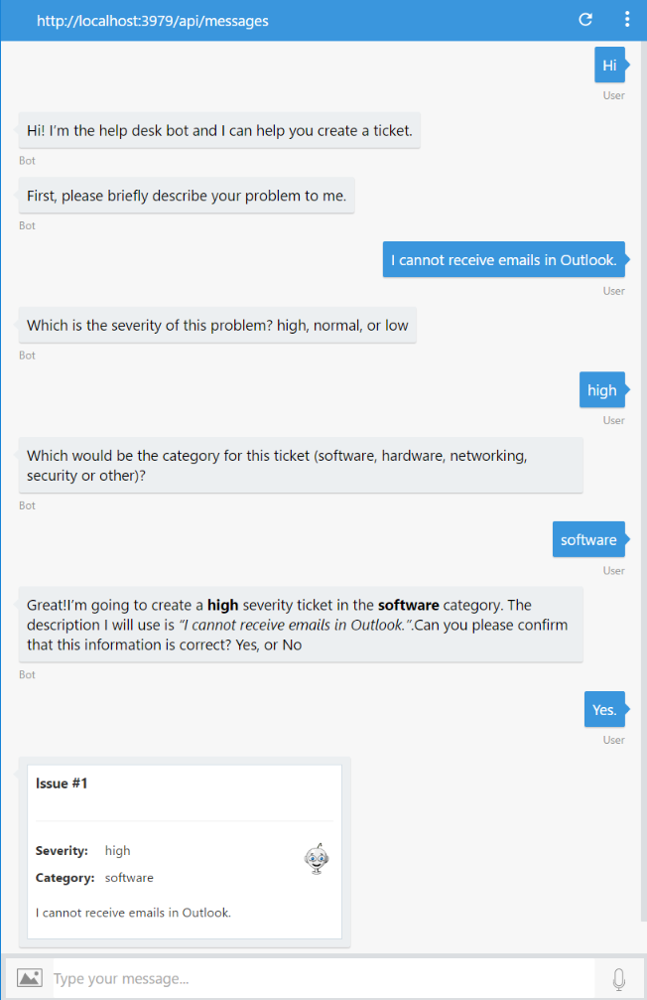

# 演習 2: ボットによるヘルプ デスク チケットの送信 (C\#)

## 概要

この演習では、ボットに会話機能を追加して、ヘルプ デスク
チケットの作成をユーザーに案内する方法を学習します。

[こちらのフォルダー](./exercise2-TicketSubmissionDialog)内には、この演習のステップの完了結果として得られるコードを含むソリューションが入っています。このソリューションは、演習を進めるにあたってさらにヒントが必要な場合に、ガイダンスとして使用できます。

## 前提条件

この演習を完了するには、以下のソフトウェアが必要です。

-   [Visual Studio 2017 Community](https://www.visualstudio.com/downloads) 以上

-   [Bot Framework Emulator](https://emulator.botframework.com/) (en-US
    ロケールで構成されていることを確認してください)

## タスク 1: ボットへの会話の追加

このタスクでは、ボット
コードを変更して、いくつかアクションを実行する前に、ユーザーに一連の質問をします。

1.  前の演習から得られたソリューションを開きます。または、[exercise1-EchoBot](./exercise1-EchoBot)
    フォルダーからソリューションを開くこともできます。

2.  **Dialogs\\RootDialog.cs** ファイルを開きます。

3.  以下の変数を、RootDialog
    クラスの先頭に追加します。この変数は、のちほどユーザーの回答を保存するために使用します。

>   private string category;

>   private string severity;

>   private string description;

1.  MessageReceivedAsync メソッドを次のコードで置き換えます。

>   public async Task MessageReceivedAsync(IDialogContext context,
>   IAwaitable\<IMessageActivity\> argument)

>   {

>   var message = await argument;

>   await context.PostAsync("Hi! I’m the help desk bot and I can help you create
>   a ticket.");

>   PromptDialog.Text(context, this.DescriptionMessageReceivedAsync, "First,
>   please briefly describe your problem to me.");

>   }

>   public async Task DescriptionMessageReceivedAsync(IDialogContext context,
>   IAwaitable\<string\> argument)

>   {

>   this.description = await argument;

>   await context.PostAsync(\$"Got it. Your problem is
>   \\"{this.description}\\"");

>   context.Done\<object\>(null);

>   }

>   Dialog
>   実装が、[会話フロー制御](https://docs.microsoft.com/en-us/bot-framework/dotnet/bot-builder-dotnet-manage-conversation-flow#a-iddialog-lifecyclea-dialog-lifecycle)メソッド
>   (IDialogContext インターフェイスが提供) または、背後でIDialogContext
>   メソッドを使用して会話フローを管理する PromptDialog ヘルパー
>   メソッドの一部のいずれかを使用して、相互に接続されている一連のメソッドで構成されていることに気づくはずです。

>   最初に会話が始まったときは、ダイアログに状態が含まれないので、Conversation.SendAsync
>   は RootDialog を構成し、StartAsync メソッドを呼び出します。StartAsync
>   メソッドは継続デリゲートで IDialogContext.Wait を呼び出し、そのメソッド
>   (この場合は MessageReceivedAsync メソッド)
>   を新しいメッセージの受信時に呼び出すように指定します。

>   Bot Framework SDK では、ユーザーからの入力の収集を簡単にするためのビルトイン
>   プロンプトのセットを提供しています。MessageReceivedAsync
>   メソッドはメッセージを待機し、受信すると、ユーザーにあいさつを返し、PromptDialog.Text()
>   を呼び出して、問題について説明するよう求めます。

>   また、応答はフレームワークによりダイアログ
>   インスタンスに保持されます。これは [Serializable]
>   としてマークされることに注意してください。これは、ダイアログのステップ間で一時情報を保存するために重要です。

1.  Visual Studio でソリューションを実行し ([実行] ボタンをクリック)
    、エミュレーターを開きます。いつもどおりにボットの URL を入力し
    (http://localhost:3979/api/messages)、以下に示すようにボットをテストします。

>   

## タスク 2: チケット詳細のプロンプト

このタスクでは、さらに多くのメッセージ ハンドラーをボット
コードに追加して、チケットのすべての詳細について尋ねます。

1.  アプリを終了し、**Dialogs\\RootDialog.cs** ファイルを開きます。

2.  DescriptionMessageReceivedAsync
    を更新して、ユーザーが入力した説明を保存し、チケットの重要度について尋ねます。以下のコードでは、ユーザーに選択肢を示す
    PromptDialog.Choice メソッドを使用します。

>   public async Task DescriptionMessageReceivedAsync(IDialogContext context,
>   IAwaitable\<string\> argument)

>   {

>   this.description = await argument;

>   var severities = new string[] { "high", "normal", "low" };

>   PromptDialog.Choice(context, this.SeverityMessageReceivedAsync, severities,
>   "Which is the severity of this problem?", null, 3, PromptStyle.AutoText);

>   }

1.  次に、SeverityMessageReceivedAsync
    メソッドを追加します。このメソッドは重要度を受信し PromptDialog.Text
    メソッドを使用して、ユーザーにカテゴリの入力を求めます。

>   public async Task SeverityMessageReceivedAsync(IDialogContext context,
>   IAwaitable\<string\> argument)

>   {

>   this.severity = await argument;

>   PromptDialog.Text(context, this.CategoryMessageReceivedAsync, "Which would
>   be the category for this ticket (software, hardware, networking, security or
>   other)?");

>   }

1.  今度は、CategoryMessageReceivedAsync
    メソッドを追加します。このメソッドは、カテゴリを保存し、PromptDialog.Confirm
    メソッドを使用して、ユーザーにチケットの作成の確認を求めます。

>   public async Task CategoryMessageReceivedAsync(IDialogContext context,
>   IAwaitable\<string\> argument)

>   {

>   this.category = await argument;

>   var text = \$"Great! I'm going to create a \*\*{this.severity}\*\* severity
>   ticket in the \*\*{this.category}\*\* category. " +

>   \$"The description I will use is \_\\"{this.description}\\"\_. Can you
>   please confirm that this information is correct?";

>   PromptDialog.Confirm(context, this.IssueConfirmedMessageReceivedAsync, text,
>   null, 3, PromptStyle.AutoText);

>   }

>   **注:** Markdown 構文を使用して、よりリッチなテキスト
>   メッセージを作成できることに注意してください。ただし、すべてのチャネルで
>   Markdown がサポートされるわけではないので、注意することが重要です。

1.  メソッドを追加して、確認メッセージの応答を処理します。

>   public async Task IssueConfirmedMessageReceivedAsync(IDialogContext context,
>   IAwaitable\<bool\> argument)

>   {

>   var confirmed = await argument;

>   if (confirmed)

>   {

>   await context.PostAsync("Awesome! Your ticked has been created.");

>   }

>   else

>   {

>   await context.PostAsync("Ok. The ticket was not created. You can start again
>   if you want.");

>   }

>   context.Done\<object\>(null);

>   }

1.  アプリを再実行して、エミュレーターの [Start new conversation] ボタン

    

    を使用します。新しい会話をテストします。

>   

>   **注:**
>   この時点で再度ボットに話しかけると、ダイアログが最初から開始されます。

## タスク 3: 外部 API を呼び出してチケットを保存

これで、チケットのすべての情報が取得されましたが、この情報はダイアログが終了すると破棄されます。今度は、外部
API
を使用して、チケットを作成するコードを追加します。わかりやすくするため、チケットをインメモリ
アレイに保存する単純なエンドポイントを使用します。実稼働環境では、ボットのコードからアクセスできる外部
API を使用することになります。

**注:** ボットについての重要事項として、構築するほとんどのボットが既存の API
のフロント
エンドとなるということに留意してください。単純に言えば、ボットはアプリであり、人工知能
(AI)、機械学習 (ML)、または自然言語処理 (NLP) がなくてもボットとみなされます。

1.  アプリを停止します。**Controllers** フォルダーで、このハンズオン ラボの
    assets フォルダーの TicketsController.cs
    をコピーします。これは、/api/tickets エンドポイントへの **POST**
    要求を処理し、チケットをアレイに追加して、作成されたチケット ID
    を使用して応答します。

2.  新しい Util
    フォルダーをプロジェクトに追加します。新しいフォルダーで、ボットからチケット
    API を呼び出す TicketAPIClient.cs ファイルをコピーします。

3.  **appSettings** セクションで **TicketsAPIBaseUrl**
    キーを追加して、Web.Config ファイルを更新します。このキーには、チケット API
    を実行するベース URL が含まれます。この演習では、ボットを実行する URL
    と同じになりますが、実稼働環境のシナリオでは別の URL になることがあります。

>   \<add key="TicketsAPIBaseUrl" value="http://localhost:3979/" /\>

1.  **Dialogs\\RootDialog.cs** ファイルを開きます。

2.  ステートメントを使用して HelpDeskBot.Util を追加します。

>   using HelpDeskBot.Util;

1.  IssueConfirmedMessageReceivedAsync
    メソッドのコンテンツを置き換えて、**TicketAPIClient**を使用して呼び出しを行います。

>   public async Task IssueConfirmedMessageReceivedAsync(IDialogContext context,
>   IAwaitable\<bool\> argument)

>   {

>   var confirmed = await argument;

>   if (confirmed)

>   {

>   var api = new TicketAPIClient();

>   var ticketId = await api.PostTicketAsync(this.category, this.severity,
>   this.description);

>   if (ticketId != -1)

>   {

>   await context.PostAsync(\$"Awesome! Your ticked has been created with the
>   number {ticketId}.");

>   }

>   else

>   {

>   await context.PostAsync("Ooops! Something went wrong while I was saving your
>   ticket. Please try again later.");

>   }

>   }

>   else

>   {

>   await context.PostAsync("Ok. The ticket was not created. You can start again
>   if you want.");

>   }

>   context.Done\<object\>(null);

>   }

1.  アプリを再実行して、エミュレーターの [Start new conversation] ボタン

    

    を使用します。すべての会話を再度テストして、API からチケット ID
    が返されることを確認します。

>   

## タスク 4: 通知メッセージを変更してアダプティブ カードを表示

このタスクでは、チケットで[アダプティブ
カード](http://adaptivecards.io/)を使用した後、ユーザーに表示される確認メッセージを向上させます。アダプティブ
カードとは、開発者が一定の共通方式で UI
コンテンツをやり取りできるようにするための、オープン
ソースのカード交換フォーマットです。アダプティブ カードのコンテンツは、JSON
オブジェクトとして指定できます。コンテンツはホスト アプリケーション (Bot
Framework チャネル)
内でネイティブにレンダリングでき、ホストの外観に自動的に適合します。

1.  Microsoft.AdaptiveCards NuGet
    パッケージを追加する必要があります。[ソリューション エクスプローラー]
    でプロジェクトの [References] フォルダーを右クリックして、[NuGet
    パッケージの管理] をクリックします。Microsoft.AdaptiveCards
    を探し、[インストール] ボタンをクリックします。または、[パッケージ
    マネージャー コンソール] で Install-Package Microsoft.AdaptiveCards
    と入力します。

2.  **Dialogs\\RootDialog.cs** ファイルを開きます。

3.  ステートメントを使用して、System.Collections.Generic と AdaptiveCards
    を追加します。

>   using System.Collections.Generic;

>   using AdaptiveCards;

1.  ファイルの末尾 (RootDialog クラス内) に、アダプティブ
    カードを作成する以下のコードを追加します。

>   このサンプル カードの詳細は、以下のとおりです。

1.  ヘッダー セクションには、ticketID を含むタイトルが入ります。

2.  中央のセクションには、ColumnSet と 2 つの列が含まれます。1
    列は重要度とカテゴリを含むFactSet、もう 1 列はアイコンが含まれます。

3.  最後のセクションには、チケットについて説明する説明ブロックが含まれます。

>   private AdaptiveCard CreateCard(int ticketId, string category, string
>   severity, string description)

>   {

>   AdaptiveCard card = new AdaptiveCard();

>   var headerBlock = new TextBlock()

>   {

>   Text = \$"Ticket \#{ticketId}",

>   Weight = TextWeight.Bolder,

>   Size = TextSize.Large,

>   Speak = \$"\<s\>You've created a new Ticket \#{ticketId}\</s\>\<s\>We will
>   contact you soon.\</s\>"

>   };

>   var columnsBlock = new ColumnSet()

>   {

>   Separation = SeparationStyle.Strong,

>   Columns = new List\<Column\>

>   {

>   new Column

>   {

>   Size = "1",

>   Items = new List\<CardElement\>

>   {

>   new FactSet

>   {

>   Facts = new List\<AdaptiveCards.Fact\>

>   {

>   new AdaptiveCards.Fact("Severity:", severity),

>   new AdaptiveCards.Fact("Category:", category),

>   }

>   }

>   }

>   },

>   new Column

>   {

>   Size = "auto",

>   Items = new List\<CardElement\>

>   {

>   new Image

>   {

>   Url =
>   "https://raw.githubusercontent.com/GeekTrainer/help-desk-bot-lab/develop/assets/botimages/head-smiling-medium.png",

>   Size = ImageSize.Small,

>   HorizontalAlignment = HorizontalAlignment.Right

>   }

>   }

>   }

>   }

>   };

>   var descriptionBlock = new TextBlock

>   {

>   Text = description,

>   Wrap = true

>   };

>   card.Body.Add(headerBlock);

>   card.Body.Add(columnsBlock);

>   card.Body.Add(descriptionBlock);

>   return card;

>   }

1.  IssueConfirmedMessageReceivedAsync
    メソッドを更新して、チケットが作成されたらこのメソッドを呼び出します。

>   public async Task IssueConfirmedMessageReceivedAsync(IDialogContext context,
>   IAwaitable\<bool\> argument)

>   {

>   var confirmed = await argument;

>   if (confirmed)

>   {

>   var api = new TicketAPIClient();

>   var ticketId = await api.PostTicketAsync(this.category, this.severity,
>   this.description);

>   if (ticketId != -1)

>   {

>   var message = context.MakeMessage();

>   message.Attachments = new List\<Attachment\>

>   {

>   new Attachment

>   {

>   ContentType = "application/vnd.microsoft.card.adaptive",

>   Content = CreateCard(ticketId, this.category, this.severity,
>   this.description)

>   }

>   };

>   await context.PostAsync(message);

>   }

>   else

>   {

>   await context.PostAsync("Ooops! Something went wrong while I was saving your
>   ticket. Please try again later.");

>   }

>   }

>   else

>   {

>   await context.PostAsync("Ok. The ticket was not created. You can start again
>   if you want.");

>   }

>   context.Done\<object\>(null);

>   }

1.  アプリを再実行して、エミュレーターの [Start new conversation] ボタン

    

    を使用します。新しい会話をテストします。アダプティブ
    カードについては、以下を参照してください。

>   

## その他の課題

自主的に学習を続ける場合は、次のタスクを利用できます。

-   conversationUpdate イベントを使用してボットにウェルカム
    メッセージを送信します。詳細は、[こちら](https://docs.microsoft.com/en-us/bot-framework/nodejs/bot-builder-nodejs-handle-conversation-events#greet-a-user-on-conversation-join)を参照してください。

-   ボットがチケット API を呼び出す間、ボットにタイピング
    インジケーターを送信します。詳細は、[こちら](https://docs.microsoft.com/en-us/bot-framework/nodejs/bot-builder-nodejs-send-typing-indicator)を参照してください。
