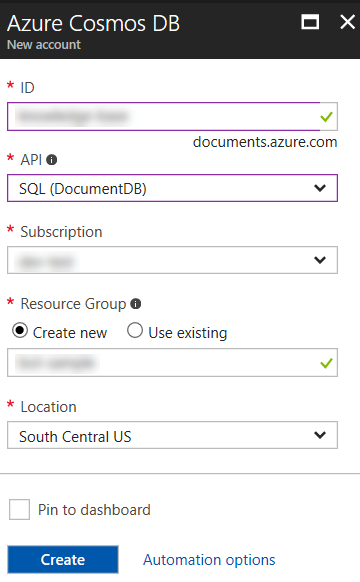
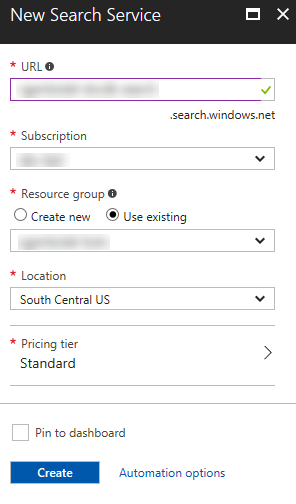
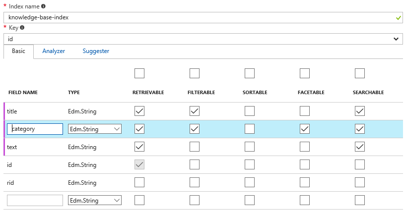

**演習 4: Azure Search と Cosmos DB によるヘルプ デスク ナレッジ ベースの実装
(C\#)**

**概要**

ボットは、ユーザーが大量のコンテンツをナビゲートする支援を行い、ユーザーのためにデータ駆動型の検索エクスペリエンスを実現することもできます。この演習では、検索機能をボットに追加し、ユーザーがナレッジ
ベースを検索する支援を行う方法について学習します。これを行うには、Azure Cosmos
DB に保管されている KB の記事のインデックスを作成する Azure Search
サービスにボットを接続します。

[Azure Cosmos DB](https://azure.microsoft.com/en-us/services/cosmos-db/)
は、マイクロソフトが提供する、ミッション
クリティカルなアプリケーション向けのグローバル分散型マルチ モデル データベース
サービスです。Azure Cosmos DB は、さまざまなデータ
モデルをサポートします。この演習では、Azure Cosmos DB の DocumentDB API
を使用します。これを使用することで、ナレッジ ベースの記事を JSON
ドキュメントとして保管できます。

[Azure Search](https://azure.microsoft.com/en-us/services/search/) は、カスタム
アプリケーションで充実した検索エクスペリエンスを実現する完全管理型のクラウド検索サービスです。Azure
Search は、さまざまなソース (Azure SQL DB、Cosmos DB、BLOB ストレージ、テーブル
ストレージ) のコンテンツのインデックスを作成でき、その他のデータ
ソースに対応する「プッシュ型」のインデックス作成をサポートします。また、PDF、Office
ドキュメント、および非構造化データが含まれるその他の形式のドキュメントを開くことができます。コンテンツ
カタログが Azure Search
インデックスに取り込まれることで、ボットのダイアログからクエリを行えるようになります。

**注:** このラボでは Azure Search と Azure Cosmos DB
を使用しますが、どの検索エンジンおよびバッキング
ストアを使用してももちろんかまいません。

[こちらのフォルダー](https://github.com/GeekTrainer/help-desk-bot-lab/blob/develop/CSharp/exercise4-KnowledgeBase)内には、この演習のステップの完了結果として得られるコードを含むソリューションが入っています。このソリューションは、演習を進めるにあたってさらにヒントが必要な場合に、ガイダンスとして使用できます。これを使用する前に、まず
Web.config で LUIS モデルの値、および Azure Search
インデックスの名前とキーを指定しておく必要があることを覚えておいてください。

次の図は、コンポーネントどうしがどのようなやりとりをするかを示したものです。

**前提条件**

この演習を完了するには、以下のソフトウェアが必要です。

-   [Visual Studio 2017 Community](https://www.visualstudio.com/downloads) 以上

-   [Azure](https://azureinfo.microsoft.com/us-freetrial.html?cr_cc=200744395&wt.mc_id=usdx_evan_events_reg_dev_0_iottour_0_0)
    サブスクリプション

-   [Bot Framework Emulator](https://emulator.botframework.com/) (en-US
    ロケールで構成されていることを確認してください)

-   [LUIS ポータル](https://www.luis.ai/)のアカウント

**タスク 1: Cosmos DB サービスを作成し、ナレッジ ベースをアップロードする**

このタスクでは、Cosmos DB
データベースを作成し、ボットによって使用されるいくつかのドキュメントをアップロードします。Azure
Cosmos DB
の仕組みについてよくわからない場合は、[こちらのドキュメント](https://docs.microsoft.com/en-us/azure/cosmos-db/)を参照してください。

1.  [Azure
    ポータル](https://portal.azure.com/)にアクセスしてサインインします。左側のバーにある
    [新規] ボタン (

    

    ) をクリックし、次に [データベース] をクリックして、**Azure Cosmos DB**
    を選択します。

2.  ダイアログ ボックスで一意のアカウント ID (例: help-desk-bot) を入力し、[API]
    で **SQL (DocumentDB)** を選択します。新しいリソース
    グループ名を入力し、[作成] をクリックします。

>   

1.  展開が完了するまで待ちます。先ほど作成した Cosmos DB
    アカウントを開き、[概要] セクションに移動します。[コレクションの追加]
    ボタンをクリックします。ダイアログ ボックスの [コレクション ID]
    で「knowledge-base」と入力し、[ストレージ容量] で [Fixed]
    を選択して、データベース名として「knowledge-base-db」と入力します。[OK]
    をクリックします。

>   

1.  左側のパネルで [ドキュメント エクスプローラー] を選択し、次に [アップロード]
    ボタンをクリックします。

2.  開いたウィンドウで、[assets/kb](https://github.com/GeekTrainer/help-desk-bot-lab/blob/develop/assets/kb)
    フォルダーのファイルをすべて選択します。各ファイルは、ナレッジ ベースの 1
    つの記事に相当します。[アップロード]
    をクリックします。ブラウザーを閉じないでください。

>   

>   **注:** 記事の「ドキュメント」にはそれぞれ 3 つのフィールド
>   (タイトル、カテゴリ、およびテキスト) が含まれています。

**タスク 2: Azure Search サービスを作成する**

このタスクでは、Cosmos DB
にアップロードされたコンテンツのインデックスを作成するための Azure Search
サービスを作成します。

1.  Azure ポータルの左側のバーにある [新規] (

    

    ) をクリックし、次に [Web + モバイル] をクリックして、**Azure Search**
    を選択し、[作成] ボタンをクリックします。一意の URL (例:
    help-desk-bot-search) を入力し、後で使用するために保存します。Cosmos DB
    で使用したものと同じリソース グループを選択します。[Price Tier] を [無料]
    に変更し、[作成] をクリックします。

>   

1.  サービスのプロビジョニング後、[概要] に移動してから [データのインポート]
    ボタン (

    

    ) をクリックします。

2.  [データに接続します] ボタン、[DocumentDB] の順にクリックします。データ
    ソース名として「knowledge-base-datasource」と入力します。先ほど作成した
    Cosmos DB のアカウント、データベース、およびコレクションを選択します。[OK]
    をクリックします。

>   

1.  [Index - Customize target index] ボタンをクリックします。[インデックス名]
    で「knowledge-base-index」と入力します。インデックスの定義が以下の図と一致するように各列のチェックボックスを更新します。[OK]
    をクリックします。

>   カテゴリ フィールドの [フィルター可能] と [ファセット可能]
>   にチェックマークが付いていることを確認します。これにより、カテゴリが一致するすべての記事を取得できると共に、各カテゴリの記事の数も取得できるようになります。これは、Azure
>   Search の専門用語で「ファセット ナビゲーション」と呼ばれます。

>   

>   **注:**
>   インデックスの詳細については、[こちらの記事](https://docs.microsoft.com/en-us/azure/search/search-what-is-an-index)を参照してください。

1.  最後に、[Indexer - Import your data] をクリックします。[名前]
    で「knowledge-base-indexer」と入力します。[スケジュール] で [1 度]
    が選択されていることを確認します。[OK] をクリックします。

>   

1.  再び [OK] をクリックし、[データのインポート] ダイアログを閉じます。

2.  左側で [キー] をクリックし、次に [クエリ キーの管理]
    をクリックします。次のタスクで使用するために、既定の Azure Search キー
    (**\<empty\>** という名前で示されています) を保存します。

>   

>   **注:** クエリ キーは、管理キーとは異なり、Search
>   インデックスの読み取り専用の操作 (例: ID によるドキュメントのクエリと検索)
>   でしか使用できません。プライマリ管理キーとセカンダリ管理キーは、すべての操作
>   (例: サービスの管理、インデックス、インデクサー、データ ソースの作成と削除)
>   を行える完全な権限を付与します。

**タスク 3: ExploreKnowledgeBase インテントが含まれるように LUIS
モデルを更新する**

このタスクでは、ナレッジ ベースを検索するために LUIS
に新しいインテントを追加します。

1.  [LUIS ポータル](https://www.luis.ai/) にサインインします。演習 3
    で作成したアプリを編集します。

2.  左側のメニューで [Intents] をクリックし、次に [Add Intent]
    ボタンをクリックします。インテント名として「ExploreKnowledgeBase」と入力してから、以下の発話を追加します。

    -   *「explore knowledge base」*

    -   *「explore hardware articles」*

    -   *「find me articles about hardware」*

>   

1.  [Save] をクリックします。

2.  左側にある [Publish App] リンクをクリックします。[Train]
    ボタンをクリックし、完了したら [Publish] ボタンをクリックします。

**タスク 4: Azure Search API を呼び出せるようにボットを更新する**

このタスクでは、先ほど作成したインテントに対応し、Azure Search
サービスを呼び出すためのダイアログを追加します。

1.  前の演習から得られたソリューションを開きます。開始点として[こちら](https://github.com/GeekTrainer/help-desk-bot-lab/blob/develop/CSharp/exercise3-LuisDialog)のソリューションを使用してもかまいません。その場合は、Dialogs\\RootDialog.cs
    内の **[LuisModel("{LUISAppID}", "{LUISKey}")]**
    属性のプレースホルダーを自分が使用している LUIS アプリ ID
    とプログラマティック API キーに置き換えてください。

2.  前のタスクで作成した Azure Search サービスを使用するには、appSettings
    セクションの Web.config で以下のキーを追加し、AzureSearchAccountName と
    AzureSearchKey の値を指定する必要があります。

3.  ...

4.  \<add key="AzureSearchAccount" value="" /\>

5.  \<add key="AzureSearchIndex" value="knowledge-base-index" /\>

6.  \<add key="AzureSearchKey" value="" /\>

>   ...

1.  新しい Model
    フォルダーをプロジェクトに追加します。[assets](https://github.com/GeekTrainer/help-desk-bot-lab/blob/develop/assets)
    フォルダーから新しいフォルダーに
    [SearchResult.cs](https://github.com/GeekTrainer/help-desk-bot-lab/blob/develop/assets/exercise4-KnowledgeBase/SearchResult.cs)
    と
    [SearchResultHit.cs](https://github.com/GeekTrainer/help-desk-bot-lab/blob/develop/assets/exercise4-KnowledgeBase/SearchResultHit.cs)
    をコピーします。これらのクラスは、Azure からの記事の検索に対応します。

2.  プロジェクトで Services フォルダーを作成し、以下のコード内に
    AzureSearchService クラスを追加します。

3.  namespace HelpDeskBot.Services

4.  {

5.  using Model;

6.  using Newtonsoft.Json;

7.  using System;

8.  using System.Net.Http;

9.  using System.Threading.Tasks;

10. using System.Web.Configuration;

11. [Serializable]

12. public class AzureSearchService

13. {

14. private readonly string QueryString =
    \$"https://{WebConfigurationManager.AppSettings["AzureSearchAccount"]}.search.windows.net/indexes/{WebConfigurationManager.AppSettings["AzureSearchIndex"]}/docs?api-key={WebConfigurationManager.AppSettings["AzureSearchKey"]}\&api-version=2015-02-28&";

15. public async Task\<SearchResult\> SearchByCategory(string category)

16. {

17. using (var httpClient = new HttpClient())

18. {

19. string nameQuery = \$"{QueryString}\$filter=category eq '{category}'";

20. string response = await httpClient.GetStringAsync(nameQuery);

21. return JsonConvert.DeserializeObject\<SearchResult\>(response);

22. }

23. }

24. }

>   }

>   **注:** この演習では、単純な Search のクエリしか行わないため、Azure Search
>   REST API を直接使用します。より複雑な操作を行う場合は、[Azure Search .NET
>   SDK](https://aka.ms/search-sdk) を使用できます。この SDK は、管理操作 (例:
>   Search サービスの作成と拡張、API キーの管理) をサポートしません。

1.  Dialogs フォルダー内で、Azure Search とやりとりを行うための新しい
    CategoryExplorerDialog クラスを作成します。

2.  namespace HelpDeskBot.Dialogs

3.  {

4.  using Microsoft.Bot.Builder.Dialogs;

5.  using Model;

6.  using Services;

7.  using System;

8.  using System.Collections.Generic;

9.  using System.Text.RegularExpressions;

10. using System.Threading.Tasks;

11. using Util;

12. [Serializable]

13. public class CategoryExplorerDialog : IDialog\<object\>

14. {

15. private readonly AzureSearchService searchService = new
    AzureSearchService();

16. private string category = null;

17. public CategoryExplorerDialog(string category)

18. {

19. this.category = category;

20. }

21. public async Task StartAsync(IDialogContext context)

22. {

23. if (string.IsNullOrWhiteSpace(this.category))

24. {

25. await context.PostAsync(\$"Try typing something like \_explore
    hardware\_.");

26. context.Done\<object\>(null);

27. }

28. else

29. {

30. SearchResult searchResult = await
    this.searchService.SearchByCategory(this.category);

31. string message;

32. if (searchResult.Value.Length != 0)

33. {

34. message = \$"These are some articles I've found in the knowledge base for
    the \_'{this.category}'\_ category:";

35. foreach (var item in searchResult.Value)

36. {

37. message += \$"\\n \* {item.Title}";

38. }

39. }

40. else

41. {

42. message = \$"Sorry, I could not find any results in the knowledge base for
    \_'{this.category}'\_";

43. }

44. await context.PostAsync(message);

45. context.Done\<object\>(null);

46. }

47. }

48. }

>   }

1.  ここで、新しい **ExploreKnowledgeBase**
    インテントに対応し、ユーザーが入力したカテゴリに属する記事の一覧を Azure
    Search から取得するための ExploreCategory メソッドを RootDialog
    クラスに追加します。

2.  [LuisIntent("ExploreKnowledgeBase")]

3.  public async Task ExploreCategory(IDialogContext context, LuisResult result)

4.  {

5.  EntityRecommendation categoryEntityRecommendation;

6.  result.TryFindEntity("category", out categoryEntityRecommendation);

7.  var category =
    ((Newtonsoft.Json.Linq.JArray)categoryEntityRecommendation?.Resolution["values"])?[0]?.ToString();

8.  context.Call(new CategoryExplorerDialog(category),
    this.ResumeAndEndDialogAsync);

9.  }

10. private async Task ResumeAndEndDialogAsync(IDialogContext context,
    IAwaitable\<object\> argument)

11. {

12. context.Done\<object\>(null);

>   }

**タスク 5: この時点でボットをテストする**

1.  [実行]
    ボタンをクリックしてアプリを実行し、エミュレーターを開きます。ボットの URL
    (http://localhost:3979/api/messages) をいつもどおり入力します。

2.  「explore
    hardware」と入力します。そのカテゴリに属する記事がボットにより一覧表示されることを確認します。他のカテゴリ値
    (例: ネットワーキング、ソフトウェア) で試してもかまいません。

>   [./media/image13.png](./media/image13.png)

**タスク 6: カテゴリと記事を表示できるようにボットを更新する**

このタスクでは、ナレッジ
ベースをカテゴリでナビゲートし、特定のテーマに関する情報を取得できるようにボットのコードを更新します。

1.  アプリを停止します。

2.  [assets](https://github.com/GeekTrainer/help-desk-bot-lab/blob/develop/assets)
    フォルダーからプロジェクトの Model フォルダーにファイル
    [FacetResult.cs](https://github.com/GeekTrainer/help-desk-bot-lab/blob/develop/assets/exercise4-KnowledgeBase/FacetResult.cs)、[SearchFacets.cs](https://github.com/GeekTrainer/help-desk-bot-lab/blob/develop/assets/exercise4-KnowledgeBase/SearchFacets.cs)、および
    [Category.cs](https://github.com/GeekTrainer/help-desk-bot-lab/blob/develop/assets/exercise4-KnowledgeBase/Category.cs)
    をコピーします。これらのクラスは、Azure Search
    サービスのクエリに必要となります。

3.  AzureSearchService クラスに以下のメソッドを追加します。

    -   カテゴリを取得して、それらを一覧表示するための FetchFacets
        メソッドを追加します。

    -   public async Task\<FacetResult\> FetchFacets()

    -   {

    -   using (var httpClient = new HttpClient())

    -   {

    -   string facetQuery = \$"{QueryString}facet=category";

    -   string response = await httpClient.GetStringAsync(facetQuery);

    -   return JsonConvert.DeserializeObject\<FacetResult\>(response);

    -   }

>   }

>   facet=category
>   クエリを使用してこれが行われることを確認します。これは、すべての記事に適用できるすべての「カテゴリ
>   フィルター」をインデックスから取得します
>   (この場合は、ソフトウェア、ハードウェア、ネットワーキングなど)。また、Azure
>   Search は、各ファセットの記事の数を返します。

-   記事を取得するための SearchByTitle メソッドを追加します。

-   public async Task\<SearchResult\> SearchByTitle(string title)

-   {

-   using (var httpClient = new HttpClient())

-   {

-   string nameQuery = \$"{QueryString}\$filter=title eq '{title}'";

-   string response = await httpClient.GetStringAsync(nameQuery);

-   return JsonConvert.DeserializeObject\<SearchResult\>(response);

-   }

>   }

>   **注:** わかりやすくするために、記事のコンテンツは Azure Search
>   から直接取得されます。しかしながら、本番のシナリオでは、Azure Search
>   はインデックスとしてのみ機能し、記事の全文は Cosmos DB から取得されます。

-   一般的な検索を行うための Search メソッドを追加します。

-   public async Task\<SearchResult\> Search(string text)

-   {

-   using (var httpClient = new HttpClient())

-   {

-   string nameQuery = \$"{QueryString}search={text}";

-   string response = await httpClient.GetStringAsync(nameQuery);

-   return JsonConvert.DeserializeObject\<SearchResult\>(response);

-   }

>   }

>   **注:** Azure Search では、A search=...
>   クエリは、インデックス内のすべての検索可能フィールドの用語を 1
>   つ以上検索し、Google や Bing などの検索エンジンと同様に機能します。A
>   filter=...
>   クエリは、インデックス内のすべてのフィルター可能フィールドでブール式を評価します。検索クエリとは異なり、フィルター
>   クエリは、フィールドの正確なコンテンツのマッチングを行います。つまり、文字列フィールドの大文字と小文字が区別されます。

1.  [assets](https://github.com/GeekTrainer/help-desk-bot-lab/blob/develop/assets)
    フォルダーからプロジェクトの Util フォルダーに
    [CardUtil.cs](https://github.com/GeekTrainer/help-desk-bot-lab/blob/develop/assets/exercise4-KnowledgeBase/CardUtil.cs)
    ファイルをコピーします。このクラスは、Azure Search からの記事の一覧で
    ThumbnailCard
    のカルーセルを作成するのに使用されます。ユーザーに対してリッチなカードを示す方法の詳細については、[こちらの記事](https://docs.microsoft.com/en-us/bot-framework/nodejs/bot-builder-nodejs-send-rich-cards)を参照してください。

2.  [assets](https://github.com/GeekTrainer/help-desk-bot-lab/blob/develop/assets)
    フォルダーからプロジェクトの Dialogs フォルダーに
    [SearchScorable.cs](https://github.com/GeekTrainer/help-desk-bot-lab/blob/develop/assets/exercise4-KnowledgeBase/SearchScorable.cs)
    と
    [ShowArticleDetailsScorable.cs](https://github.com/GeekTrainer/help-desk-bot-lab/blob/develop/assets/exercise4-KnowledgeBase/ShowArticleDetailsScorable.cs)
    をコピーします。これらのクラスは、ボットに送信されるすべてのメッセージをインターセプトし、検索サービスを起動する
    Scorable です。

    -   SearchScorable は、メッセージが「search
        about」で始まる場合に起動され、AzureSearchService の Search
        メソッドを呼び出します。

    -   ShowArticleDetailsScorable は、メッセージが「show me the
        article」で始まる場合に起動され、AzureSearchService の SearchByTitle
        メソッドを呼び出します。

>   Scorable
>   は、会話に送信されるすべてのメッセージをインターセプトし、定義したロジックに基づいてメッセージにスコアを付けます。最もスコアの高い
>   Scorable がメッセージ (もっと正確に言えば、会話に送信されるメッセージ)
>   を処理する機会を「獲得」します。ボットで実装するグローバル コマンドごとに
>   Scorable を作成することで、グローバル メッセージ
>   ハンドラーを実装できます。Scorable
>   の詳細については、[こちらのサンプル](https://github.com/Microsoft/BotBuilder-Samples/tree/master/CSharp/core-GlobalMessageHandlers)を参照してください。

1.  Global.asax.cs を開き、以下の using ステートメントを追加します。

2.  using Autofac;

3.  using HelpDeskBot.Dialogs;

4.  using Microsoft.Bot.Builder.Dialogs;

5.  using Microsoft.Bot.Builder.Scorables;

>   using Microsoft.Bot.Connector;

1.  同じファイルで、Application\_Start
    メソッドを以下のコードに置き換え、会話コンテナーに Scorable を登録します。

2.  protected void Application\_Start()

3.  {

4.  GlobalConfiguration.Configure(WebApiConfig.Register);

5.  var builder = new ContainerBuilder();

6.  builder.RegisterType\<SearchScorable\>()

7.  .As\<IScorable\<IActivity, double\>\>()

8.  .InstancePerLifetimeScope();

9.  builder.RegisterType\<ShowArticleDetailsScorable\>()

10. .As\<IScorable\<IActivity, double\>\>()

11. .InstancePerLifetimeScope();

12. builder.Update(Conversation.Container);

>   }

1.  CategoryExplorerDialog で変数 originalText
    を追加し、そのコンストラクターを更新し、これを受け取り、これを設定します。

2.  private string originalText = null;

3.  public CategoryExplorerDialog(string category, string originalText)

4.  {

5.  this.category = category;

6.  this.originalText = originalText;

>   }

1.  ボットが元のメッセージでカテゴリを検出しなかった場合にカテゴリの一覧を取得するように
    StartAsync
    の実装を変更します。メソッドのコードを以下のコードに置き換えます。

2.  public async Task StartAsync(IDialogContext context)

3.  {

4.  if (string.IsNullOrWhiteSpace(this.category))

5.  {

6.  FacetResult facetResult = await this.searchService.FetchFacets();

7.  if (facetResult.Facets.Category.Length != 0)

8.  {

9.  List\<string\> categories = new List\<string\>();

10. foreach (Category category in facetResult.Facets.Category)

11. {

12. categories.Add(\$"{category.Value} ({category.Count})");

13. }

14. PromptDialog.Choice(context, this.AfterMenuSelection, categories, "Let\\'s
    see if I can find something in the knowledge for you. Which category is your
    question about?");

15. }

16. }

17. else

18. {

19. SearchResult searchResult = await
    this.searchService.SearchByCategory(this.category);

20. if (searchResult.Value.Length \> 0)

21. {

22. await context.PostAsync(\$"These are some articles I\\'ve found in the
    knowledge base for \_'{this.category}'\_, click \*\*More details\*\* to read
    the full article:");

23. }

24. await CardUtil.ShowSearchResults(context, searchResult, \$"Sorry, I could
    not find any results in the knowledge base for \_'{this.category}'\_");

25. context.Done\<object\>(null);

26. }

>   }

1.  AfterMenuSelection
    メソッドを追加します。このメソッドは、ユーザーが検索するカテゴリを選択する際に呼び出されます。

2.  public virtual async Task AfterMenuSelection(IDialogContext context,
    IAwaitable\<string\> result)

3.  {

4.  this.category = await result;

5.  this.category = Regex.Replace(this.category, \@"\\s\\([\^)]\*\\)",
    string.Empty);

6.  SearchResult searchResult = await
    this.searchService.SearchByCategory(this.category);

7.  await context.PostAsync(\$"These are some articles I\\'ve found in the
    knowledge base for \_'{this.category}'\_, click \*\*More details\*\* to read
    the full article:");

8.  await CardUtil.ShowSearchResults(context, searchResult, \$"Sorry, I could
    not find any results in the knowledge base for \_'{this.category}'\_");

9.  context.Done\<object\>(null);

>   }

1.  最後に、RootDialog で、CategoryExplorerDialog
    の署名のマッチングを行えるように ExploreCategory メソッドを更新します。

2.  [LuisIntent("ExploreKnowledgeBase")]

3.  public async Task ExploreCategory(IDialogContext context, LuisResult result)

4.  {

5.  EntityRecommendation categoryEntityRecommendation;

6.  result.TryFindEntity("category", out categoryEntityRecommendation);

7.  var category =
    ((Newtonsoft.Json.Linq.JArray)categoryEntityRecommendation?.Resolution["values"])?[0]?.ToString();

8.  context.Call(new CategoryExplorerDialog(category, result.Query),
    this.ResumeAndEndDialogAsync);

>   }

1.  また、ナレッジ ベースの機能が含まれるように Help
    メソッドのテキストを更新できます。

2.  [LuisIntent("Help")]

3.  public async Task Help(IDialogContext context, LuisResult result)

4.  {

5.  await context.PostAsync("I'm the help desk bot and I can help you create a
    ticket or explore the knowledge base.\\n" +

6.  "You can tell me things like \_I need to reset my password\_ or \_explore
    hardware articles\_.");

7.  context.Done\<object\>(null);

>   }

**タスク 7: エミュレーターからボットをテストする**

1.  [実行]
    ボタンをクリックしてアプリを実行し、エミュレーターを開きます。ボットの URL
    (http://localhost:3979/api/messages) をいつもどおり入力します。

2.  「explore knowledge base」と入力します。Cosmos DB
    にアップロードした記事カテゴリの一覧、および各カテゴリの記事の数が表示されます。

>   [./media/image14.png](./media/image14.png)

1.  一覧表示されたカテゴリのいずれかをクリックすると、そのカテゴリの記事が表示されます。

>   [./media/image15.png](./media/image15.png)

1.  記事の [More Details] ボタンをクリックすると、記事の全文が表示されます。

>   [./media/image16.png](./media/image16.png)

1.  特定のカテゴリを検索してみてもかまいません。「explore
    software」と入力すると、そのカテゴリに属する記事がいくつか表示されます。

>   [./media/image17.png](./media/image17.png)

1.  同様に、特定のトピックに関する記事を検索してみてもかまいません。たとえば、「search
    about OneDrive」と入力します。

>   [./media/image18.png](./media/image18.png)

>   **注:** 検索によって返されるドキュメントごとにスコア (関連度)
>   が返されることを確認してください。

**その他の課題**

自主的に学習を続ける場合は、次のタスクを利用できます。

-   記事 ThumbnailCard で既定の画像を表示する代わりに、[Bing Image Search
    API](https://azure.microsoft.com/en-us/services/cognitive-services/bing-image-search-api/)
    を使用して、記事のカテゴリに関連する画像を表示できます。[こちら](https://github.com/GeekTrainer/help-desk-bot-lab/blob/develop/assets/exercise4-KnowledgeBase/FurtherChallenge/ImageSearchService.cs)で提供されている
    [assets](https://github.com/GeekTrainer/help-desk-bot-lab/blob/develop/assets)
    フォルダーのコードを使用できます。

-   カルーセルで使用される記事 ThumbnailCard をアダプティブ
    カードで変更できます。例として[こちら](https://github.com/GeekTrainer/help-desk-bot-lab/blob/develop/assets/exercise4-KnowledgeBase/FurtherChallenge/CardUtil.cs)で提供されているコードを使用できます。
