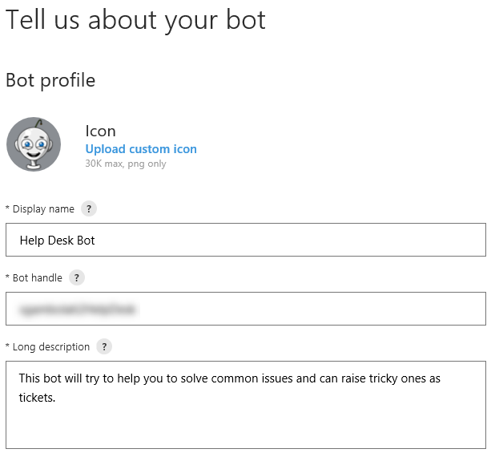
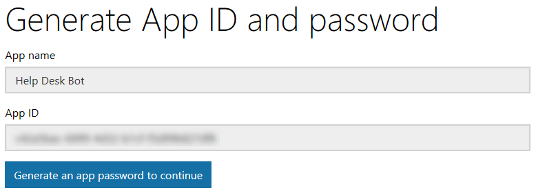
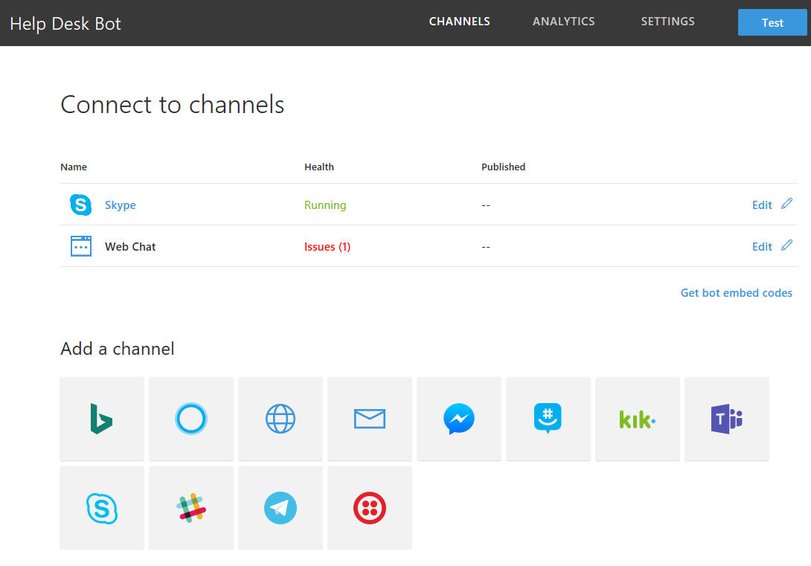
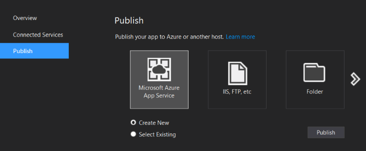
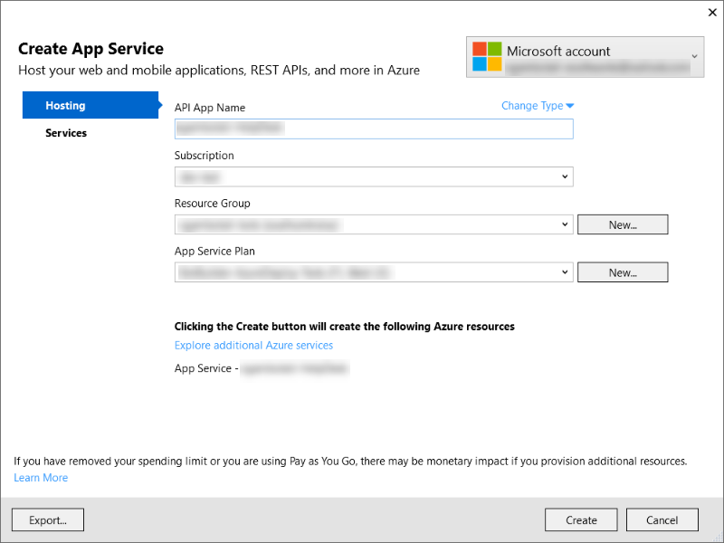
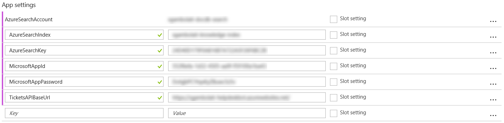
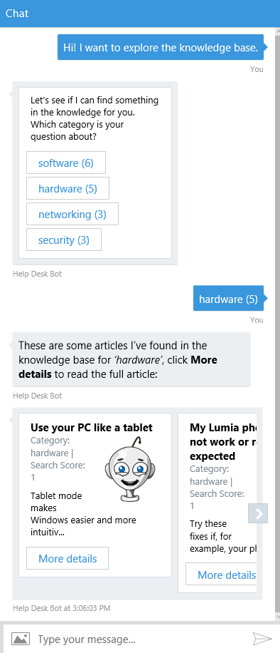
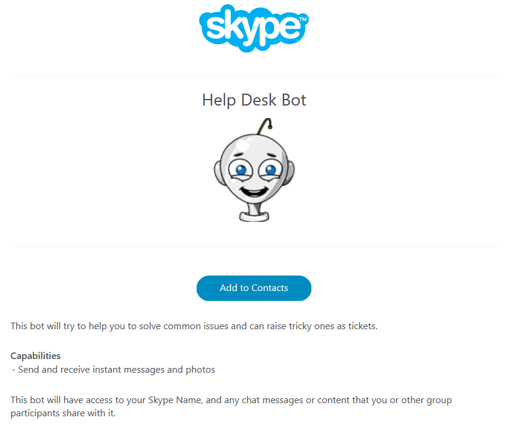
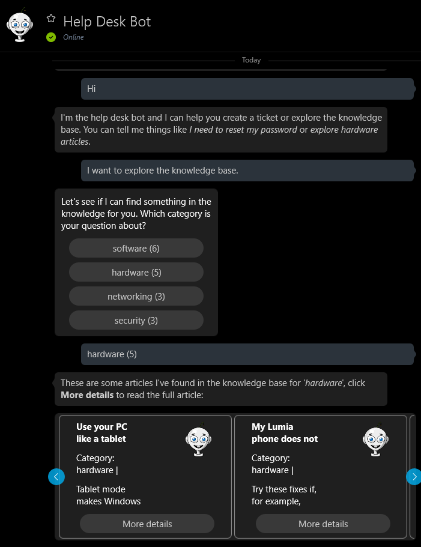

# 演習 5: クラウドへのボットの展開 (C\#)

## 概要

この演習では、自分のボットを登録し、Azure
に展開して、他の人々がそのボットを使用できるようにする方法を学習します。

## 前提条件

この演習を完了するには、以下のソフトウェアが必要です。

-   [Visual Studio 2017 Community](https://www.visualstudio.com/downloads) 以上

-   [Azure](https://azureinfo.microsoft.com/us-freetrial.html?cr_cc=200744395&wt.mc_id=usdx_evan_events_reg_dev_0_iottour_0_0)
    サブスクリプション

-   [LUIS ポータル](https://www.luis.ai/)のアカウント

-   [Skype](https://www.skype.com/) アカウント (オプション)

## タスク 1: Bot Framework へのボットの登録

このタスクでは、アプリ ID とアプリ パスワードを生成し、ボットを登録します。

1.  [Bot Framework Portal](https://dev.botframework.com/) にサインインします。

2.  [My bots] ボタンをクリックし、次に [Create a bot] をクリックするか
    (他のボットがある場合)、または [Register] ボタンをクリックします。

3.  [logo.png](../assets/logo.png)
    を**カスタム アイコン**としてアップロードします。

4.  [Display Name] に「Help Desk Bot」と入力します。[Bot Handle]
    にグローバル一意アプリ名を入力します。

5.  [Long Description] には、「This bot will try to help you to solve common
    issues and can raise tricky ones as
    tickets.」と入力してください。この説明は検索結果で表示されるため、ボットの機能を正確に記述してください。

   

6.  [Configuration] セクションで、[Create Microsoft AppID and Password]
    ボタンをクリックします。それにより、新しいページが開きます。必要に応じて、Bot
    Framework Portal
    で使用した資格情報を入力して、もう一度サインインしてください。このページには、先ほど入力したアプリ名と、自動生成された**アプリ
    ID** が表示されます。**アプリ ID**
    は後から確認できるように保存しておき、[アプリパスワードを生成して続行]
    をクリックします。

   

7.  ポップアップが開き、自動生成されたボット用パスワードが表示されます。このパスワードが表示されるのはこの
    1
    回限りです。後から確認できるように**安全な方法で保管**しておいてください。[OK]
    をクリックしてポップアップを閉じます。

   

8.  [Finish and go back to Bot Framework]
    ボタンをクリックします。ページが閉じ、ボット登録画面に戻ります。ページに、アプリ
    ID が表示されるようになりました。

9.  画面を下にスクロールして、使用条件、プライバシーに関する声明、および倫理規定への同意について確認します。[Register]
    ボタンをクリックします。確認メッセージが表示されます。[OK]
    をクリックします。次に、ボットのダッシュボードが表示されます。いくつかのチャネルが利用可能になっています。

   

## タスク 2: Azure へのボットの発行

このタスクでは、Visual Studio から Azure へボットを発行する方法を学習します。

1.  前の演習から得られたソリューションを開きます。または、[exercise4-KnowledgeBase](./exercise4-KnowledgeBase)
    フォルダーからソリューション
    ファイルを開くこともできます。その場合は、Dialogs\\RootDialog.cs 内の
    **[LuisModel("{LUISAppID}", "{LUISKey}")]**
    属性のプレースホルダーを自分が使用している LUIS アプリ ID
    とプログラマティック API キーに置き換えてください。

2.  [Build] メニューに移動して、[Publish HelpDeskBot
    (または自分が使用しているプロジェクト名)]
    をクリックします。表示されたウィンドウで、[Microsoft Azure App
    Service]、[新規作成] をクリックし、[発行] をクリックします。

   

3.  新しいウィンドウが開きます。[アプリ名]
    にアプリ名を入力し、[サブスクリプション] でサブスクリプションを、[リソース
    グループ] でリソース グループをそれぞれ選択します。Cosmos DB および Search
    サービスで使用したものと同じリソース グループを使用できます。

4.  [作成] ボタンをクリックします。次に、展開によってサブスクリプションでの Web
    アプリの作成が開始されます。完了すると、既定の Web ブラウザーが開き、ボット
    URL にリダイレクトされます。

   

## タスク 3: Azure Web アプリの構成

このタスクでは、Bot Framework
のチャネルと通信できるようにアプリを構成する方法を学習します。

1.  [Azure ポータル](https://portal.azure.com/)にサインインします。

2.  前に作成したアプリ サービスを開きます。左側のメニューにある [Application
    Settings] をクリックします。[App settings]
    に移動して、以下のキーを追加し、それぞれの値を説明に従って置き換えます
    (これらの値はボットのソース コードに含まれているはずです)。

    | **キー**             | **説明**                                                               |
    |----------------------|------------------------------------------------------------------------|
    | AzureSearchAccount   | **Azure Search アカウント名**を使用します。                            |
    | AzureSearchIndex     | **Azure Search インデックス名**を使用します。                          |
    | AzureSearchKey       | **Azure Search キー**を使用します。                                    |
    | MicrosoftAppId       | **ボット アプリ ID** を使用します。                                    |
    | MicrosoftAppPassword | **ボット パスワード**を使用します。                                    |
    | TicketsAPIBaseUrl    | アプリ サービスの URL (例: <https://help-desk-bot.azurewebsites.net/>) |

    キーと値の入力が完了すると、次の図のような結果になるはずです。

    

3.  [Save] () をクリックします。

## タスク 4: ボット構成の更新

1.  [Bot Framework Portal](https://dev.botframework.com/)
    に移動します。ボットを編集するために、ボット名をクリックします。

2.  ページの右上隅にある [Settings] ボタンをクリックします。

3.  [Configuration] セクションで、タスク 2 で作成したアプリ サービス URL (例:
    <https://help-desk-bot.azurewebsites.net/api/messages>) を入力します。URL
    の末尾には必ず /api/messages を付け、またプロトコルは必ず **https**
    にしてください。ページ下部の [Save changes] ボタンをクリックします。

   

## タスク 5: 発行したボットのテスト

このタスクでは、他のチャネルからボットをテストします。

1.  ページの右上隅にある [Test]
    ボタンをクリックします。ページの右側に新しいウィンドウが開きます。これは、ボットを容易にテストできるようにする埋め込みの
    Web チャット チャネルです。

2.  「Hi! I want to explore the knowledge
    base.」と入力し、この入力への応答としてボットがカテゴリ一覧を返すことを確認します。任意のカテゴリをクリックして、そのカテゴリの記事一覧が表示されることを確認し、いずれかの記事をクリックして内容を確認します。

   

3.  [Channels] メニュー項目をクリックします。**Skype** チャネルと **Web
    チャット** チャネルが既定で有効になっているはずです。[Skype]
    リンクをクリックします。新しいページが開きます。このページで、**Skype**
    アカウントにボットを追加できます。[Add to Contacts]
    ボタンをクリックします。Skype
    アカウントにサインインするように求められ、Skype アプリが開かれるはずです。

   

> **注:** [Get bot embed codes] リンクについても確認してみてください。ここでは、ユーザーが自分の Skype アカウントにボットを追加できるようにするためのリンクの構築方法がわかります。

4.  連絡先リストでボットを検索して、新しい会話をテストします。

   

> **注:** このハンズオン ラボの作成時点で、Skype はアダプティブ カードを完全にサポートしてはいないため、チケット確認メッセージが正しく表示されない可能性があります。

## その他の課題

-   Bot Emulator でボットをテストします。ngrok を使用して、ローカル
    コンピューターへの応答方法をボットに知らせる必要があります。そのための手順については、[こちら](https://docs.microsoft.com/en-us/bot-framework/debug-bots-emulator#a-idngroka-install-and-configure-ngrok)を参照してください。

-   Application Insights を使用した Bot Analytics
    の追加も試してみてください。方法については、[こちら](https://docs.microsoft.com/en-us/bot-framework/portal-analytics-overview)を参照してください。
