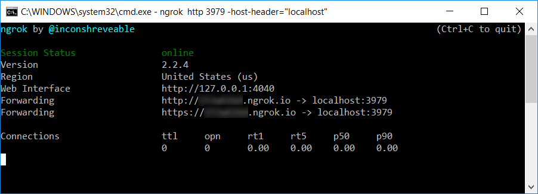
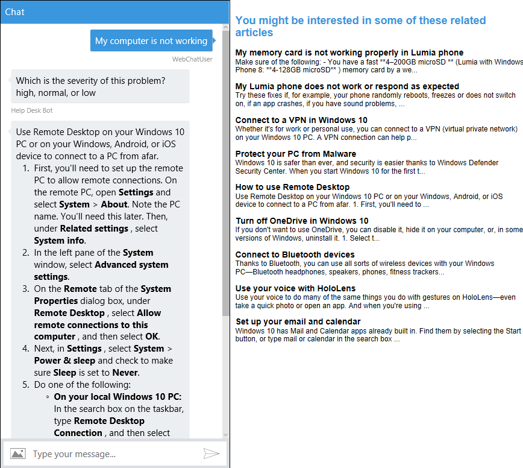

**演習 8: バックチャネルを通したイベントの送受信 (C\#)**

**概要**

バックチャネル メカニズムを使用すると、ユーザーからは見えない情報をクライアント
アプリとボットがやり取りできます。たとえば、クライアントのタイム ゾーンの要求や
GPS の位置情報の読み取り、Web
ページでのユーザーの操作内容などがあります。ボットがユーザーをガイドして、Web
フォームの一部に自動的に記入することなどもできます。バックチャネルは、JavaScript
クライアント
アプリとボットの隔たりを埋める役割を果たします。このメカニズムは、Direct Line
API を使用して実装します。この API
を使用すると、クライアントとボットの間でアクティビティを送受信できます。

この演習では、アプリに Web ページを追加します。ボットと Web
ページはバックチャネル
メカニズムを使用して通信を行います。ボットはユーザーのチケットを Web
ページに送信し、Web
ページではそのチケットに関連するサポート技術情報の記事を表示します。目標は、人間のスーパーバイザー
エージェントが会話を監視し、Web
ページを使用してユーザーに役立つ記事があるかどうかを判断し、チケットの作成を回避できるようにすることです。ユーザーが記事を見つけたら、スーパーバイザー
エージェントはその記事をクリックし、ユーザーとボットの会話で表示します。

ボットのバックチャネル
パターンについては、[こちらの記事](https://docs.microsoft.com/en-us/bot-framework/nodejs/bot-builder-nodejs-backchannel)で詳しく説明します。

[こちらのフォルダー](https://github.com/GeekTrainer/help-desk-bot-lab/blob/develop/CSharp/exercise8-BackChannel)内には、この演習のステップの完了結果として得られるコードを含むソリューションが入っています。このソリューションは、演習を進めるにあたってさらにヒントが必要な場合に、ガイダンスとして使用できます。これを使用する前に、まず
Web.config で LUIS モデルの値、および Azure Search
インデックスの名前とキーを指定しておく必要があることを覚えておいてください。

この図は、この演習のコンポーネントを簡単に示しています。

**前提条件**

この演習を完了するには、以下のソフトウェアが必要です。

-   [Visual Studio 2017 Community](https://www.visualstudio.com/downloads/) 以上

-   [Azure](https://azureinfo.microsoft.com/us-freetrial.html?cr_cc=200744395&wt.mc_id=usdx_evan_events_reg_dev_0_iottour_0_0)
    サブスクリプション

-   [Bot Framework Emulator](https://emulator.botframework.com/) (en-US
    ロケールで構成されていることを確認してください)

-   ローカル開発用 [ngrok](https://ngrok.com/)

**タスク 1: ボットの Web チャット チャネルへの新しいサイトの追加**

1.  [Bot Framework ポータル](https://dev.botframework.com/)にサインインします。

2.  [My bots] ボタンをクリックし、編集するボットをクリックします。

>   **注:** この演習では、Bot Framework
>   ポータルにボットが既に登録されていることを前提としています。登録していない場合は、[演習
>   5](https://github.com/GeekTrainer/help-desk-bot-lab/blob/develop/CSharp/exercise5-Deployment.md)
>   の説明を参照してください。

1.  Web チャット チャネルの [編集] (

    

    ) リンクをクリックします。開いたウィンドウで [Add new site]
    をクリックします。サイト名 (例: ヘルプ デスク チケット検索) を入力します。

>   

1.  [完了] をクリックすると、次のページが表示されます。**秘密鍵**が 2
    つあることに注意してください。後で使用できるように、いずれか 1
    つを保存しておきます。[完了] をクリックします。

>   

**タスク 2: 埋め込み済み Web チャットによる HTML ページの追加**

このタスクでは、Web Chat コントロールと、ボットに event
メッセージを送受信するコードが含まれるアプリに HTML
ページを追加します。次に、event アクティビティをボットから Web ページに送信する
BackChannel 機能を追加します。

1.  前の演習から得られたアプリを開きます。または、[exercise7-HandOffToHuman](https://github.com/GeekTrainer/help-desk-bot-lab/blob/develop/CSharp/exercise7-HandOffToHuman)
    フォルダーにあるソリューションを使用することもできます。

>   **注:**
>   あらかじめ提供しているソリューションを使用する場合は、必ず以下の値を置き換えてください。

-   RootDialog.cs 内の **[LuisModel("{LUISAppID}", "{LUISKey}")]**
    属性のプレースホルダーを、自分が使用している LUIS アプリ ID
    とプログラマティック API キーに置き換えます

-   Web.config 内の **TextAnalyticsApiKey** を、自分が使用している Text
    Analytics キーに置き換えます (演習 6 で説明しています)。

-   Web.config 内の **AzureSearchAccount**、**AzureSearchIndex**、および
    **AzureSearchKey** を、自分の Search
    アカウント、インデックス名、キーに置き換えます (演習 4 で説明しています)。

1.  default.htm を
    [こちらのテンプレート](https://github.com/GeekTrainer/help-desk-bot-lab/blob/develop/assets/exercise8-BackChannel/default.htm)に置き換えます。

2.  [botchat.js script
    element](https://github.com/GeekTrainer/help-desk-bot-lab/blob/develop/assets/exercise8-BackChannel/default.htm#L52)の下に、Web
    Channel Secret で **DirectLine**
    オブジェクトを作成する以下のコードを含む、新しいスクリプト要素を追加します。{DIRECTLINE\_SECRET}
    プレースホルダーを、これまでに取得した秘密鍵で置き換え、{BOT\_ID}
    プレースホルダーをボット処理 ID (例: *help-desk-bot*) で置き換えます。

3.  \<script\>

4.  var botConnection = new BotChat.DirectLine({

5.  secret: '{DIRECTLINE\_SECRET}'

6.  });

7.  var resPanel = document.getElementById('results');

8.  BotChat.App({

9.  botConnection: botConnection,

10. user: { id: 'WebChatUser' },

11. bot: { id: '{BOT\_ID}' },

12. locale: 'en-us',

13. }, document.getElementById('bot'));

>   \</script\>

>   **注:** [オープンソースの Web Chat
>   コントロール](https://github.com/Microsoft/BotFramework-WebChat)は、[Direct
>   Line API](https://docs.botframework.com/en-us/restapi/directline3/#navtitle)
>   を使用してボットと通信を行います。Direct Line API
>   を使用することで、activities
>   をクライアントとボットの間で送受信できます。最も一般的な型のアクティビティは
>   message ですが、その他の型もあります。たとえば、typing
>   型のアクティビティは、ユーザーが入力していること、またはボットが応答のコンパイル作業中であることを示します。

1.  同じスクリプト要素で、event アクティビティを受信するためのボット
    アクティビティ リスナーを追加し、記事リストを表示します。

>   **注:** Web Chat コントロールは、type="event"
>   のアクティビティを自動的に無視します。これにより、ページはボットと、ボットはページと直接通信を行うことができます。

>   botConnection.activity\$

>   .filter(function (activity) {

>   return activity.type === 'event' && activity.name === 'searchResults';

>   })

>   .subscribe(function (activity) {

>   updateSearchResults(activity.value)

>   });

>   function updateSearchResults(results) {

>   resPanel.innerHTML = ''; // clear

>   results.forEach(function (result) {

>   resPanel.appendChild(createSearchResult(result));

>   });

>   }

>   function createSearchResult(result) {

>   var el = document.createElement('div');

>   el.innerHTML = '\<h3\>' + result.Title + '\</h3\>' +

>   '\<p\>' + result.Text.substring(0, 140) + '...\</p\>';

>   return el;

>   }

>   **注:** わかりやすくするため、ユーザーとの会話を含む Web Chat
>   コントロールと検索結果は同じページに表示します。ただし、この 2
>   つはそれぞれ別々に扱うことが理想的です。エージェントが監視と推奨記事の送信ができるように、スーパーバイザー
>   Web サイトには進行中の会話のリストを表示する必要があります。

**タスク 3: ボットを更新して event アクティビティを Web アプリに送信**

このタスクではevent メッセージをボットと送受信する機能を追加します。

1.  Dialogs\\RootDialog.cs を開きます。searchResults
    イベントを作成し、送信するSendSearchToBackchannel メソッドを追加します。

2.  private async Task SendSearchToBackchannel(IDialogContext context,
    IMessageActivity activity, string textSearch)

3.  {

4.  var searchService = new AzureSearchService();

5.  var searchResult = await searchService.Search(textSearch);

6.  if (searchResult != null && searchResult.Value.Length != 0)

7.  {

8.  var reply = ((Activity)activity).CreateReply();

9.  reply.Type = ActivityTypes.Event;

10. reply.Name = "searchResults";

11. reply.Value = searchResult.Value;

12. await context.PostAsync(reply);

13. }

>   }

1.  次の using ステートメントを追加します。

>   using HelpDeskBot.Services;

1.  SubmitTicket メソッドを更新して、ボットはチケットの説明を受信すると新しい
    SendSearchToBackchannel メソッドを呼び出すようにします。messageActivity
    パラメーターを導入する必要があります。

2.  [LuisIntent("SubmitTicket")]

3.  public async Task SubmitTicket(IDialogContext context,
    IAwaitable\<IMessageActivity\> messageActivity, LuisResult result)

4.  {

5.  ...

6.  await this.EnsureTicket(context);

7.  var activity = await messageActivity;

8.  await this.SendSearchToBackchannel(context, activity, this.description);

>   }

**タスク 4: ボットから Web アプリへのバックチャネルのテスト**

1.  [実行] ボタンをクリックしてアプリを実行します。

2.  *ngrok* をダウンロードした新しいコンソール
    ウィンドウが開き、そのウィンドウで、ngrok http 3979 -host-header="localhost"
    と入力します。3979
    は、ボットを実行しているポート番号であることに注意してください。別のポート番号を使用している場合は、変更します。次に、転送先の
    **https** URL も保存しておきます。

>   

>   **注:** IIS Express ではどの開発サイトを表示するかを Host
>   ヘッダーを使用して判別するため、-host-header
>   修飾子を使用する必要があります。詳細については、[こちら](https://ngrok.com/docs#host-header)を参照してください。

1.  [Bot Framework ポータル](https://dev.botframework.com/)にサインインします。

2.  [My bots] ボタンをクリックし、次に、編集するボットをクリックします。[設定]
    タブをクリックして、メッセージのエンドポイント URL を *ngrok*
    から取得した転送先 **https** URL で更新します (/api/messages
    を忘れずに保持してください)。[変更の保存] ボタンをクリックします。

3.  Web ブラウザでボットの URL に移動します (いつもどおり
    <http://localhost:3979/> です)。Web Chat コントロールで、「I need to reset
    my password, this is urgent」(急いでパスワードを変更する必要があります)
    と入力します。入力した説明に応じて、右側に記事リストが表示されるのがわかります。

>   

**タスク 5: Web ページを更新して event メッセージをボットに送信**

1.  default.htm ファイルを開きます。ファイル冒頭の \<style\>
    セクションで、[\#results h3
    selector](https://github.com/GeekTrainer/help-desk-bot-lab/blob/develop/assets/exercise8-BackChannel/default.htm#L25)
    を次の CSS で置き換えます。

2.  \#results h3 {

3.  margin-top: 0;

4.  margin-bottom: 0;

5.  cursor: pointer;

>   }

1.  createSearchResult
    関数を次のコードで更新します。このコードは、ユーザーが記事のタイトルをクリックすると、event
    アクティビティをボットにポストします。

2.  function createSearchResult(result) {

3.  var el = document.createElement('div');

4.  el.innerHTML = '\<h3\>' + result.Title + '\</h3\>' +

5.  '\<p\>' + result.Text.substring(0, 140) + '...\</p\>';

6.  el.getElementsByTagName('h3')[0]

7.  .addEventListener('click', function () {

8.  botConnection

9.  .postActivity({

10. type: 'event',

11. value: this.textContent.trim(),

12. from: { id: 'user' },

13. name: 'showDetailsOf'

14. })

15. .subscribe(function (id) {

16. console.log('event sent', id);

17. });

18. });

19. return el;

>   }

**タスク 6: ボットを更新して event アクティビティを受信**

1.  Controllers\\MessagesController.cs を開き、次の using
    ステートメントを追加します。

2.  using System;

>   using HelpDeskBot.Services;

1.  Post
    メソッドを以下のコードで更新して、ユーザーが記事のタイトルをクリックすると呼び出される
    event メッセージを処理します。

2.  public async Task\<HttpResponseMessage\> Post([FromBody]Activity activity)

3.  {

4.  if (activity.Type == ActivityTypes.Message)

5.  {

6.  await Conversation.SendAsync(activity, () =\> new RootDialog());

7.  }

8.  else if (activity.Type == ActivityTypes.Event)

9.  {

10. await this.HandleEventMessage(activity);

11. }

12. else

13. {

14. this.HandleSystemMessage(activity);

15. }

16. var response = Request.CreateResponse(HttpStatusCode.OK);

17. return response;

>   }

1.  次のコードを追加して、showDetailsOf
    イベントを処理します。このメソッドは、サポート技術情報で記事のタイトルを検索し、結果を
    **Web Chat コントロール**でユーザーに送信します。

2.  private async Task HandleEventMessage(Activity message)

3.  {

4.  if (string.Equals(message.Name, "showDetailsOf",
    StringComparison.InvariantCultureIgnoreCase))

5.  {

6.  AzureSearchService searchService = new AzureSearchService();

7.  var searchResult = await
    searchService.SearchByTitle(message.Value.ToString());

8.  string reply = "Sorry, I could not find that article.";

9.  if (searchResult != null && searchResult.Value.Length != 0)

10. {

11. reply = "Maybe you can check this article first: \\n\\n" +
    searchResult.Value[0].Text;

12. }

13. // return our reply to the user

14. Activity replyActivity = message.CreateReply(reply);

15. ConnectorClient connector = new ConnectorClient(new
    Uri(message.ServiceUrl));

16. await connector.Conversations.ReplyToActivityAsync(replyActivity);

17. }

>   }

**タスク 7: アプリからボットへのバックチャネル メッセージのテスト**

1.  [実行] ボタンをクリックしてアプリを実行します。引き続き ngrok
    が実行中であることを確認します (ngrok http 3979 -host-header="localhost")。

2.  Web ブラウザでボットの URL に移動します (いつもどおり
    <http://localhost:3979/>です)。Web Chat コントロールで、「My computer is not
    working」(コンピューターが動作していません) と入力します。

3.  いずれかの記事のタイトルをクリックすると、Web Chat
    コントロールに記事のコンテンツが表示されます。

>   
