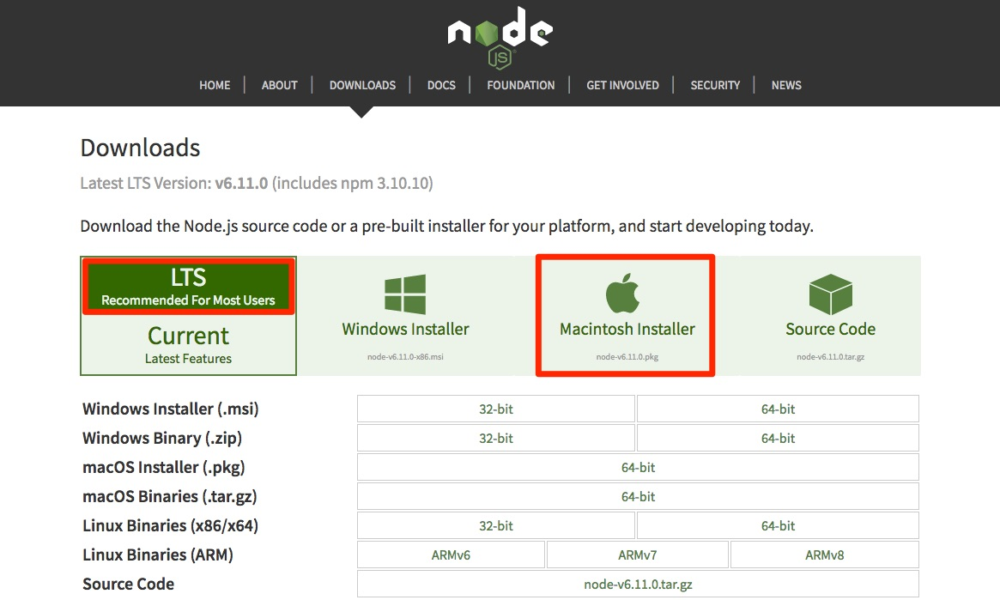
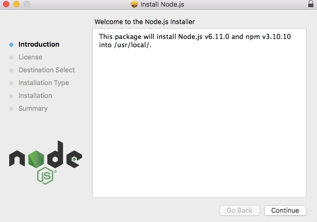
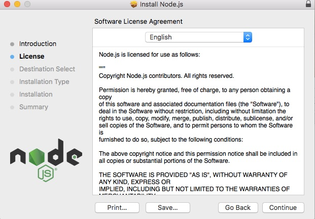
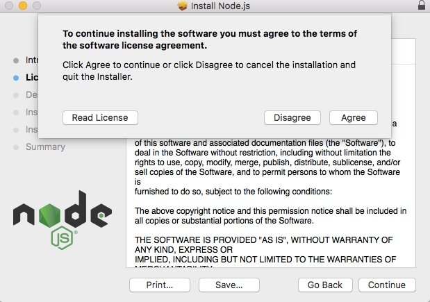
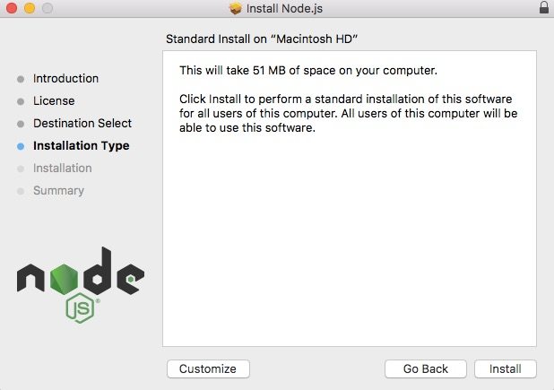
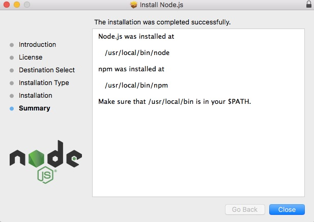
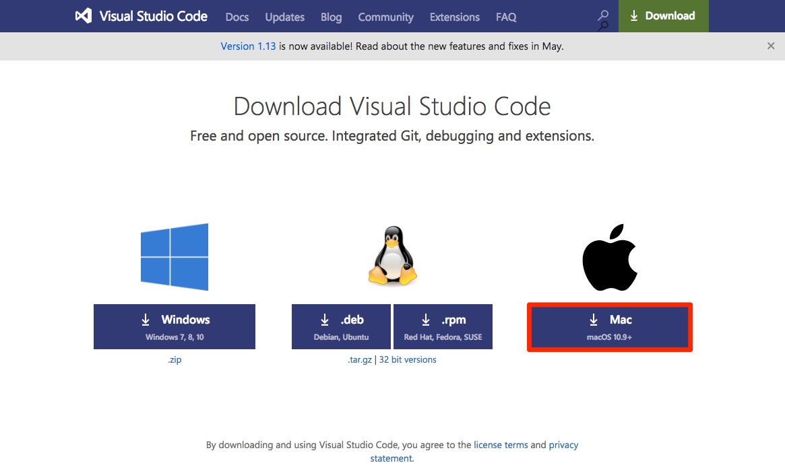
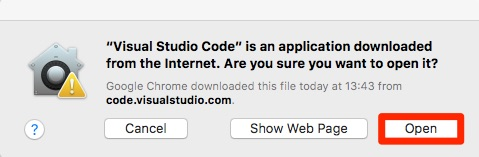
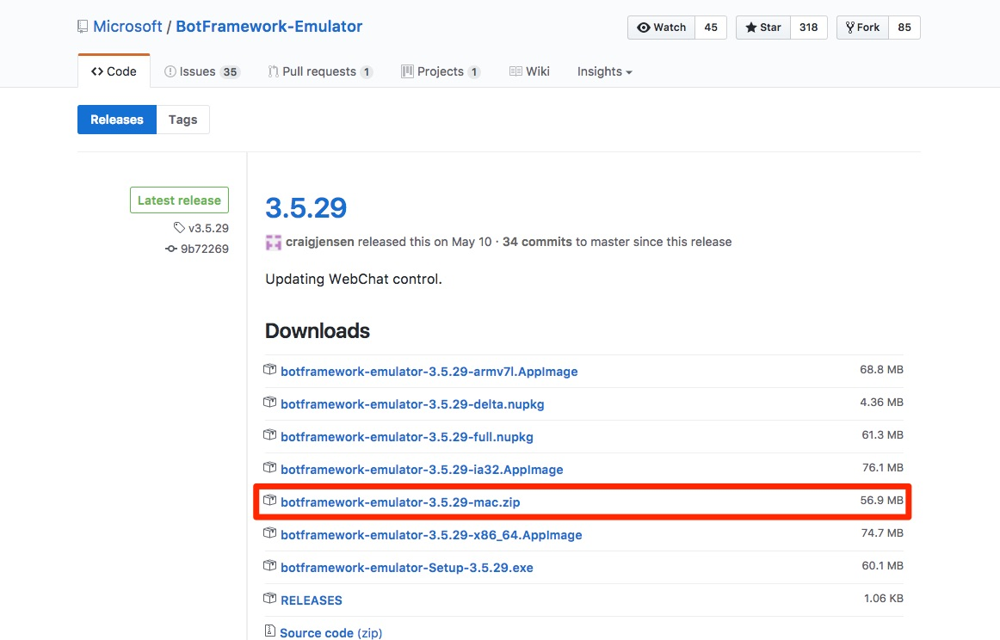
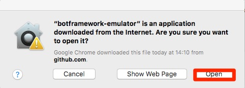

# 演習 0: 前提条件にある環境を構築する

## 概要

この演習では、その後の演習の前提条件にあたる環境を構築します。お手元の環境に合わせて適時タスクやステップを実施してください。

## 前提条件
この演習を完了するには、以下のソフトウェアが必要です。

* [最新の Node.js と npm](https://nodejs.org/en/download)
* [Visual Studio Code](https://code.visualstudio.com/download) (推奨) や Visual Studio 2017 Community 以上などのコード エディター
* [Bot Framework Emulator](https://emulator.botframework.com/) (ボットのテストに使用するクライアント)

> このドキュメントの動作確認はそれぞれ下記バージョンにて実施しています。
>* Node.js LTS Version: v6.11.0,  npm 3.10.10
>* Bot Framework Emulator 3.5.29
>* Google Chrome Version 59.0.3071.115 (Official Build) (64-bit)
>* Visual Studio Code (version 1.13)
>* macOS Sierra version 10.12.5
<!---* Windows 10 Version 1703 (Build 15063.413) --->

## タスク 1 Node.js のインストール
1. [https://nodejs.org/en/download/](https://nodejs.org/en/download/) にアクセスします。
2. 最新の Node.js と npm のセットをダウンロードします。LTS を選択し、りんごマークを選択すると自動でダウンロードがはじまります。

3. インストーラーを起動し、ウィザードに従ってインストール作業をすすめます。

以上で Node.js のインストールは終わりです。

## タスク 2 Visual Studio Code のインストール
1. [https://code.visualstudio.com/download](https://code.visualstudio.com/download) にアクセスします。
2. 最新の Visual Studio Code をダウンロードします。

3. ダウンロードした zip を解凍し、任意の場所にコピーします。（Applications など）Visual Studio Code.app を起動します。（特別なインストール作業は必要ではありません。）初回起動時のみ下記の警告が表示されます。

Terminal 等で呼び出したい場合は、Path や alias を設定しておくと便利です。

## タスク 3 Bot Framework Emulator のインストール
1. [https://github.com/Microsoft/BotFramework-Emulator/releases/tag/v3.5.29](https://github.com/Microsoft/BotFramework-Emulator/releases/tag/v3.5.29 ) にアクセスします。
2. botframework-emulator-3.5.29-mac.zip をダウンロードします。

3. ダウンロードした zip を解凍し、任意の場所にコピーします。（Applications など）botframework-emulator.app を起動します。（特別なインストール作業は必要ではありません。）初回起動時のみ下記の警告が表示されます。

Terminal 等で呼び出したい場合は、Path や alias を設定しておくと便利です。
ハンズオン演習の後半で複数起動を行う際に Terminal から open コマンドで起動することもあります。

**次の演習** [演習1: Bot Builder SDK for Node.js による初めての "おうむ返し" ボットの作成](./exercise1-EchoBot.md)