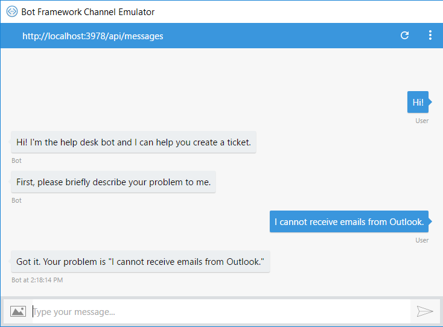
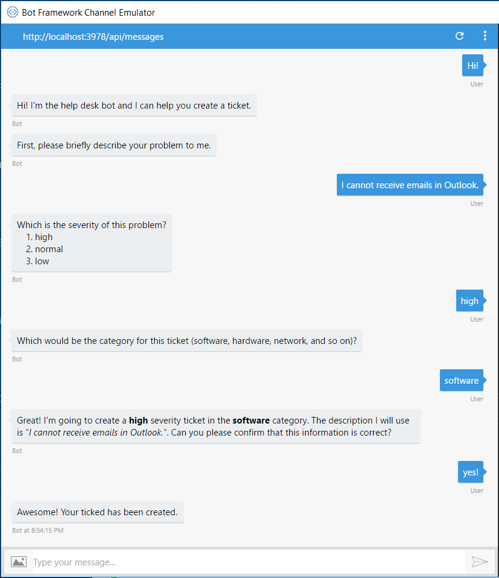
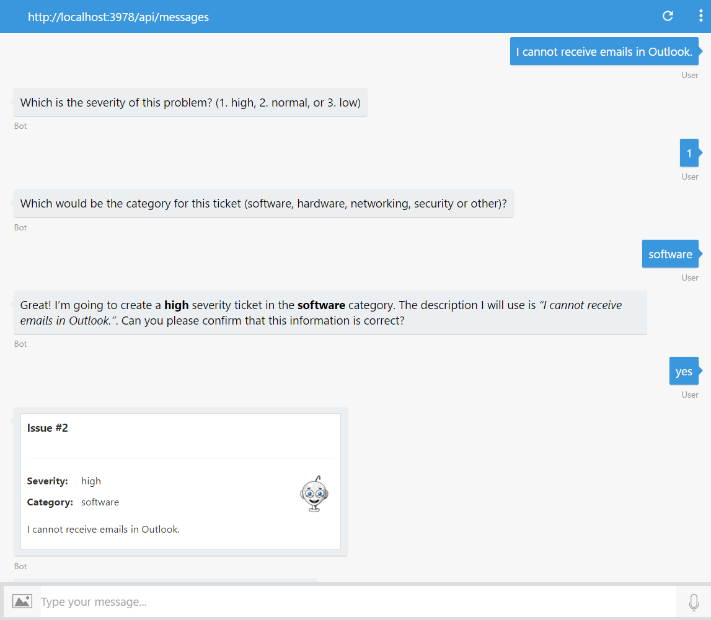

# 演習 2: ボットによるヘルプ デスク チケットの送信 (Node.js)

## 概要

この演習では、ボットに会話機能を追加して、ヘルプ デスク
チケットの作成をユーザーに案内する方法を学習します。

[こちらのフォルダー](./exercise2-TicketSubmissionDialog)内には、この演習のステップの完了結果として得られるコードを含むソリューションが入っています。このソリューションは、演習を進めるにあたってさらにヒントが必要な場合に、ガイダンスとして使用できます。ソリューションを使用するには、まず必ず
npm install を実行してください。

## 前提条件

この演習を完了するには、以下のソフトウェアが必要です。

-   [最新の Node.js と NPM](https://nodejs.org/en/download)

-   [Visual Studio Code](https://code.visualstudio.com/download) (推奨) や
    Visual Studio 2017 Community 以上などのコード エディター

-   [Bot Framework Emulator](https://emulator.botframework.com/) (en-US
    ロケールで構成されていることを確認してください)

## ラボ ノート

サーバーとボットのコードが混在することで、app.js
が多少長くなることに気づくかもしれません。これは、わかりやすくラボを進めるためのものです。より複雑なボットでは、通常、複数のファイルにボットを分割することになります。
f
## タスク 1: ボットへの会話の追加

このタスクでは、ボットを変更して、いくつかアクションを実行する前に、ユーザーに一連の質問をします。

1.  前の演習から得られた app.js
    ファイルを開きます。または、[exercise1-EchoBot](./exercise1-EchoBot)
    フォルダーからこのファイルを開くこともできます。

2.  以下のように、UniversalBot
    コネクターを作成するコードを更新します。ボットのメッセージ
    ハンドラーが、単一の関数ではなく、ウォーターフォールと呼ばれる関数の配列となっていることに気づくでしょう。ユーザーがこのボットにメッセージを送信すると、ウォーターフォールの最初の関数が呼び出されます。これはユーザーへのあいさつで、text()
    を使用して、まず、問題について説明することを求めます。SDK
    では、ユーザーからの入力の収集を簡単にするためのビルトイン
    プロンプトのセットを提供しています。
    
    ユーザーの応答が、ウォーターフォールの 2 番目の関数に渡されます。この関数では、説明の内容を確認します。このカスケード形式の質問/応答シーケンスから、ウォーターフォールという名前が付いています。
    
    また、応答はダイアログ データに保持されます。ダイアログ データは、1 つのダイアログ インスタンスの情報の保持に使用されます。これは、ダイアログのウォーターフォールのステップ間で一時情報を保存するために重要です。

    ``` javascript
    var bot = new builder.UniversalBot(connector, [
        (session, args, next) => {
            session.send('Hi! I\'m the help desk bot and I can help you create a ticket.');
            builder.Prompts.text(session, 'First, please briefly describe your problem to me.');
        },
        (session, result, next) => {
            session.dialogData.description = result.response;
            session.send(`Got it. Your problem is "${session.dialogData.description}"`);
            session.endDialog();
        }
    ]);
    ```

3.  コンソール (nodemon app.js)
    からアプリを実行し、エミュレーターを開きます。いつもどおりにボットの URL
    を入力し (http://localhost:3978/api/messages)、ボットをテストします。

   

4.  コンソール ウィンドウでも、メッセージ ハンドラーが 1
    つずつ実行される様子を確認できます。

   

## タスク 2: チケット詳細のプロンプト

このタスクでは、さらに多くのメッセージ ハンドラーをボット
ウォーターフォールに追加して、チケットのすべての詳細について尋ねます。

1.  以下のように、UniversalBot
    コネクターを作成するコードを更新します。これにより、2
    種類のプロンプトが導入されます。

    -   Prompts.choice(): チケットの重要度について尋ねます。
    -   Prompts.confirm(): チケットの情報が正しいことを確認します。

    ```javascript
    var bot = new builder.UniversalBot(connector, [
        (session, args, next) => {
            session.send('Hi! I\'m the help desk bot and I can help you create a ticket.');
            builder.Prompts.text(session, 'First, please briefly describe your problem to me.');
        },
        (session, result, next) => {
            session.dialogData.description = result.response;

            var choices = ['high', 'normal', 'low'];
            builder.Prompts.choice(session, 'Which is the severity of this problem?', choices, { listStyle: builder.ListStyle.button });
        },
        (session, result, next) => {
            session.dialogData.severity = result.response.entity;

            builder.Prompts.text(session, 'Which would be the category for this ticket (software, hardware, networking, security or other)?');
        },
        (session, result, next) => {
            session.dialogData.category = result.response;

            var message = `Great! I'm going to create a "${session.dialogData.severity}" severity ticket in the "${session.dialogData.category}" category. ` +
                      `The description I will use is "${session.dialogData.description}". Can you please confirm that this information is correct?`;

            builder.Prompts.confirm(session, message, { listStyle: builder.ListStyle.button });
        },
        (session, result, next) => {
            if (result.response) {
                session.send('Awesome! Your ticked has been created.');
                session.endDialog();
            } else {
                session.endDialog('Ok. The ticket was not created. You can start again if you want.');
            }
        }
    ]);
    ```

>   **注:** Markdown 構文を使用して、よりリッチなテキスト メッセージを作成できることに注意してください。ただし、すべてのチャネルで Markdown がサポートされるわけではないので、注意することが重要です。

2.  アプリを再実行して、エミュレーターの [Start new conversation] ボタン  を使用します。新しい会話をテストします。

   

   この時点で再度ボットに話しかけると、ウォーターフォールが最初から開始されます。

## タスク 3: 外部 API を呼び出してチケットを保存

この時点で、チケットのすべての情報が取得されましたが、この情報はウォーターフォールが終了すると破棄されます。今度は、外部
API
を使用して、チケットを作成するコードを追加します。わかりやすくするため、チケットをインメモリ
アレイに保存する単純なエンドポイントを使用します。実稼働環境では、ボットのコードからアクセスできる任意の
API を使用できます。

> **注:** ボットについての重要事項として、構築するほとんどのボットが既存の API のフロント エンドとなるということに留意してください。単純に言えば、ボットはアプリであり、人工知能 (AI)、機械学習 (ML)、または自然言語処理 (NLP) がなくてもボットとみなされます。

1.  アプリのルート フォルダーで新しい **ticketsApi.js**
    ファイルを作成し、以下のコードを追加します。

    ``` javascript
    var tickets = [];
    var lastTicketId = 1;

    module.exports = (req, res) => {
        console.log('Ticket received: ', req.body);
        let ticketId = lastTicketId++;
        var ticket = req.body;
        ticket.id = ticketId;
        tickets.push(ticket);

        res.send(ticketId.toString());
    };
    ```

## タスク 4: サーバーを更新して API をホスト

以下のステップでは、app.js
のコードをクリーンアップして、サービスの追加のサポートを向上させます。さらに、Restify
を更新して API と併用できるようにします。

1.  app.js ファイルの冒頭に、以下の require ステートメントを追加します。

    ```javascript
    const ticketsApi = require('./ticketsApi');
    ```

2.  listenPort 定数を追加します。

    ```javascript
    const listenPort = process.env.port || process.env.PORT || 3978;
    ```
    
3.  ticketSubmissionUrl 定数を追加します。

    ```javascript
    const ticketSubmissionUrl = process.env.TICKET_SUBMISSION_URL || `http://localhost:${listenPort}`;
    ```

4.  以下に示すように、server.listen() を更新します。

    ```javascript
    server.listen(listenPort, '::', () => {
        console.log('Server Up');
    });
    ```

5.  bodyParser を追加します。これにより、以下に示すように、API
    でメッセージ本文とチケット API を読み取れるようになります。

    ```javascript
    // Setup body parser and tickets api
    server.use(restify.bodyParser());
    server.post('/api/tickets', ticketsApi);
    ```

6.  **最後のメッセージ
    ハンドラー**のコードを、以下のコードに置き換えます。このコードでは、dialogData
    をチケット API に送信します。

    ```javascript
    // --- existing code here ---
    (session, result, next) => {
        if (result.response) {
            var data = {
                category: session.dialogData.category,
                severity: session.dialogData.severity,
                description: session.dialogData.description,
            }

            const client = restify.createJsonClient({ url: ticketSubmissionUrl });

            client.post('/api/tickets', data, (err, request, response, ticketId) => {
                if (err || ticketId == -1) {
                    session.send('Something went wrong while I was saving your ticket. Please try again later.')
                } else {
                    session.send(`Awesome! Your ticked has been created with the number ${ticketId}.`);
                }

                session.endDialog();
            });
        } else {
            session.endDialog('Ok. The ticket was not created. You can start again if you want.');
        }
    }
    ```

7.  ファイルを保存して、エミュレーターの [Start new conversation] ボタン  をクリックします。すべての会話を再度テストして、API からチケット ID が返されることを確認します。

   

## タスク 5: 通知メッセージを変更してアダプティブ カードを表示

このタスクでは、チケットで[アダプティブ
カード](http://adaptivecards.io/)を使用した後、ユーザーに表示される確認メッセージを向上させます。アダプティブ
カードとは、開発者が一定の共通方式で UI
コンテンツをやり取りできるようにするための、オープン
ソースのカード交換フォーマットです。アダプティブ カードのコンテンツは、JSON
オブジェクトとして指定できます。コンテンツはホスト アプリケーション (Bot
Framework チャネル)
内でネイティブにレンダリングでき、ホストの外観に自動的に適合します。

カードを簡単に作成するため、カードの JSON は
[ticket.json](../assets/exercise2-TicketSubmissionDialog/ticket.json)
ファイルに既に用意されています。通常は、コンテンツに対して構造が既に作成されており、ランタイムに動的に追加します。ticket.json
を探す際は、{ticketId}、{severity}、{category}、および {description}
のプレースホルダーに注意します。オブジェクト内でこれらの文字列を探し、適切な値を指定して更新します。

1.  アプリのルート フォルダーで、**cards**
    という名前のフォルダーを作成します。この新しいフォルダーで、このハンズオン
    ラボのルートにある
    [assets/exercise2](../assets/exercise2-TicketSubmissionDialog)
    フォルダーから **ticket.json** ファイルをコピーします。

2.  前のタスクで得られた app.js ファイルを開きます。require
    セクションで、読み取りを行う fs
    モジュールを以下のようにファイルに追加します。

    ```javascript
    const fs = require('fs');
    ```

3.  ファイルの末尾に createCard 関数を追加します。この関数は、JSON
    ファイルのコンテンツを返し、プレースホルダーをパラメーターで置き換えます。


    ```javascript
    const createCard = (ticketId, data) => {
        var cardTxt = fs.readFileSync('./cards/ticket.json', 'UTF-8');

        cardTxt = cardTxt.replace(/{ticketId}/g, ticketId)
                        .replace(/{severity}/g, data.severity)
                        .replace(/{category}/g, data.category)
                        .replace(/{description}/g, data.description);

        return JSON.parse(cardTxt);
    };
    ```

4.  ウォーターフォールの最後のステップを探し、次の行を置き換えます。

    ```javascript
    session.send(`Awesome! Your ticked has been created with the number ${ticketId}.`);
    ```

   次の行で置き換えます。

    ```javascript
    session.send(new builder.Message(session).addAttachment({
        contentType: "application/vnd.microsoft.card.adaptive",
        content: createCard(ticketId, data)
    }));
    ```

5.  ファイルを保存して、エミュレーターの [Start new conversation] ボタンを使用します 。新しい会話をテストします。確認メッセージについては、以下を参照してください。

   

## その他の課題

自主的に学習を続ける場合は、次のタスクを利用できます。

-   conversationUpdate イベントを使用してボットにウェルカム
    メッセージを送信します。詳細は、[こちら](https://docs.microsoft.com/en-us/bot-framework/nodejs/bot-builder-nodejs-handle-conversation-events#greet-a-user-on-conversation-join)を参照してください。

-   ボットがチケット API を呼び出す間、ボットにタイピング
    インジケーターを送信します。詳細は、[こちら](https://docs.microsoft.com/en-us/bot-framework/nodejs/bot-builder-nodejs-send-typing-indicator)を参照してください。
