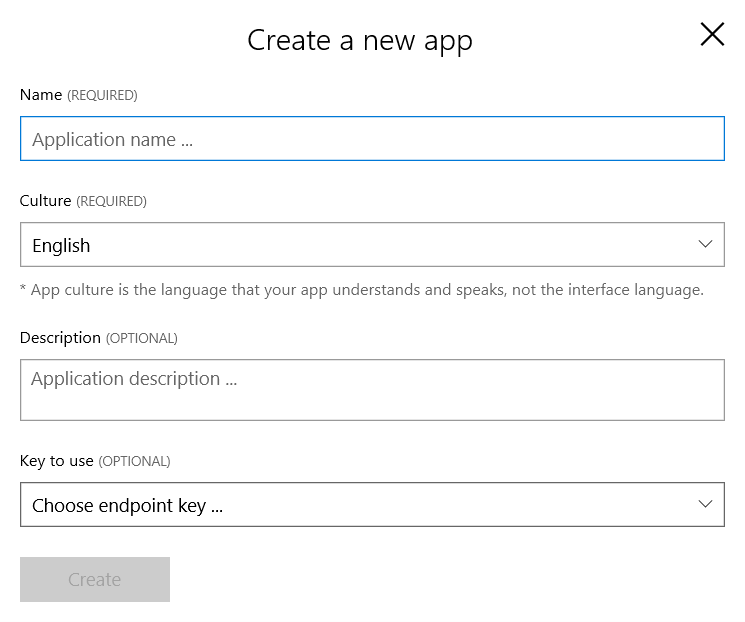
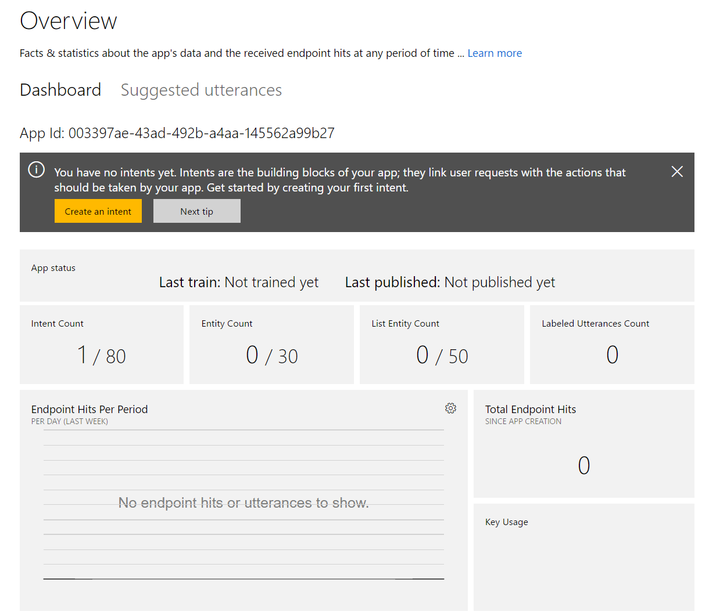
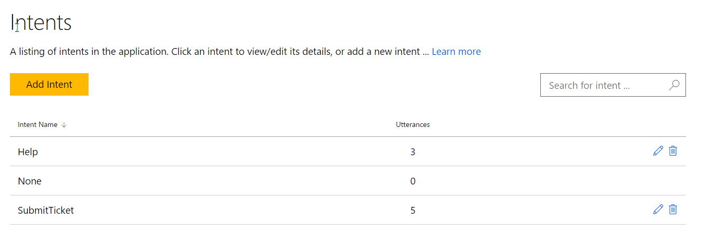
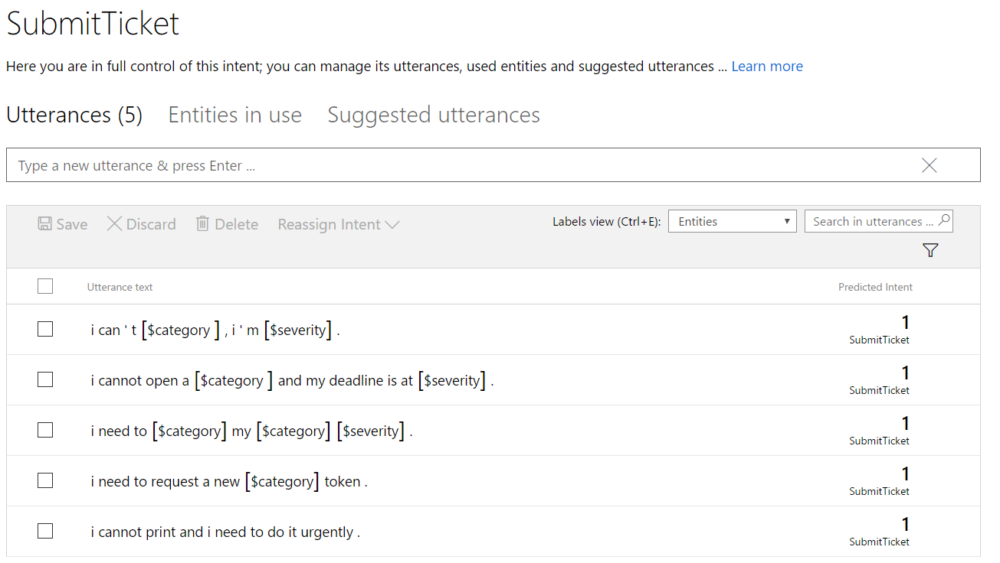
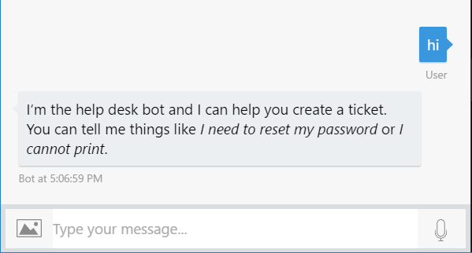
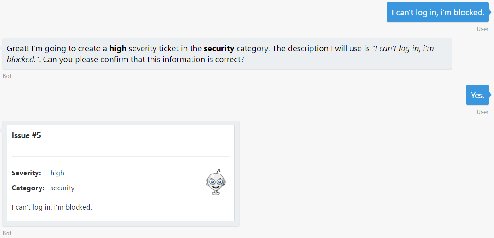
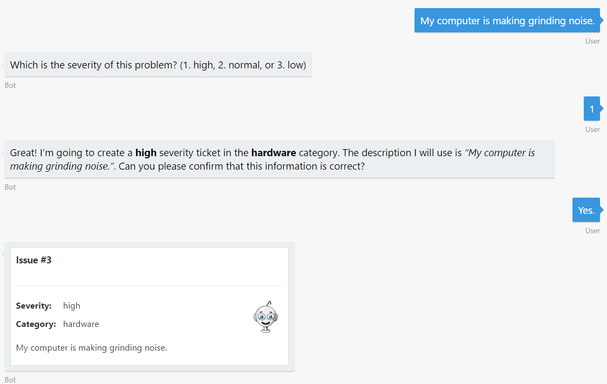

# 演習 3: 言語理解の機能によるボットのスマート化 (Node.js)

## 概要

人間とコンピューターとの対話式操作における大きな問題の 1 つに人間が何を欲しているかをコンピューターが理解する能力があります。LUIS は、人間の言語を理解することにより、ユーザーの要求に応じることができるスマートアプリケーションを開発者が構築できるように設計されています。

この演習では、ヘルプ デスクボットに自然言語理解機能を追加して、ユーザーがチケットを容易に作成できるようにする方法を学習します。そのためには、Azure Cognitive Services の一部である LUIS (Language Understanding Intelligent Service) を使用します。これはボットがコマンドを理解して行動できるようにさせるための言語モデルを、開発者が構築できるようにします。たとえば、前の演習ではユーザーが重大度とカテゴリを入力する必要がありました。今回は、ユーザーのメッセージから両方の "エンティティ" が認識されるようにします。

[こちらのフォルダー](./exercise3-LuisDialog)内には、この演習のステップの完了結果として得られるコードを含むソリューションが入っています。このソリューションは、演習を進めるにあたってさらにヒントが必要な場合に、ガイダンスとして使用できます。これを使用するには、まず `npm install` を実行して、`.env` ファイルに LUIS モデルの値を入力しておく必要があることを忘れないでください。

## 前提条件

この演習を完了するには、以下のソフトウェアが必要です。

-   [最新の Node.js と NPM](https://nodejs.org/en/download)

-   [Visual Studio Code](https://code.visualstudio.com/download) (推奨) や Visual Studio 2017 Community 以上などのコード エディター

-   [Azure](https://azureinfo.microsoft.com/us-freetrial.html?cr_cc=200744395&wt.mc_id=usdx_evan_events_reg_dev_0_iottour_0_0) サブスクリプション

-   [Bot Framework Emulator](https://emulator.botframework.com/) (en-US ロケールで構成されていることを確認します)

-   [LUIS ポータル](https://www.luis.ai/)のアカウント

## タスク 1: LUIS アプリを作成する

このタスクでは、LUIS ポータルでアプリを作成します。

**注:** 既に LUIS に習熟している場合は、この演習の [assets](../assets/exercise3-LuisDialog)フォルダーにあるファイル `luis_model.json` を各自のアカウントにインポートして、モデルをトレーニングおよび発行し、タスク 4 に進むことができます。しかし、LUIS の初心者である場合は、学習のためにモデルを最初から作成することをお勧めします。

1.  [LUIS ポータル](https://www.luis.ai/)に移動してサインインします。[My apps] タブを開きます。

2.  [New App] をクリックします。ダイアログ ボックスにアプリケーションの **名前** (たとえば、「HelpDeskBot」) を入力します。まだ選択されていない場合は、[Culture] で [English] を選択します。

>   

1.  [Key to use] を選択します。まだ何も選択していない場合は、既定として BoostrapKey が作成されます。

2.  [Create] をクリックします。空の LUIS アプリ ダッシュボードが表示されます。

>   

## タスク 2: LUIS に新しいエンティティを追加する

このタスクでは、LUIS アプリにエンティティを追加します。これによって、ボットはチケットのカテゴリと重大度を、ユーザーが入力した問題の説明から理解できるようになります。エンティティはアプリケーションのドメインの「名前」です。エンティティは、類似のオブジェクト (場所、もの、人間、イベントまたは概念) の集合を含むクラスを表します。

このラボでは、List エンティティ タイプを使用します。これにより、一般に "クローズド リスト" と呼ばれるものを作成できます。これは、用語に **機械学習を適用せず** 、直接一致を使用することを意味します。用語の正規化の試行時、または一定のキーワードが常にエンティティとしてピックアップされることを保証する場合に非常に有益です。

1.  LUIS ポータルの左パネルで [Entities] をクリックします。

2.  [Add custom entity] をクリックします。

3.  表示されたダイアログで [Entity name] に「category」と入力します。[Entity type] には "List" を選択します。[Save] をクリックします。

>   

1.  新しいページが表示され、そのページで使用可能な値を追加できます。この処理をスピードアップするには、[Import Lists] リンクをクリックします。

2.  このハンズオンラボのルートにある [assets](../assets) フォルダーで categories.json ファイルを探します。有効化したら、[Import]
    をクリックします。

3.  "severity" という名前の新しいエンティティでもこの処理を繰り返します、同じ場所にある `severities.json` という名前のファイルを使用して読み込みます。

>   

1.  次に、左パネルの [Train & Test] をクリックします。

2.  [Train Application] をクリックして、完了するまで数秒間待ちます。現在のモデルを更新する際はいつでも、アプリをトレーニングしてからテスト/発行する必要があります。

## タスク 3: インテントおよび発話を追加する

インテントは発話 (文) を通じて伝達される意図または望まれるアクションです。インテントは、ボットにアクションを実行させることでユーザーの要求に応じます。このため、ボットがユーザーの要求を理解し、適切に対応できるようにインテントを追加する必要があります。エンティティが名詞であるとすると、インテントは動詞に相当します。

発話は、ボットに受信/解釈させるためのユーザークエリやコマンドのサンプルを表す文です。ボット内の各インテントに、サンプルの発話を追加する必要があります。LUIS がこれらの発話から学習すると、ボットでは同様のコンテキストの一般化および理解が可能になります。発話を継続的に追加して、ラベル付けすることで、ボットの言語学習エクスペリエンスが向上します。

インテントの詳細については、[こちら](https://docs.microsoft.com/en-us/azure/cognitive-services/LUIS/add-intents) を、発話については[こちら](https://docs.microsoft.com/en-us/azure/cognitive-services/LUIS/add-example-utterances) を参照してください。

1.  LUIS ポータルの左パネルで [Intents] をクリックします。既に "None" インテントが存在することがわかります。

2.  [Add Intent] をクリックすると、ポップアップが表示されます。[Intent name] に「SubmitTicket」と入力して、[Save] をクリックします。

3.  次は、テキスト ボックスに次の発話を追加します。1 つ入力するごとに Enter キーを押します。ユーザーがこれらの文または類似の文を入力すると、LUIS アプリはユーザーがチケットを送信しようとしていると想定します。Bot Framework 言語ではこれを "インテント" と呼びます。

    -   I can't log in, I'm blocked.
        (ログインできません。ブロックされています。)

    -   I cannot print and I need to do it urgently.
        (印刷できません、すぐに印刷する必要があります。)

    -   I need to request a new RAS token. (新しい RAS
        トークンを要求する必要があります。)

    -   I need to reset my password ASAP.
        (即座にパスワードをリセットする必要があります。)

    -   I cannot open a web page and my deadline is at risk. (Web
        ページが開けません、期限が迫っています。)

>   **注:** 発話は必要なだけ追加できます。追加する発話が多いほど、アプリがユーザーのインテントを認識する能力が高まります。ここで使用する例の場合、非常に多様な発話 (ハードウェアの問題もあれば、ソフトウェアの問題もあります) が SubmitTicket を起動する可能性があるため、ボットを実稼働に向けてリリースする前に大量の発話でボットをトレーニングすることが理想です。

1.  [Save] () をクリックします。

2.  前述の手順を使用して、発話を "help"、"hi"、"hello" として新しい Help インテントを追加します。

   

>   **注:** 他のインテントと異なる場合でも、"None" インテントに発話をいくつか追加することをお勧めします。トレーニング サンプルを指定しても、"None" インテントを起動するテキストに制約はかかりませんが、他のインテントの起動精度の向上に役立ちます。

1.  前述の説明に従って、アプリを再度トレーニングします。

2.  [Intents] メニューを開き、[SubmitTicket] インテントをクリックします。発話がエンティティ値によって認識されることを確認します。

   

1.  次に、LUIS アプリを発行してボットから使用できるようにします。左側のメニューの [Publish App] をクリックします。

2.  [Endpoint key] が選択されていることを確認します。既定の [Production] スロットはそのままにします。

3.  [Publish] ボタンをクリックします。新しい確認メッセージの表示後に LUIS アプリが発行されます。後で使用できるように、生成された Endpoint url をコピーして保存します。  
LUIS アプリの出力が、HTTP エンドポイント (自然言語の理解を追加する際にボットから参照する) が設定された Web サービスであることがわかります。

>   **注:** BoostrapKey は 1 か月あたり 1,000 のトランザクションが存在します。

## タスク 4: LUIS を使用するようにボットを構成する

このタスクでは、ボット コードを更新して、前の手順で作成した LUIS アプリを使用するようにします。

1.  前の演習から得られた `app.js` ファイルを開きます。または、[exercise2-TicketSubmissionDialog](./exercise2-TicketSubmissionDialog) フォルダーから このファイルを開くこともできます。

2.  次の行を追加して `.env` ファイルを更新し、LUIS_MODEL_URL キーに前のタスクから得られた値を設定します。

```javascript
    LUIS_MODEL_URL=
```

1.  ボット初期化後に次の行を追加して、ボットに LuisRecognizer を追加します (`new builder.UniversalBot(...)`)。標準の Bot Builder SDK には、LUISRecognizer クラスが含まれ、LUIS ポータルを使用してトレーニングした機械学習モデルの呼び出しに使用できます。このクラスには、onEnabled
    という名前の関数が存在し、条件に応じて認識エンジンの有効/無効を切り替えることができます。これは、ボットがユーザーに確認を行い、応答を待っている場合など、LUIS 抽出インテントおよびエンティティの必要がないことがわかっている場合に有益です。`onEnabled` 関数の詳細については、[こちら](https://docs.botframework.com/en-us/node/builder/chat-reference/classes/_botbuilder_d_.intentrecognizer.html#onenabled) で確認できます。また、[onFilter](https://docs.botframework.com/en-us/node/builder/chat-reference/classes/_botbuilder_d_.intentrecognizer.html#onfilter) 関数を使用して、認識エンジンからの出力のフィルタリングをすることもできます。

```javascript
    var luisRecognizer = new builder.LuisRecognizer(process.env.LUIS_MODEL_URL).onEnabled(function(context, callback) {
        var enabled = context.dialogStack().length === 0;
        callback(null, enabled);
    });
    bot.recognizer(luisRecognizer);
```

>   **注:** インテント認識エンジンは、ユーザーの入力に基づいてユーザーのインテントを解釈します。インテントが判別されると、認識エンジンは、名前付きインテントを返し、これを使用してボット内の追加のアクションおよびダイアログを起動できます。認識エンジンは、ユーザーから受け取ったすべてのメッセージに対して実行されることを覚えておいてください。

## タスク 5: LUIS を使用するようにボットを更新する

次に、演習 2 のウォーターフォール ステップをリファクタリングして、LUIS インテントによって起動される新しいダイアログにします。ダイアログを使用すると、ボットの会話ロジックを管理可能なコンポーネントにカプセル化できます。ダイアログは、別のダイアログで構成して再利用を最大化することができ、ダイアログのコンテキストは、任意の時点の会話でアクティブなダイアログのスタックを維持します。ダイアログで構成される会話はコンピューター間で移植可能であるため、ボットの実装の規模の調整が可能になります。

1.  名前を `SubmitTicket` として新しい空のダイアログを登録します。ボットの初期化と同様に、ダイアログを既存のウォーターフォールに渡すことができます。ウォーターフォール ステップを進んでいきます。ここでボットは重大度、カテゴリを要求し、入力データを確認し、チケット API をヒットする最後のステップへ移動します。次のようなコードを設定する必要があります。

```javascript
    bot.dialog('SubmitTicket', [
        ...
    ])
    .triggerAction({
        matches: 'SubmitTicket'
    });
```

>   **注:** matches 値が LUIS アプリのインテント名と一致していることを確認します。

1.  UniversalBot 初期化からのすべてのウォーターフォール ステップを、新しい `SubmitTicket` ダイアログに移動します。コードを次のコードに置き換えます。

```javascript
    var bot = new builder.UniversalBot(connector, (session) => {
        session.endDialog(`I'm sorry, I did not understand '${session.message.text}'.\nType 'help' to know more about me :)`);
    });
```    

1.  次に LUIS から category と severity のエンティティ値を取得し、dialogData に保存して、後で使用できるようにします。最後に、重大度が既に保存されている場合は次のステップを呼び出し、保存されていない場合はユーザーにいずれかを選択するように要求します。そのためには、最初のウォーターフォール ステップを次のコードに置き換えます。

```javascript
    ...
    (session, args, next) => {
        var category = builder.EntityRecognizer.findEntity(args.intent.entities, 'category');
        var severity = builder.EntityRecognizer.findEntity(args.intent.entities, 'severity');
        
        if (category && category.resolution.values.length > 0) {
            session.dialogData.category = category.resolution.values[0];
        }
        
        if (severity && severity.resolution.values.length > 0) {
            session.dialogData.severity = severity.resolution.values[0];
        }
        
        session.dialogData.description = session.message.text;
        
        if (!session.dialogData.severity) {
            var choices = ['high', 'normal', 'low'];
            builder.Prompts.choice(session, 'Which is the severity of this problem?', choices);
        } else {
            next();
        }
    },
    ...
```

1.  コードを更新して、チケットの重大度を受け取り、保存します。カテゴリを既に把握している場合は、次のステップが呼び出され、まだ把握していない場合は、ボットからユーザーに入力を求めます。このためには、2 番目と 3 番目のウォーターフォール ステップを次のコードに置き換えます。4 番目と 5 番目のウォーターフォール ステップは変更しないでおきます。

```javascript
    ...
    (session, result, next) => {
        if (!session.dialogData.severity) {
            session.dialogData.severity = result.response.entity;
        }

        if (!session.dialogData.category) {
            builder.Prompts.text(session, 'Which would be the category for this ticket (software, hardware, network, and so on)?');
        } else {
            next();
        }
    },
    ...
```

1.  新しい 3 番目のウォーターフォール (以前は 4 番目) で、if ステートメントを次のように更新します。

```javascript
    ...
    (session, result, next) => {
        if (!session.dialogData.category) {
            session.dialogData.category = result.response;
        }
        
        var message = `Great! I'm going to create a "${session.dialogData.severity}" severity ticket in the "${session.dialogData.category}" category. ` + `The description I will use is "${session.dialogData.description}". Can you please confirm that this information is correct?`;

        builder.Prompts.confirm(session, message);
    },
    ...
```

1.  最後に、ユーザーが「help」または「hi」を入力したときに実行される新しいヘルプ ダイアログを作成します。

```javascript
    bot.dialog('Help',
        (session, args, next) => {
            session.endDialog(`I'm the help desk bot and I can help you create a ticket.\n` + `You can tell me things like _I need to reset my password_ or _I cannot print_.`);
        }
    ).triggerAction({
        matches: 'Help'
    });
```

## タスク 6: エミュレーターからボットをテストする

1.  コンソール (`nodemon app.js`) からアプリを実行し、エミュレーターを開きます。ボットの URL (`http://localhost:3978/api/messages`) をいつもどおり入力します。

2.  「hi」と入力します。Help インテントがどのように認識され、実行されるかがわかります。

    

1.  ボットのトレーニングに使用した発話のいずれかを入力します。たとえば「I can't log in, I'm blocked」と入力します。ユーザーのメッセージから、チケットのカテゴリおよび重大度が自動的に把握されます。「yes」と入力して、チケットを保存します。

    

1.  次に、ボットのトレーニングに使用されていない発話を入力してみます。例: My computer is making a grinding noise. (コンピューターが摩擦音を立てています) 重大度は把握されていませんが、エンティティ computer が存在するためカテゴリは把握されています。

    

1.  LUIS が認識できない発話を入力すると、LUIS は None インテントを返し、ボット フレームワークは既定のダイアログ ハンドラーを実行します。

   

   アプリケーションを展開し、システムにトラフィックの流入が開始すると、LUIS はアクティブ ラーニングを使用して、自己改善します。アクティブ ラーニングプロセスで、LUIS はあまり確信できない発話を特定して、インテントまたはエンティティに従ってその発話にラベル付けすることを求めます。LUIS ポータルのインテント内には [Suggested Utterances] セクションが存在し、そこではラベル付けを実行できます。

    

## その他の課題

自主的に学習を続ける場合は、次のタスクを利用できます。

-   `cancelAction` を使用して `SubmitTicket` ダイアログにキャンセル イベント ハンドラーを追加する。

-   `beginDialogAction` を使用して `SubmitTicket` 内でユーザーにヘルプを提供するためのカスタム ダイアログを追加する。

-   `onEnabled` イベントを使用して、cancel が呼び出されない限り、開始された `SubmitDialog` が完了することを保証する。

-   チケットのステータスをボットに要求する機能を追加する。チケットにステータス プロパティを追加し、新しいダイアログを起動する LUIS アプリの新しいインテントを追加する必要があります。

## 追加参考資料

-   [Manage conversation flow](https://docs.microsoft.com/en-us/bot-framework/nodejs/bot-builder-nodejs-dialog-manage-conversation)

-   [Managing conversations and dialogs in Microsoft Bot Framework using Node.JS](http://blog.geektrainer.com/2017/02/21/Managing-conversations-and-dialogs-in-Microsoft-Bot-Framework-using-Node-JS/)
