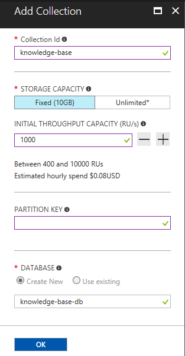
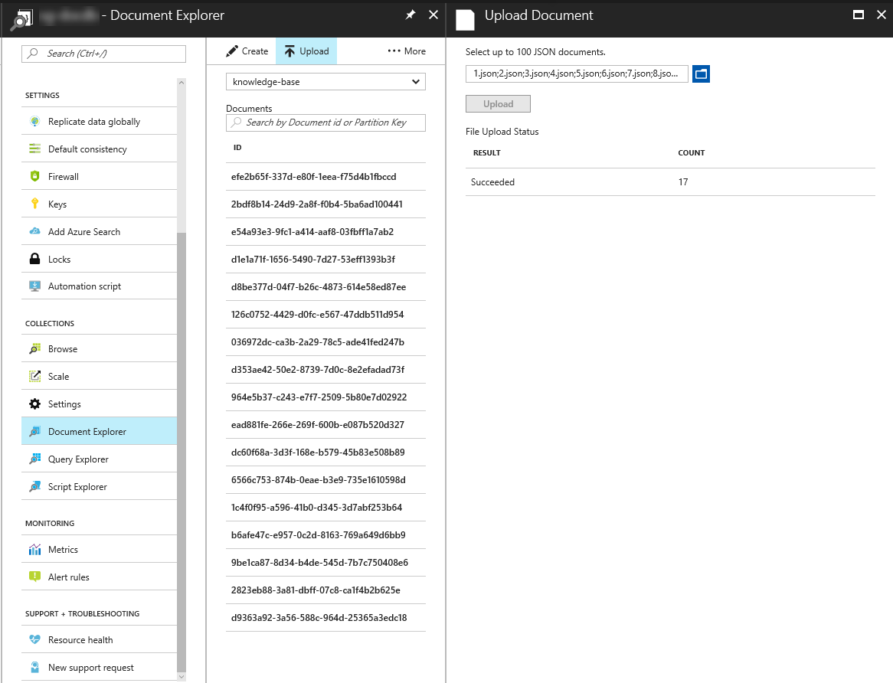
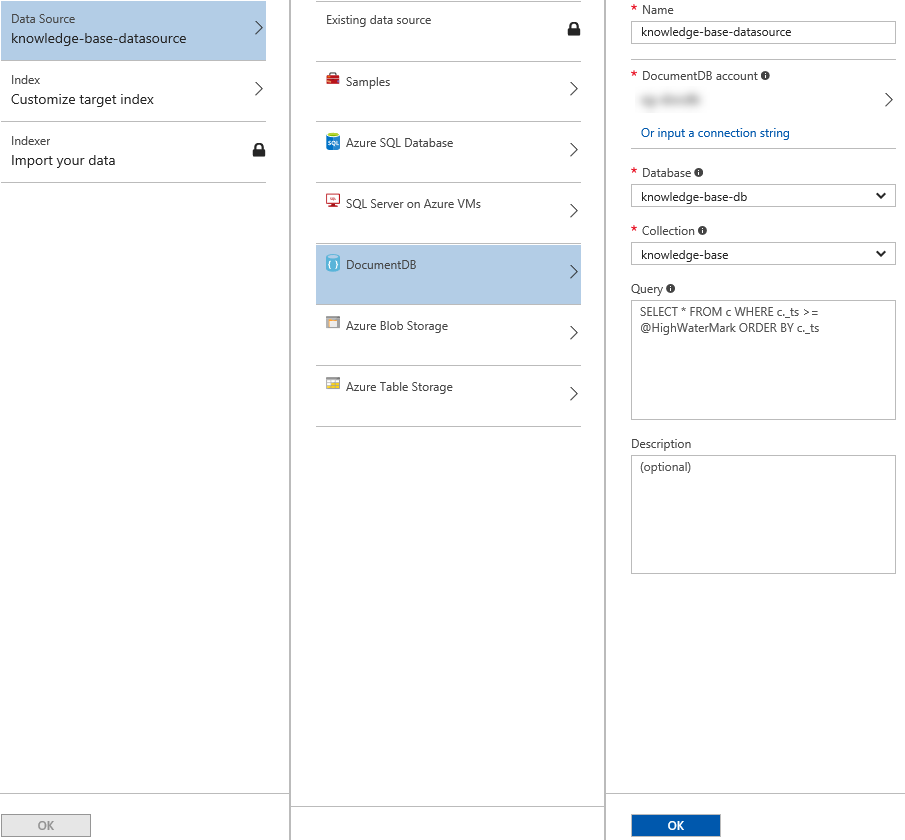
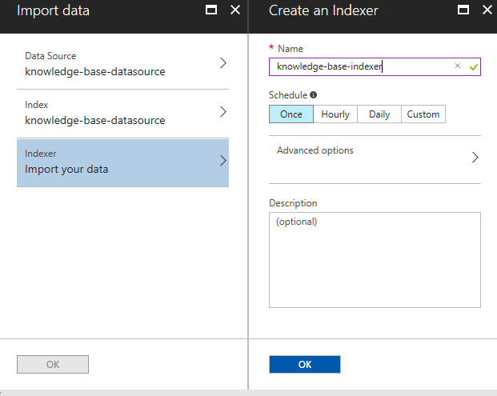
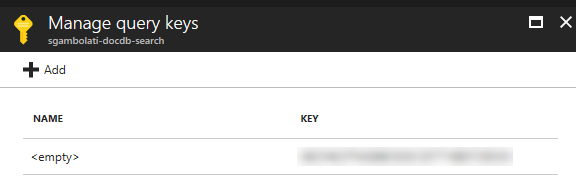
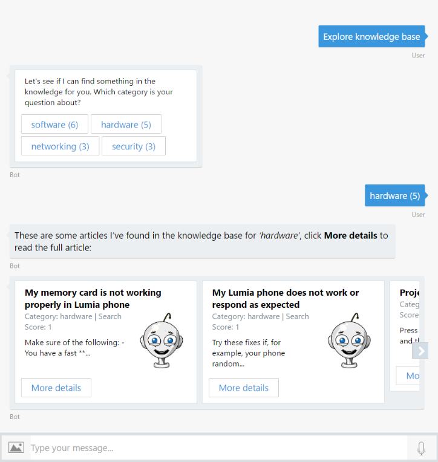
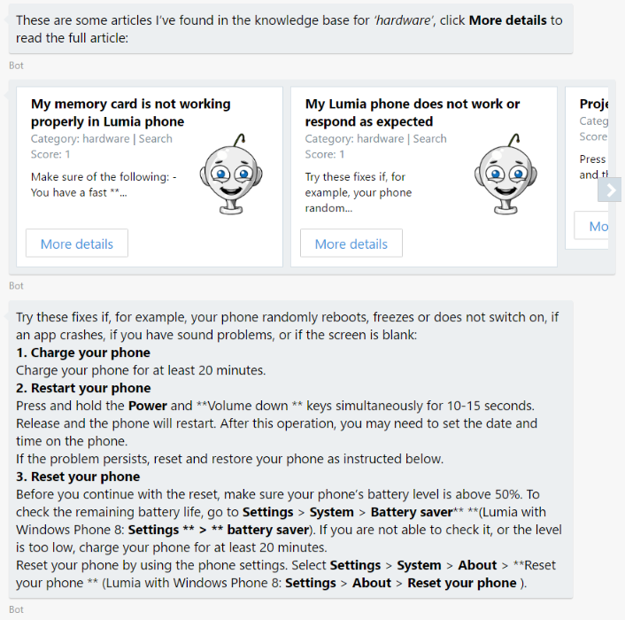
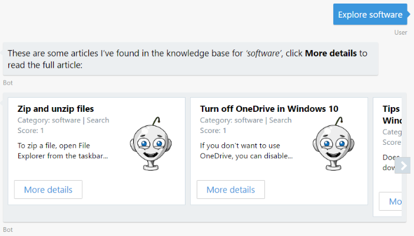
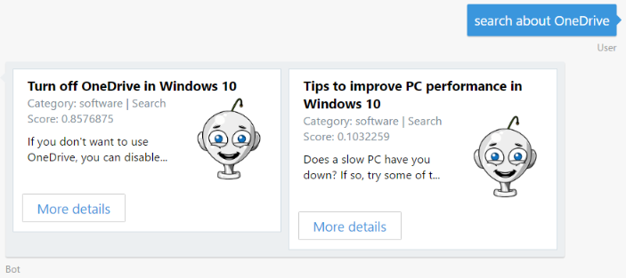

# 演習 4: Azure Search と Cosmos DB によるヘルプ デスク ナレッジ ベースの実装 (Node.js)

## 概要

ボットは、ユーザーが大量のコンテンツをナビゲートする支援を行い、ユーザーのためにデータ駆動型の検索エクスペリエンスを実現することもできます。この演習では、検索機能をボットに追加し、ユーザーがナレッジ
ベースを検索する支援を行う方法について学習します。これを行うには、Azure Cosmos
DB に保管されている KB の記事のインデックスを作成する Azure Search
サービスにボットを接続します。

[Azure Cosmos DB](https://azure.microsoft.com/en-us/services/cosmos-db/)
は、マイクロソフトが提供する、ミッション
クリティカルなアプリケーション向けのグローバル分散型マルチ モデル データベース
サービスです。Azure Cosmos DB は、さまざまなデータ
モデルをサポートします。この演習では、Azure Cosmos DB の DocumentDB API
を使用します。これを使用することで、ナレッジ ベースの記事を JSON
ドキュメントとして保管できます。

[Azure Search](https://azure.microsoft.com/en-us/services/search/) は、カスタム
アプリケーションで充実した検索エクスペリエンスを実現する完全管理型のクラウド検索サービスです。Azure
Search は、さまざまなソース (Azure SQL DB、Cosmos DB、BLOB ストレージ、テーブル
ストレージ) のコンテンツのインデックスを作成でき、その他のデータ
ソースに対応する「プッシュ型」のインデックス作成をサポートします。また、PDF、Office
ドキュメント、および非構造化データが含まれるその他の形式のドキュメントを開くことができます。コンテンツ
カタログが Azure Search
インデックスに取り込まれることで、ボットのダイアログからクエリを行えるようになります。

次の図は、コンポーネントどうしがどのようなやりとりをするかを示したものです。

**注:** このラボでは Azure Search と Azure Cosmos DB
を使用しますが、どの検索エンジンおよびバッキング
ストアを使用してももちろんかまいません。

[こちらのフォルダー](./exercise4-KnowledgeBase)内には、この演習のステップの完了結果として得られるコードを含むソリューションが入っています。このソリューションは、演習を進めるにあたってさらにヒントが必要な場合に、ガイダンスとして使用できます。これを使用には、まず
npm install を実行し、.env ファイルで LUIS モデルの値、および Azure Search
インデックスの名前とキーを指定しておく必要があることを覚えておいてください。

## 前提条件

この演習を完了するには、以下のソフトウェアが必要です。

-   [最新の Node.js と NPM](https://nodejs.org/en/download)

-   [Visual Studio Code](https://code.visualstudio.com/download) (推奨) や
    Visual Studio 2017 Community 以上などのコード エディター

-   [Azure](https://azureinfo.microsoft.com/us-freetrial.html?cr_cc=200744395&wt.mc_id=usdx_evan_events_reg_dev_0_iottour_0_0)
    サブスクリプション

-   [Bot Framework Emulator](https://emulator.botframework.com/) (en-US
    ロケールで構成されていることを確認してください)

-   [LUIS ポータル](https://www.luis.ai/)のアカウント

## タスク 1: Cosmos DB サービスを作成し、ナレッジ ベースをアップロードする

このタスクでは、Cosmos DB
データベースを作成し、ボットによって使用されるいくつかのドキュメントをアップロードします。Azure
Cosmos DB
の仕組みについてよくわからない場合は、[こちらのドキュメント](https://docs.microsoft.com/en-us/azure/cosmos-db/)を参照してください。

1.  [Azure
    ポータル](https://portal.azure.com/)にアクセスしてサインインします。左側のバーにある
    [新規] ボタン (

    

    ) をクリックし、次に [データベース] をクリックして、**Azure Cosmos DB**
    を選択します。

2.  ダイアログ ボックスで一意のアカウント ID (例: help-desk-bot) を入力し、[API]
    で **SQL (DocumentDB)** を選択します。新しいリソース
    グループ名を入力し、[作成] をクリックします。

>   

1.  展開が完了するまで待ちます。先ほど作成した Cosmos DB
    アカウントを開き、[概要] セクションに移動します。[コレクションの追加]
    ボタンをクリックします。ダイアログ ボックスの [コレクション ID]
    で「knowledge-base」と入力し、[ストレージ容量] で [Fixed]
    を選択して、データベース名として「knowledge-base-db」と入力します。[OK]
    をクリックします。

>   

1.  左側で [ドキュメント エクスプローラー] を選択し、次に [アップロード]
    ボタンをクリックします。

2.  開いたウィンドウで、[assets/kb](../assets/kb)
    フォルダーのファイルをすべて選択します。各ファイルは、ナレッジ ベースの 1
    つの記事に相当します。[アップロード]
    をクリックします。ブラウザーを閉じないでください。

>   

>   **注:** 記事の「ドキュメント」にはそれぞれ 3 つのフィールド
>   (タイトル、カテゴリ、およびテキスト) が含まれています。

## タスク 2: Azure Search サービスを作成する

このタスクでは、Cosmos DB
にアップロードされたコンテンツのインデックスを作成するための Azure Search
サービスを作成します。Azure Search
は、検索に最適化されたインデックス付きのデータのコピーを作成します。

1.  Azure ポータルの左側のバーにある [新規] ボタン (

    

    ) をクリックし、次に [Web + モバイル] をクリックして、**Azure Search**
    を選択し、[作成] ボタンをクリックします。一意の URL (例:
    help-desk-bot-search) を入力します。Cosmos DB で使用したものと同じリソース
    グループを選択します。[Price Tier] を [無料] に変更し、[作成]
    をクリックします。

>   

1.  サービスのプロビジョニング後、[概要] に移動してから [データのインポート]
    ボタン (

    

    ) をクリックします。

2.  [データに接続します] ボタン、[DocumentDB] の順にクリックします。データ
    ソース名として「knowledge-base-datasource」と入力します。先ほど作成した
    Cosmos DB のアカウント、データベース、およびコレクションを選択します。[OK]
    をクリックします。

>   

1.  [Index - Customize target index] ボタンをクリックします。[インデックス名]
    で「knowledge-base-index」と入力します。インデックスの定義が以下の図と一致するように各列のチェックボックスを更新します。[OK]
    をクリックします。

>   カテゴリ フィールドの [フィルター可能] と [ファセット可能]
>   にチェックマークが付いていることを確認します。これにより、カテゴリが一致するすべての記事を取得できると共に、各カテゴリの記事の数も取得できるようになります。これは、Azure
>   Search の専門用語で「ファセット ナビゲーション」と呼ばれます。ファセット
>   ナビゲーションは、ユーザーのガイドを支援する強力なボットのユーザー
>   エクスペリエンス ツールです。

>   

>   **注:**
>   インデックスの詳細については、[こちらの記事](https://docs.microsoft.com/en-us/azure/search/search-what-is-an-index)を参照してください。

1.  最後に [Indexer - Import your data] ボタンをクリックします。[名前]
    で「knowledge-base-indexer」と入力します。[スケジュール] で [1 度]
    が選択されていることを確認します。[OK] をクリックします。

>   

1.  再び [OK] をクリックし、[データのインポート] ダイアログを閉じます。

2.  左側で [キー] をクリックし、次に [クエリ キーの管理]
    をクリックします。次のタスクで使用するために、既定の Azure Search キー
    (**\<empty\>** という名前で示されています) を保存します。

>   

>   **注:** クエリ キーは、管理キーとは異なり、Search
>   インデックスの読み取り専用の操作 (例: ID によるドキュメントのクエリと検索)
>   でしか使用できません。プライマリ管理キーとセカンダリ管理キーは、すべての操作
>   (例: サービスの管理、インデックス、インデクサー、データ ソースの作成と削除)
>   を行える完全な権限を付与します。

## タスク 3: ExploreKnowledgeBase インテントが含まれるように LUIS モデルを更新する

このタスクでは、ナレッジ ベースを検索するために LUIS
に新しいインテントを追加します。

1.  [LUIS ポータル](https://www.luis.ai/) にサインインします。演習 3
    で作成したアプリを編集します。

2.  左側のメニューで [Intents] をクリックし、次に [Add Intent]
    ボタンをクリックします。インテント名として「ExploreKnowledgeBase」と入力してから、以下の発話を追加します。

    -   *「explore knowledge base」*

    -   *「explore hardware articles」*

    -   *「find me articles about hardware」*

>   

1.  [Save] をクリックします。

2.  左側にある [Publish App] リンクをクリックします。[Train]
    ボタンをクリックし、完了したら [Publish] ボタンをクリックします。

## タスク 4: Azure Search API を呼び出せるようにボットを更新する 

このタスクでは、先ほど作成したインテントに対応し、Azure Search
サービスを呼び出すためのダイアログを追加します。

1.  前の演習から得られたアプリを開きます。または、[exercise3-LuisDialog](./exercise3-LuisDialog)
    フォルダーのアプリを使用することもできます。その場合は、.env
    ファイルを編集し、**LUIS\_MODEL\_URL** キーをご使用のモデル URL
    に置き換えます。

2.  **azureSearchApiClient.js** という名前の新しい空のファイルを追加し、REST API
    を介して Azure Search からデータを取得する以下のコードを追加します。

3.  const restify = require('restify');

4.  module.exports = (config) =\> {

5.  return (query, callback) =\> {

6.  const client = restify.createJsonClient({ url:
    \`https://\${config.searchName}.search.windows.net/\` });

7.  var urlPath =
    \`/indexes/\${config.indexName}/docs?api-key=\${config.searchKey}\&api-version=2015-02-28&\${query}\`;

8.  client.get(urlPath, (err, request, response, result) =\> {

9.  if (!err && response && response.statusCode == 200) {

10. callback(null, result);

11. } else {

12. callback(err, null);

13. }

14. });

15. };

>   };

1.  以下の行を追加し、.env ファイルを更新します。AZURE\_SEARCH\_ACCOUNT の値に
    Azure Search のアカウント名 (例: help-desk-bot-search)
    を指定し、AZURE\_SEARCH\_KEY にキー値を指定します。

2.  AZURE\_SEARCH\_ACCOUNT=

3.  AZURE\_SEARCH\_INDEX=knowledge-base-index

>   AZURE\_SEARCH\_KEY=

1.  **app.js**
    の上のセクションに以下のコードを追加し、検索クライアントをインスタンス化します。

2.  const azureSearch = require('./azureSearchApiClient');

3.  const azureSearchQuery = azureSearch({

4.  searchName: process.env.AZURE\_SEARCH\_ACCOUNT,

5.  indexName: process.env.AZURE\_SEARCH\_INDEX,

6.  searchKey: process.env.AZURE\_SEARCH\_KEY

>   });

1.  SubmitTicket ダイアログの直後に、カテゴリの記事を取得するための
    ExploreKnowledgeBase ダイアログ ハンドラーを追加します。

2.  bot.dialog('ExploreKnowledgeBase', [

3.  (session, args) =\> {

4.  var category = builder.EntityRecognizer.findEntity(args.intent.entities,
    'category');

5.  if (!category) {

6.  return session.endDialog('Try typing something like \_explore hardware\_.');

7.  }

8.  // search by category

9.  azureSearchQuery('\$filter=' + encodeURIComponent(\`category eq
    '\${category.entity}'\`), (error, result) =\> {

10. if (error) {

11. console.log(error);

12. session.endDialog('Ooops! Something went wrong while contacting Azure
    Search. Please try again later.');

13. } else {

14. var msg = \`These are some articles I\\'ve found in the knowledge base for
    the \_'\${category.entity}'\_ category:\`;

15. result.value.forEach((article) =\> {

16. msg += \`\\n \* \${article.title}\`;

17. });

18. session.endDialog(msg);

19. }

20. });

21. }

22. ]).triggerAction({

23. matches: 'ExploreKnowledgeBase'

>   });

## タスク 5: この時点でボットをテストする

1.  コンソール (nodemon app.js)
    からアプリを実行し、エミュレーターを開きます。ボットの URL
    (http://localhost:3978/api/messages) をいつもどおり入力します。

2.  「explore
    hardware」と入力します。そのカテゴリに属する記事がボットにより一覧表示されることを確認します。他のカテゴリ値
    (例: ネットワーキング、ソフトウェア) で試してもかまいません。

>   

## タスク 6: カテゴリと記事を表示できるようにボットを更新する

このタスクでは、ナレッジ
ベースをカテゴリで検索できるようにボットのコードを更新します。

1.  ユーザーが入力したテキストを使用して単純な検索を行うための以下のダイアログを
    **app.js**
    に追加します。この場合、ダイアログは、ユーザーの入力テキスト内で「search
    about」というフレーズを検出する正規表現によって起動されます。matches
    メソッドが正規表現やレコグナイザーの名前を取ることができるのを確認します。

2.  bot.dialog('SearchKB', [

3.  (session) =\> {

4.  session.sendTyping();

5.  azureSearchQuery(\`search=\${encodeURIComponent(session.message.text.substring('search
    about '.length))}\`, (err, result) =\> {

6.  if (err) {

7.  session.send('Ooops! Something went wrong while contacting Azure Search.
    Please try again later.');

8.  return;

9.  }

10. session.replaceDialog('ShowKBResults', { result, originalText:
    session.message.text });

11. });

12. }

13. ])

14. .triggerAction({

15. matches: /\^search about (.\*)/i

>   });

>   **注:** Azure Search では、A search=...
>   クエリは、インデックス内のすべての検索可能フィールドの用語を 1
>   つ以上検索し、Google や Bing などの検索エンジンと同様に機能します。A
>   filter=...
>   クエリは、インデックス内のすべてのフィルター可能フィールドでブール式を評価します。検索クエリとは異なり、フィルター
>   クエリは、フィールドの正確なコンテンツのマッチングを行います。つまり、文字列フィールドの大文字と小文字が区別されます。

1.  カテゴリを取得し、それらを一覧表示できるように **ExploreKnowledgeBase**
    ダイアログを置き換えます。facet=category
    クエリを使用し、インデックスのクエリを行って、これが行われることを確認します。これは、すべての記事に適用できるすべての「カテゴリ
    フィルター」をインデックスから取得します
    (この場合は、ソフトウェア、ハードウェア、ネットワーキングなど)。また、Azure
    Search は、各ファセットの記事の数を返します。

2.  bot.dialog('ExploreKnowledgeBase', [

3.  (session, args, next) =\> {

4.  var category = builder.EntityRecognizer.findEntity(args.intent.entities,
    'category');

5.  if (!category) {

6.  // retrieve facets

7.  azureSearchQuery('facet=category', (error, result) =\> {

8.  if (error) {

9.  session.endDialog('Ooops! Something went wrong while contacting Azure
    Search. Please try again later.');

10. } else {

11. var choices = result['\@search.facets'].category.map(item=\>
    \`\${item.value} (\${item.count})\`);

12. builder.Prompts.choice(session, 'Let\\'s see if I can find something in the
    knowledge base for you. Which category is your question about?', choices, {
    listStyle: builder.ListStyle.button });

13. }

14. });

15. } else {

16. if (!session.dialogData.category) {

17. session.dialogData.category = category.entity;

18. }

19. next();

20. }

21. },

22. ]).triggerAction({

23. matches: 'ExploreKnowledgeBase'

>   });

1.  \$filter=... クエリを使用して記事カテゴリで検索を行うための 2
    つ目のウォーターフォール手順を追加します。

2.  (session, args) =\> {

3.  var category;

4.  if (session.dialogData.category) {

5.  category = session.dialogData.category;

6.  } else {

7.  category = args.response.entity.replace(/\\s**\\(**[\^)]\***\\)**/,'');

8.  }

9.  // search by category

10. azureSearchQuery('\$filter=' + encodeURIComponent(\`category eq
    '\${category}'\`), (error, result) =\> {

11. if (error) {

12. session.endDialog('Ooops! Something went wrong while contacting Azure
    Search. Please try again later.');

13. } else {

14. session.replaceDialog('ShowKBResults', { result, originalText: category });

15. }

16. });

>   }

>   **注:** session.replaceDialog()
>   メソッドにより、呼び出し元に返さずに、現在のダイアログを終了し、これを新しいものに置き換えることができます。

1.  **DetailsOf** ダイアログを追加するために、**app.js**
    ファイルの最後に以下のコードを追加します。このダイアログは、タイトルに基づいて特定の記事を取得します
    (\$filter='title eq ...' クエリ フィルターを確認します)。

2.  bot.dialog('DetailsOf', [

3.  (session, args) =\> {

4.  var title = session.message.text.substring('show me the article '.length);

5.  azureSearchQuery('\$filter=' + encodeURIComponent(\`title eq '\${title}'\`),
    (error, result) =\> {

6.  if (error \|\| !result.value[0]) {

7.  session.endDialog('Sorry, I could not find that article.');

8.  } else {

9.  session.endDialog(result.value[0].text);

10. }

11. });

12. }

13. ]).triggerAction({

14. matches: /\^show me the article (.\*)/i

>   });

>   **注:** わかりやすくするために、記事のコンテンツは Azure Search
>   から直接取得されます。しかしながら、本番のシナリオでは、Azure Search
>   はインデックスとしてのみ機能し、記事の全文は Cosmos DB から取得されます。

1.  **ShowKBResults**
    ダイアログに対応するための以下のダイアログを追加します。このダイアログは、ThumbnailCard
    のカルーセルを使用して、記事の結果の一覧をユーザーに示します。通常、カードには、1
    つの大きな画像、1
    つ以上のボタン、およびテキストが含まれています。ユーザーに対してリッチなカードを示す方法の詳細については、[こちらの記事](https://docs.microsoft.com/en-us/bot-framework/nodejs/bot-builder-nodejs-send-rich-cards)を参照してください。

2.  bot.dialog('ShowKBResults', [

3.  (session, args) =\> {

4.  if (args.result.value.length \> 0) {

5.  var msg = new
    builder.Message(session).attachmentLayout(builder.AttachmentLayout.carousel);

6.  args.result.value.forEach((faq, i) =\> {

7.  msg.addAttachment(

8.  new builder.ThumbnailCard(session)

9.  .title(faq.title)

10. .subtitle(\`Category: \${faq.category} \| Search Score:
    \${faq['\@search.score']}\`)

11. .text(faq.text.substring(0, Math.min(faq.text.length, 50) + '...'))

12. .images([builder.CardImage.create(session,
    'https://bot-framework.azureedge.net/bot-icons-v1/bot-framework-default-7.png')])

13. .buttons([{ title: 'More details', value: \`show me the article
    \${faq.title}\`, type: 'postBack' }])

14. );

15. });

16. session.send(\`These are some articles I\\'ve found in the knowledge base
    for \_'\${args.originalText}'\_, click \*\*More details\*\* to read the full
    article:\`);

17. session.endDialog(msg);

18. } else {

19. session.endDialog(\`Sorry, I could not find any results in the knowledge
    base for \_'\${args.originalText}'\_\`);

20. }

21. }

>   ]);

>   **注:** ポストバックのアクション
>   タイプは、ボットにメッセージをプライベートでポストするため、そのメッセージがポストされたことは会話内の他の参加者にはわかりません。

1.  最後に、ナレッジ ベースの機能が含まれるように Help
    ダイアログのテキストを更新します。

2.  bot.dialog('Help',

3.  (session, args, next) =\> {

4.  session.endDialog(\`I'm the help desk bot and I can help you create a ticket
    or explore the knowledge base.\\n\` +

5.  \`You can tell me things like \_I need to reset my password\_ or \_explore
    hardware articles\_.\`);

6.  }

7.  ).triggerAction({

8.  matches: 'Help'

>   });

## タスク 7: エミュレーターからボットをテストする

1.  コンソール (nodemon app.js)
    からアプリを実行し、エミュレーターを開きます。ボットの URL
    (http://localhost:3978/api/messages) をいつもどおり入力します。

2.  「explore knowledge base」と入力します。Cosmos DB
    にアップロードした記事カテゴリの一覧、および各カテゴリの記事の数が表示されます。

>   

1.  一覧表示されたカテゴリのいずれかをクリックすると、そのカテゴリの記事が表示されます。

>   

1.  記事の [More Details] ボタンをクリックすると、記事の全文が表示されます。

>   

1.  特定のカテゴリを検索してみてもかまいません。「explore software
    articles」と入力すると、そのカテゴリに属する記事がいくつか表示されます。

>   

1.  同様に、特定のトピックに関する記事を検索してみてもかまいません。たとえば、「search
    about OneDrive」と入力します。

>   

>   **注:**
>   検索によって返されるドキュメントごとにスコアが返されることを確認してください。

## その他の課題

自主的に学習を続ける場合は、次のタスクを利用できます。

-   カルーセルで使用される記事 ThumbnailCard をアダプティブ
    カードで変更できます。例として[こちら](../assets/exercise4-KnowledgeBase/FurtherChallenge/articlesCard.js)で提供されているコードを使用できます。

-   記事 ThumbnailCard で既定の画像を表示する代わりに、[Bing Image Search
    API](https://azure.microsoft.com/en-us/services/cognitive-services/bing-image-search-api/)
    を使用して、記事のカテゴリに関連する画像を表示できます。ハンズオン ラボの
    [assets](../assets)
    フォルダーの[こちらのモジュール](../assets/exercise4-KnowledgeBase/FurtherChallenge/imageSearchApiClient.js)を使用できます。
