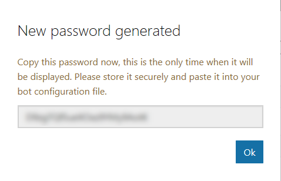
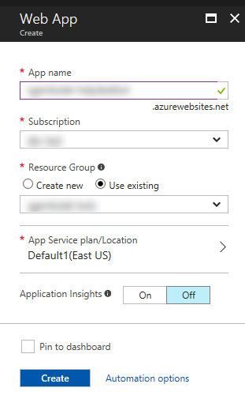
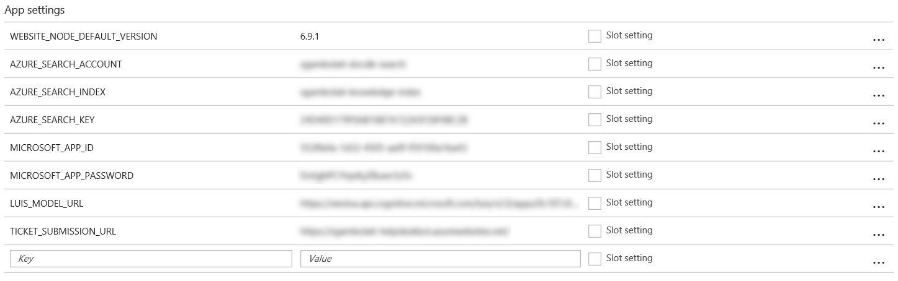
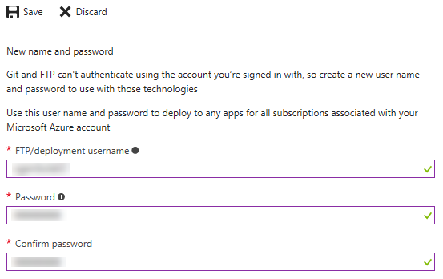
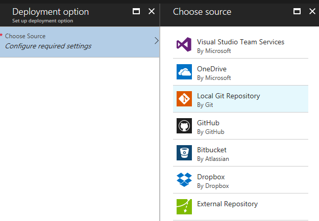
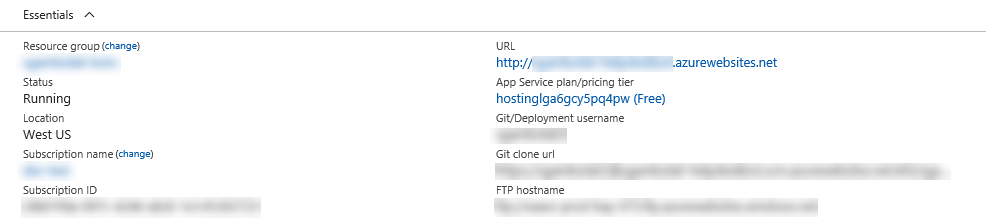
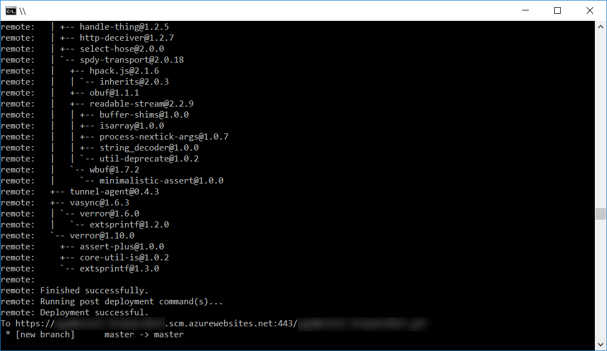
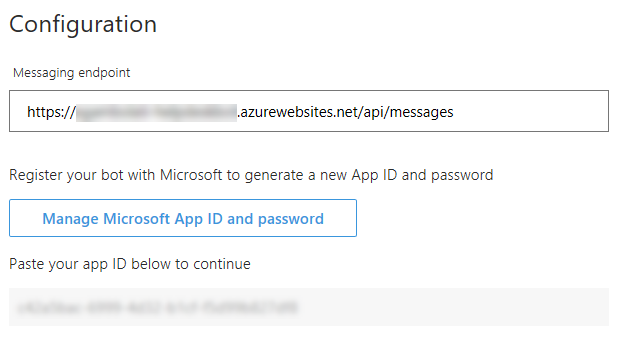

# 演習 5: クラウドへのボットの展開 (Node.js)

## 概要

この演習では、自分のボットを登録し、Azure　に展開して、他の人々がそのボットを使用できるようにする方法を学習します。

**前の演習** [演習4 Azure Search と Cosmos DB によるヘルプ デスク KB の実装](./exercise4-KnowledgeBase.md)

## 前提条件

この演習を完了するには、以下のソフトウェアが必要です。

*   [Visual Studio Code](https://code.visualstudio.com/download) (推奨) や Visual Studio 2017 Community 以上などのコード エディター
*   [Azure](https://azureinfo.microsoft.com/us-freetrial.html?cr_cc=200744395&wt.mc_id=usdx_evan_events_reg_dev_0_iottour_0_0)サブスクリプション
*   [LUIS ポータル](https://www.luis.ai/)のアカウント
*   [Git コマンド ライン インターフェイス](https://git-scm.com/downloads)
*   [Skype](https://www.skype.com/) アカウント (オプション)

<!-- ドライラン時に補足追加 -->
> 補足: このドキュメントの動作確認はそれぞれ下記バージョンにて実施しています。
>* node-v6.11.0-x64
>* botframework-emulator-Setup-3.5.29
>* Windows 10 Version 1703 (Build 15063.413)
> package.json ファイルのバージョンが下記になっていることを確認してください。

```json
 "dependencies": {
    "botbuilder": "^3.8.4",
    "dotenv": "^4.0.0",
    "restify": "^4.3.0"
  };
```

もし、なっていない場合は 下記のコマンドでコンポーネントの再インストールを行います。
```
    npm install --save botbuilder@3.8.4 restify@4.3.0 dotenv@4.0.0 
    npm install -g nodemon
```

<!-- ドライラン時に補足追加 -->


## タスク 1: Bot Framework へのボットの登録

このタスクでは、_アプリ ID_ と _アプリ パスワード_ を生成し、ボットを登録します。

1.  [Bot Framework Portal](https://dev.botframework.com/) にサインインします。

2.  **My bots** ボタンをクリックし、次に **Create a bot** をクリックするか (他のボットがある場合)、または **Register** ボタンをクリックします。

3.  [logo.png](../assets/logo.png) を**カスタム アイコン**としてアップロードします。

4.  **Display Name** に **Help Desk Bot** と入力します。**Bot Handle** にグローバル一意アプリ名を入力します。

5.  **Long Description** には、_This bot will try to help you to solve common issues and can raise tricky ones as tickets._ と入力してください。この説明は検索結果で表示されるため、ボットの機能を正確に記述してください。

   

6.  **Configuration** セクションで、**Create Microsoft AppID and Password** ボタンをクリックします。それにより、新しいページが開きます。必要に応じて、Bot Framework Portal で使用した資格情報を入力して、もう一度サインインしてください。このページには、先ほど入力したアプリ名と、自動生成された**アプリID** が表示されます。**アプリ ID** は後から確認できるように保存しておき、**アプリパスワードを生成して続行** をクリックします。

   

7.  ポップアップが開き、自動生成されたボット用パスワードが表示されます。このパスワードが表示されるのはこの 1 回限りです。後から確認できるように**安全な方法で保管**しておいてください。**OK** をクリックしてポップアップを閉じます。

   

8.  **Finish and go back to Bot Framework** ボタンをクリックします。ページが閉じ、ボット登録画面に戻ります。オートコンプリートによって、ページに _アプリ ID_ が入力されています。

9.  画面を下にスクロールして、`使用条件、プライバシーに関する声明、および倫理規定への同意について確認します。` _Register_ ボタンをクリックします。確認メッセージが表示されます。*OK* をクリックします。次に、ボットのダッシュボードが表示されます。いくつかのチャネルが利用可能になっています。

   

## タスク 2: Azure Web アプリの作成

このタスクでは、アプリの展開方法と、Bot Framework のチャネルと通信できるようにするためのアプリの構成方法を学習します。

1.  [Azureポータル](https://portal.azure.com/)にサインインします。左側のバーにある **新規** ボタンをクリックし、**Web + モバイル** をクリックして **Web App** をクリックします。

2.  **アプリ名** にアプリ名を入力し、**サブスクリプション** でサブスクリプションを、**リソース グループ** でリソースグループをそれぞれ選択します。Cosmos DB および Search サービスで使用したものと同じリソース グループが使用できます。**作成** をクリックします。

   

3.  2の手順で作成した _App Service_ を開きます(まだ開いていない場合)。左側のメニューにある **アプリケーション設定** をクリックします。*アプリ設定* に移動して、以下のキーを追加し、それぞれの値を説明に従って置き換えます(これらの値はボットのソース コードに含まれているはずです)。

    | **キー**                 | **説明**                                                               |
    |--------------------------|------------------------------------------------------------------------|
    | AZURE\_SEARCH\_ACCOUNT   | **Azure Search アカウント名**を使用します。                            |
    | AZURE\_SEARCH\_INDEX     | **Azure Search インデックス名**を使用します。                          |
    | AZURE\_SEARCH\_KEY       | **Azure Search キー**を使用します。                                    |
    | MICROSOFT\_APP\_ID       | **ボット アプリ ID** を使用します。                                    |
    | MICROSOFT\_APP\_PASSWORD | **ボット パスワード**を使用します。                                    |
    | LUIS\_MODEL\_URL         | **LUIS モデル URL** を使用します。                                     |
    | TICKET\_SUBMISSION\_URL  | アプリ サービスの URL (例: <https://help-desk-bot.azurewebsites.net/>など、2の手順で作成した URL ) |

    キーと値の入力が完了すると、次の図のような結果になるはずです。

    

4.  **保存** () をクリックします。

5.  **デプロイメント** セクションに移動して、左側のバーにある **デプロイ資格情報** をクリックします。**FTP/デプロイ ユーザー名**と**パスワード**を入力します。パスワードは **パスワード** フィールドに入力した後、確認のために **パスワードの確認** に再入力します。次に **保存** ボタンをクリックします。

   

6.  **デプロイメント** セクションに移動して、左側のメニューにある **デプロイ オプション** をクリックします。次に、**必要な設定の構成** をクリックし、**ローカル Git リポジトリ** を選択します。**OK** をクリックします。

   

7.  左側のバーにある **概要** オプションをクリックします。後で使用できるように、**基本** ウィンドウの右側の列にある **Git クローン URL** の URL を保存しておきます。

   

## タスク 3: Azure へのボットの発行

このタスクでは、コードを Git リポジトリに発行します。それにより、最近の変更内容が Azure App Service に展開されます。Git の詳細については、[こちら](https://git-scm.com/docs)をクリックして Git のリファレンスを参照してください。

1.  前の演習で得られたアプリフォルダーでコンソールを開きます。または、[exercise4-KnowledgeBase](./exercise4-KnowledgeBase) フォルダーにあるアプリを使用することもできます。このコード用の Git リポジトリを作成していない場合は、コンソールで次のコマンドを入力します(このコードを Git リポジトリで既に初期化している場合は、このステップを行う必要はありません)。

```
    git init
```

<!--- ドライラン追記--->
**補足** Ctrl + Shift + 右クリックでエクスプローラーで選択したフォルダでコマンドプロンプトもしくはPowerShell のコンソールを開くことができます。

2.  次に、次のコマンドを入力します。`{gitcloneurl}` の部分は、前のタスクで得られた **Git クローン URL** の URL に置き換えてください。

```
    git remote add azure {gitcloneurl}
```

3.  以下のコマンドを入力して、変更内容をコミットし、_Azure Web App_ にプッシュします。


```
    git add .
    git rm --cached node_modules -r
    git commit -m "initial commit"
    git push azure master
```

4. 前のタスクで作成したデプロイ資格情報を入力します。

5. 次に表示される画面で、ファイルがアップロードされ、リモート サーバー上に npm パッケージがインストールされている様子を確認できます。最後に展開状態が表示されます。

   

## タスク 4: ボット構成の更新

1.  [Bot Framework Portal](https://dev.botframework.com/) に移動します。ボットを編集するために、ボット名をクリックします。

2.  ページの右上隅にある **Settings** ボタンをクリックします。

3.  _Configuration_ セクションの `Messaging endpoint` に、タスク 2 で作成した _アプリ サービス URL_ (例: <https://help-desk-bot.azurewebsites.net/api/messages>) を入力します。URL の末尾には必ず `/api/messages` を付け、またプロトコルは必ず **https** にしてください。ページ下部の **Save changes** ボタンをクリックします。

   

## タスク 5: 発行したボットのテスト

このタスクでは、他のチャネルからボットをテストします。

1.  [Bot Framework Portal](https://dev.botframework.com/) に移動し、ボットを編集します (まだ、ポータル上の編集画面に移動していない場合)。

2.  ページの右上隅にある **Test** ボタンをクリックします。ページの右側に新しいウィンドウが開きます。これは、ボットを容易にテストできるようにする埋め込みの _Web チャット チャネル_ です。

3.  `Hi! I want to explore the knowledge base.` と入力し、この入力への応答としてボットがカテゴリ一覧を返すことを確認します。任意のカテゴリをクリックして、そのカテゴリの記事一覧が表示されることを確認し、いずれかの記事をクリックして内容を確認します。

   

4.  **Channels** メニュー項目をクリックします。**Skype** チャネルと **Webチャット** チャネルが既定で有効になっているはずです。**Skype** リンクをクリックします。新しいページが開きます。このページで、**Skype**アカウントにボットを追加できます。**Add to Contacts** ボタンをクリックします。Skype アカウントにサインインするように求められ、Skype アプリが開かれるはずです。

   

> **注:** **Get bot embed codes** リンクについても確認してみてください。ここでは、ユーザーが自分の Skype アカウントにボットを追加できるようにするためのリンクの構築方法がわかります。

5.  連絡先リストでボットを検索して、新しい会話をテストします。

   

> **注:** このハンズオン ラボの作成時点では、Skype はアダプティブ カードを完全にサポートしてはいないため、チケット確認メッセージが正しく表示されない可能性があります。

## その他の課題

* Bot Emulator でボットをテストします。[ngrok](https://docs.microsoft.com/en-us/bot-framework/debug-bots-emulator#a-idngroka-install-and-configure-ngrok) を使用して、ローカルコンピューターへの応答方法をボットに知らせる必要があります。
*   Skype または Web チャットを介したボットのテスト中、[コードをローカルで実行します](https://blogs.msdn.microsoft.com/jamiedalton/2016/07/29/ms-bot-framework-ngrok/)。
*   [Application Insights を使用した Bot Analytics](https://docs.microsoft.com/en-us/bot-framework/portal-analytics-overview) の追加も試してみてください。
*   [Slack](https://slack.com/) などの別のチャネルにボットを登録します。

**次の演習** [演習6 ユーザーのメッセージの背後にある感情の判別](./exercise6-MoodDetection.md)
