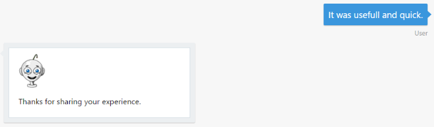

# 演習 6: ユーザーのメッセージの背後にあるセンチメントの判別 (Node.js)

## 概要

ユーザーとボットとの対話はほとんどの場合自由形式で行われるため、ボットは言語を自然に、かつ文脈に応じて理解する必要があります。この演習では、Azure
Text Analytics API を使用してユーザーの感情や気分を検出する方法を学習します。

Azure Cognitive Services オファリングの一部である [Text Analytics
API](https://azure.microsoft.com/ja-jp/services/cognitive-services/text-analytics/)
を使用することによって、センチメント、キー
フレーズ、トピック、および言語をテキストから検出できます。この API は 0 ～ 1
の数字によるスコアを返します。1 に近いスコアは肯定的なセンチメントを、0
に近いスコアは否定的なセンチメントを示します。センチメント
スコアは、分類の手法により生成されます。

[このフォルダー](https://github.com/GeekTrainer/help-desk-bot-lab/blob/develop/Node/exercise6-MoodDetection)内には、この演習のステップの完了結果として得られるコードを含むソリューションが入っています。このソリューションは、演習を進めるにあたってさらにヒントが必要な場合に、ガイダンスとして使用できます。このソリューションを使用する場合は、必ず事前に
npm install を実行し、.env ファイル内の Text Analytics
キー値を設定してください。

## 前提条件

この演習を完了するには、以下のソフトウェアが必要です。

-   [最新の Node.js と NPM](https://nodejs.org/ja/download)

-   [Visual Studio Code](https://code.visualstudio.com/download) (推奨) や
    Visual Studio 2017 Community 以上などのコード エディター

-   [Azure](https://azureinfo.microsoft.com/us-freetrial.html?cr_cc=200744395&wt.mc_id=usdx_evan_events_reg_dev_0_iottour_0_0)
    サブスクリプション

-   [Bot Framework Emulator](https://emulator.botframework.com/) (en-US
    ロケールで構成されていることを確認してください)

## タスク 1: Text Analytics API キーの作成

このタスクでは、Text Analytics アカウントを作成します。

1.  [ここ](https://azure.microsoft.com/ja-jp/try/cognitive-services/)を参照して、[言語]
    タブをクリックします。Text Analytics API を見つけて [作成]
    をクリックします。使用条件に同意し、国を選択するように求められます。次に、[次へ]
    をクリックします。

2.  Azure サブスクリプション アカウントでログインします。1 か月あたり 5,000
    の無料要求が可能な評価キーを含む次のようなページが表示されます。後で使用できるように、キーの
    1 つを保存しておきます。

>   

## タスク 2: Text Analytics API クライアントの追加

このタスクでは、ボットから Text Analytics API
を呼び出す新しいモジュールを作成します。

1.  前の演習から得られたアプリを開きます。または、[exercise4-LuisDialog](https://github.com/GeekTrainer/help-desk-bot-lab/blob/develop/Node/exercise4-KnowledgeBase)
    フォルダーにあるアプリを使用することもできます。

>   **注:** あらかじめ提供しているソリューションを使用する場合は、.env
>   ファイルを編集して以下の値を置き換えてください。

-   **LUIS\_MODEL\_URL** キーを自分が使用しているモデル URL に置き換えます。

-   **AZURE\_SEARCH\_INDEX** と **AZURE\_SEARCH\_KEY** を自分が使用している
    Search インデックス名とキーに置き換えます (演習 4 で説明しています)。

1.  textAnalyticsApiClient.js
    という名前の新しいファイルを作成し、このファイルに次のコードを追加します。

>   **注:** クライアントは /sentiment エンドポイントにアクセスしていますが、Text
>   Analytics API は /keyPhrases エンドポイントと /languages
>   エンドポイントも提供します。また、複数のドキュメントを分析用に送信できます。

>   const restify = require('restify');

>   module.exports = (config) =\> {

>   return (query, callback) =\> {

>   const client = restify.createJsonClient({

>   url: \`https://westus.api.cognitive.microsoft.com\`,

>   headers: {

>   'Ocp-Apim-Subscription-Key': config.apiKey

>   }

>   });

>   const payload = {

>   documents: [{

>   language: 'en',

>   id: 'singleId',

>   text: query

>   }]

>   };

>   const urlPath = '/text/analytics/v2.0/sentiment';

>   client.post(urlPath, payload, (err, request, response, result) =\> {

>   if (!err &&

>   response &&

>   response.statusCode == 200 &&

>   result.documents[0]) {

>   callback(null, result.documents[0].score);

>   } else {

>   callback(err, null);

>   }

>   });

>   };

>   };

## タスク 3: フィードバックを要求してユーザーのセンチメントを分析できるようにするためのボットの変更

このタスクでは、新たな Text Analytics
モデルを導入し、ボットの新しいダイアログからこのモデルを使用します。

1.  次の行を追加して、.env ファイルを更新します。この TEXT\_ANALYTICS\_KEY
    キーは、タスク 1 で得られた Text Analytics キーに置き換えます。

>   TEXT\_ANALYTICS\_KEY=

1.  **app.js** ファイルを開きます。

2.  次のコードを追加します。

>   const textAnalytics = require('./textAnalyticsApiClient');

1.  次のコードを追加します。

2.  const analyzeText = textAnalytics({

3.  apiKey: process.env.TEXT\_ANALYTICS\_KEY

>   });

1.  ファイルの末尾に次のコードを追加します。ユーザーにフィードバックを要求し、Text
    Analytics API
    クライアントを呼び出してユーザーの感情を評価するための新しいダイアログを作成するコードです。応答内容
    (スコアが 0.5 より高いか、低いか)
    に応じて異なるメッセージがユーザーに表示されます。

2.  bot.dialog('UserFeedbackRequest', [

3.  (session, args) =\> {

4.  builder.Prompts.text(session, 'Can you please give me feedback about this
    experience?');

5.  },

6.  (session, response) =\> {

7.  const answer = session.message.text;

8.  analyzeText(answer, (err, score) =\> {

9.  if (err) {

10. session.endDialog('Ooops! Something went wrong while analzying your answer.
    An IT representative agent will get in touch with you to follow up soon.');

11. } else {

12. var msg = new builder.Message(session);

13. var cardImageUrl, cardText;

14. // 1 - positive feeling / 0 - negative feeling

15. if (score \< 0.5) {

16. cardText = 'I understand that you might be dissatisfied with my assistance.
    An IT representative will get in touch with you soon to help you.';

17. cardImageUrl =
    'https://raw.githubusercontent.com/GeekTrainer/help-desk-bot-lab/develop/assets/botimages/head-sad-small.png';

18. } else {

19. cardText = 'Thanks for sharing your experience.';

20. cardImageUrl =
    'https://raw.githubusercontent.com/GeekTrainer/help-desk-bot-lab/develop/assets/botimages/head-smiling-small.png';

21. }

22. msg.addAttachment(

23. new builder.HeroCard(session)

24. .text(cardText)

25. .images([builder.CardImage.create(session, cardImageUrl)])

26. );

27. session.endDialog(msg);

28. }

29. });

30. }

>   ]);

>   **注:**
>   センチメント分析では、テキストを文に分割することをお勧めします。一般に、この分割によって、センチメント予測の精度が向上します。

1.  **SubmitTicket** ダイアログの最後のウォーターフォール
    ステップを更新します。次のコード内の session.endDialog();
    の部分を変更します。

2.  (session, result, next) =\> {

3.  if (result.response) {

4.  ...

5.  client.post('/api/tickets', data, (err, request, response, ticketId) =\> {

6.  ...

7.  session.endDialog();

8.  });

9.  } else {

10. ...

11. }

>   }

>   この部分を、UserFeedbackRequest
>   ダイアログを呼び出す次のコードに置き換えてください。

>   session.replaceDialog('UserFeedbackRequest');

## タスク 4: エミュレーターからのボットのテスト

1.  コンソール (nodemon app.js)
    からアプリを実行し、エミュレーターを開きます。ボットの URL
    (http://localhost:3978/api/messages) をいつもどおり入力します。

2.  「I need to reset my
    password.」と入力し、次に重大度を選択します。チケットの送信を確認し、フィードバックについての新たな要求をチェックします。

>   

1.  「It was very useful and
    quick.」と入力します。肯定的なフィードバックだったことを意味する次のような応答が表示されます。

>   

1.  チケットの送信をもう一度行い、ボットからフィードバックを求められたら、「It
    was useless and time
    wasting.」と入力します。否定的なフィードバックだったことを意味する次のような応答が表示されます。

>   

>   この後の演習 (7) では、会話を人間の担当者に引き渡し
>   (ハンドオフ)、担当者を通じてユーザーを支援する方法について学習します。

## その他の課題

自主的に学習を続ける場合は、次のタスクを利用できます。

-   Microsoft Cognitive Services
    内の別のサービスを使用して、ボットに音声認識機能を追加できます。[Bing Speech
    API](https://azure.microsoft.com/ja-jp/services/cognitive-services/speech/)
    を試してみてください。
