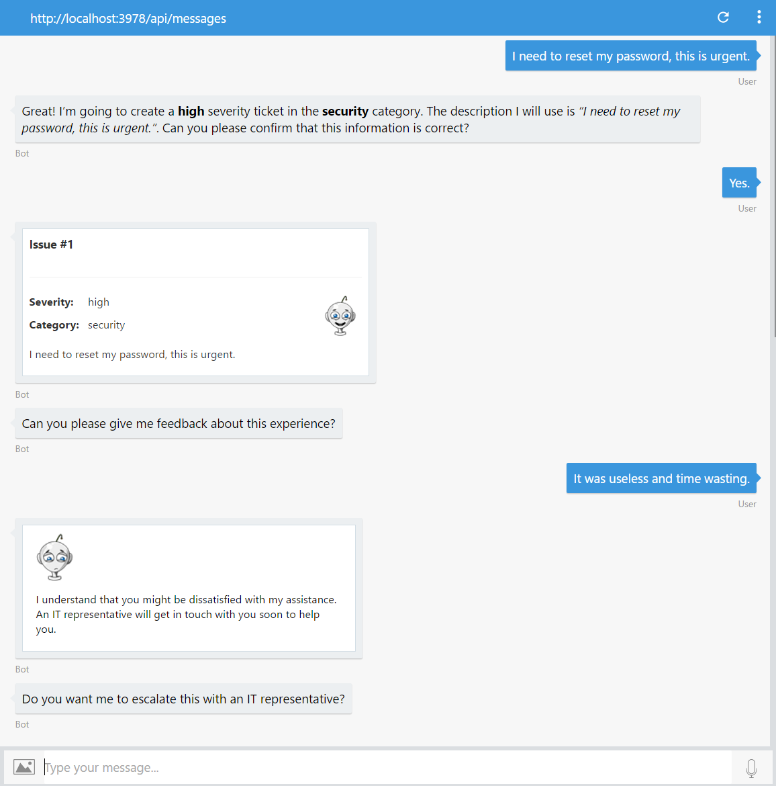
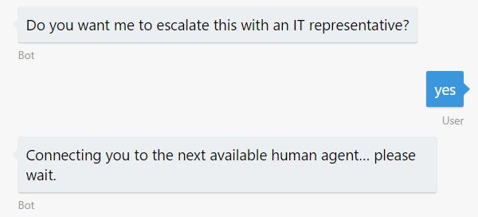
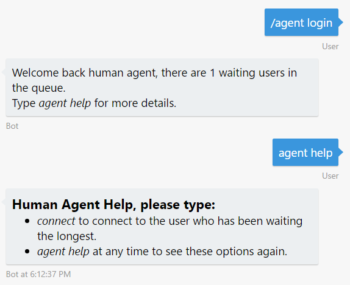
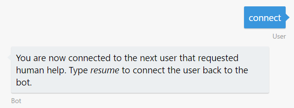
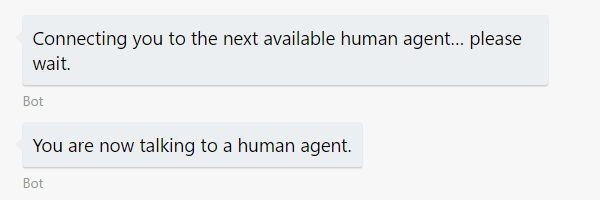
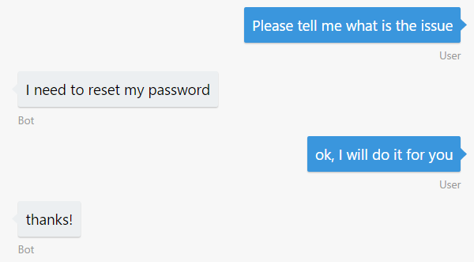
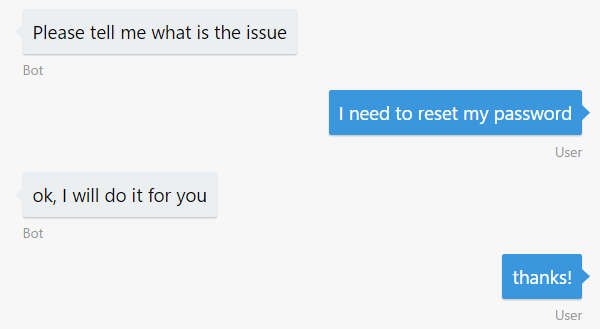
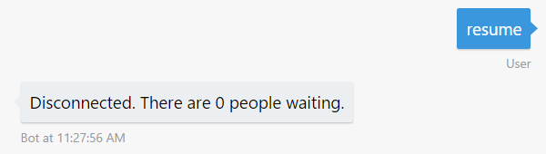
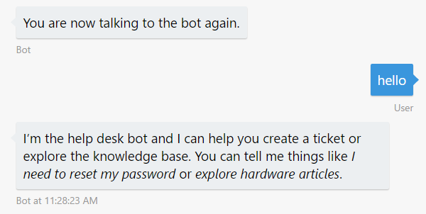

**演習 7: ヒューマン エージェントへの会話のハンドオフ (Node.js)**

**概要**

ボットが持つ人工知能の能力がどんなに大きくても、まだ会話を人間にハンドオフしなければならない状況が発生することがあります。たとえば、質問に自動的に返信し、場所を問わずお客様に対応できる一方で、問題を人間にエスカレートできるボットを構築する必要があるでしょう。またボットがすべての状況に対応できない場合や、エッジケースが存在する場合、ボットは適切な権限を持つ人間にその対応を任せることができなければなりません。ボットはハンドオフが必要なタイミングを認識し、明確かつスムーズなハンドオフを実現する必要があります。この演習では、ボットを利用してユーザーと会話を開始し、コンテキストをヒューマン
エージェントにハンドオフする方法を学習します。

最初に、送受信イベント/メッセージをインターセプトするミドルウェアを作成する方法を学習します。このミドルウェアでは、ユーザーとエージェント間の通信およびエージェントのみで利用できる特別なコマンドを処理します。後半では、新しいミドルウェアを使用するようにボットを変更し、ボットの会話をヒューマン
エージェントにハンドオフするダイアログを追加します。

[こちらのフォルダー](https://github.com/GeekTrainer/help-desk-bot-lab/blob/develop/Node/exercise7-HandOffToHuman)内には、この演習のステップで作成するコードを含むソリューションが入っています。このソリューションは、演習を進めるにあたってさらにヒントが必要な場合に、ガイダンスとして使用できます。ミドルウェアを使用するには、npm
install を実行し、LUIS モデルの値、Azure Search インデックスの名前とキー、および
Text Analytics キーを .env ファイルで設定する必要があります。

この演習で使用するハンドオフ アプローチの詳細については、[BUILD
2017](https://channel9.msdn.com/Events/Build/2017/P4075)
のこちらのセッションか、[GitHub
にホストされているサンプル](https://github.com/palindromed/Bot-HandOff)を参照してください。

この図は、この演習用のボットのコンポーネントを簡単に示しています。

**前提条件**

この演習を完了するには、以下のソフトウェアが必要です。

-   [最新の Node.js と NPM](https://nodejs.org/ja/download)

-   [Visual Studio Code](https://code.visualstudio.com/download) (推奨) や
    Visual Studio 2017 Community 以上などのコード エディター

-   [Azure](https://azureinfo.microsoft.com/us-freetrial.html?cr_cc=200744395&wt.mc_id=usdx_evan_events_reg_dev_0_iottour_0_0)
    サブスクリプション

-   [Bot Framework Emulator](https://emulator.botframework.com/) (en-US
    ロケールで構成されていることを確認してください)

-   [LUIS ポータル](https://www.luis.ai/)のアカウント

**タスク 1: ハンドオフ ロジックの構築**

このタスクでは、2 人の人物 (ユーザーとエージェント)
を橋渡しする通信を処理するために必要な "裏側"
のロジックを追加します。送受信イベント/メッセージをインターセプトするミドルウェアを作成して配置する方法を学習します。

Bot Builder SDK for Node.js
のミドルウェア機能により、ボットは、ユーザーとボット間で交換されるすべてのメッセージをインターセプトできます。インターセプトされるメッセージごとに、指定したデータ
ストアにメッセージを保存して会話ログを生成したり、何らかの方法でメッセージを検査して、コードで指定したアクションを実行したりするなどの処理を行うことができます。ミドルウェアの詳細については、[こちらのリンク](https://docs.microsoft.com/en-us/bot-framework/nodejs/bot-builder-nodejs-intercept-messages)を参照してください。

1.  前の演習から得られたアプリを開きます。または、[exercise6-MoodDetection](https://github.com/GeekTrainer/help-desk-bot-lab/blob/develop/Node/exercise6-MoodDetection)
    フォルダーにあるアプリを使用することもできます。

>   **注:**
>   あらかじめ提供しているソリューションを使用する場合は、必ず以下の値を置き換えてください。

-   **LUIS\_MODEL\_URL** プレースホルダーを、自分が使用しているモデル URL
    に置き換えます

-   **TEXT\_ANALYTICS\_KEY** を、自分が使用している Text Analytics
    キーに置き換えます (演習 6 で説明しています)。

-   **AZURE\_SEARCH\_INDEX** と **AZURE\_SEARCH\_KEY**
    を、自分が使用している検索インデックス名とキーに置き換えます (演習 4
    で説明しています)。

1.  ハンズオン ラボの assets フォルダーから次のファイルをコピーします。

    -   [provider.js](https://github.com/GeekTrainer/help-desk-bot-lab/blob/develop/assets/exercise7-HandOffToHuman/provider.js):
        ヒューマン
        エージェントとの通信を待つユーザーを入れるキューを作成します。各会話には、次の
        3 つの状態があります:
        ConnectedToBot、WaitingForAgent、ConnectedToAgent。状態に応じて、(次のステップで構築する)
        ルーターがメッセージをどちらか一方の会話に転送します。このモジュールでは、外部ストレージでキューを存続させません。これは、会話のメタデータを格納する場所でもあります。

    -   [command.js](https://github.com/GeekTrainer/help-desk-bot-lab/blob/develop/assets/exercise7-HandOffToHuman/command.js):
        エージェントとボット間の特別な対話を処理し、会話や会話の再開を待つユーザーをピークします。このモジュールには、ヒューマン
        エージェントからのメッセージをインターセプトして、ユーザーとの接続や通信の再開を実行するオプションにメッセージをルーティングする[ミドルウェア](https://github.com/GeekTrainer/help-desk-bot-lab/blob/develop/assets/exercise7-HandOffToHuman/command.js#L9)があります。

2.  次のボイラープレート コードを使用して、handoff フォルダーに router.js
    ファイルを作成します。ルーターには、各メッセージがエージェントまたはユーザーのいずれに送信される必要があるかを把握する役割があります。

3.  const builder = require('botbuilder');

4.  const { Provider, ConversationState } = require('./provider');

5.  function Router(bot, isAgent) {

6.  'use strict';

7.  const provider = new Provider();

8.  const pending = () =\> {

9.  return provider.currentConversations().filter((conv) =\> conv.state ===
    ConversationState.WaitingForAgent).length;

10. };

11. return {

12. isAgent,

13. middleware,

14. pending,

15. provider,

16. bot

17. };

18. }

>   module.exports = Router;

1.  middleware メソッドを router.js
    に追加します。このメソッドでは、処理される受信メッセージをヒューマン
    エージェント メッセージとしてルーティングするか、通常ユーザー
    メッセージとしてルーティングするかを決定します。

2.  const middleware = () =\> {

3.  return {

4.  botbuilder: (session, next) =\> {

5.  if (session.message.type === 'message') {

6.  if (isAgent(session)) {

7.  routeAgentMessage(session);

8.  } else {

9.  routeUserMessage(session, next);

10. }

11. } else {

12. next();

13. }

14. }

15. };

>   };

1.  routeAgentMessage メソッドを router.js
    に追加します。このメソッドは、エージェントが会話中の場合に、ヒューマン
    エージェントからのメッセージをユーザーにルーティングします。

2.  const routeAgentMessage = (session) =\> {

3.  const message = session.message;

4.  const conversation =
    provider.findByAgentId(message.address.conversation.id);

5.  if (!conversation) {

6.  return;

7.  }

8.  bot.send(new
    builder.Message().address(conversation.user).text(message.text));

>   };

1.  routeUserMessage メソッドを router.js
    に追加します。このメソッドは、ハンドオフ ロジックの中で最も重要なメソッドの
    1
    つです。受信メッセージが通常ユーザーからのものであれば、このメソッドは会話の情報を取得
    (または作成) し、conversation.state を使用して、通常のボット
    フローを継続するかどうかを決定します。そしてメッセージをユーザーに送信してキューの状態を通知するか、ユーザーのメッセージをヒューマン
    エージェントにルーティングします。

2.  const routeUserMessage = (session, next) =\> {

3.  const message = session.message;

4.  const conversation =
    provider.findByConversationId(message.address.conversation.id) \|\|
    provider.createConversation(message.address);

5.  switch (conversation.state) {

6.  case ConversationState.ConnectedToBot:

7.  return next();

8.  case ConversationState.WaitingForAgent:

9.  session.send(\`Connecting you to the next available human agent... please
    wait, there are \${pending()-1} users waiting.\`);

10. return;

11. case ConversationState.ConnectedToAgent:

12. bot.send(new
    builder.Message().address(conversation.agent).text(message.text));

13. return;

14. }

>   };

これで、ユーザーとエージェント間の通信をサポートするモジュールの用意ができました。

**タスク 2: ボットを更新して会話をハンドオフ**

このタスクでは、作成したルーティング
ミドルウェアに接続するようにボットを更新し、会話のハンドオフ
フローを処理するために必要なダイアログを追加します。

1.  [LUIS ポータル](https://www.luis.ai/)に移動し、次の発話を含む
    **HandOffToHuman** インテントを追加するようにアプリを編集します。

    -   *I want to talk to an IT representative*

    -   *Connect me to a human being*

    -   *Operator*

**注:** 既に LUIS に習熟している場合は、この演習の
[assets](https://github.com/GeekTrainer/help-desk-bot-lab/blob/develop/assets/exercise7-HandOffToHuman/luis_model.json)
フォルダーにあるファイル luis\_model.json
を各自のアカウントにインポートし、モデルをトレーニングおよび発行して、タスク 3
に進むことができます。しかし、LUIS
の初心者である場合は、学習のためにモデルを最初から作成することをお勧めします。

1.  アプリをトレーニングして再度発行します。

2.  **app.js** ファイルを開きます。次の require
    ステートメントをファイルの最上部に追加します。

3.  const HandOffRouter = require('./handoff/router');

>   const HandOffCommand = require('./handoff/command');

1.  次のように、ミドルウェアを作成するコードを追加します。

2.  const handOffRouter = new HandOffRouter(bot, (session) =\> {

3.  return session.conversationData.isAgent;

4.  });

>   const handOffCommand = new HandOffCommand(handOffRouter);

1.  bot.use(...) を使用して、各ミドルウェアをボットに接続します。

2.  bot.use(handOffCommand.middleware());

>   bot.use(handOffRouter.middleware());

1.  ユーザーをヒューマン エージェントに切り替える AgentMenu
    ダイアログを追加します。ここでは、ボットが conversationData の isAgent
    変数を使用して、ヒューマン エージェントをそれ自体として認識します
    (エージェントの認識)。

2.  bot.dialog('AgentMenu', [

3.  (session, args) =\> {

4.  session.conversationData.isAgent = true;

5.  session.endDialog(\`Welcome back human agent, there are
    \${handOffRouter.pending()} users waiting in the queue.\\n\\nType \_agent
    help\_ for more details.\`);

6.  }

7.  ]).triggerAction({

8.  matches: /\^**\\/**agent login/

>   });

>   **注:**
>   簡単にするために、エージェントを登録する現在の方法には保護や認証は含まれていません。運用環境のボットでは、これをリファクタリングして、通常ユーザーがエージェントとして接続するのを防ぐ必要があります。

1.  エージェントと通信するためのキューにユーザーを入れるダイアログを追加します。

2.  bot.dialog('HandOff',

3.  (session, args, next) =\> {

4.  if (handOffCommand.queueMe(session)) {

5.  var waitingPeople = handOffRouter.pending() \> 1 ? \`, there are
    \${handOffRouter.pending()-1} users waiting\` : '';

6.  session.send(\`Connecting you to the next available human agent... please
    wait\${waitingPeople}.\`);

7.  }

8.  session.endDialog();

9.  }

10. ).triggerAction({

11. matches: 'HandOffToHuman'

>   });

1.  ユーザーの満足度スコアが 0.5 未満の場合に、前のステップで作成された Handoff
    ダイアログを呼び出すように、UserFeedbackRequest
    ダイアログを更新します。ダイアログ全体を次のコードで置き換えることができます。

2.  bot.dialog('UserFeedbackRequest', [

3.  (session, args) =\> {

4.  builder.Prompts.text(session, 'Can you please give me feedback about this
    experience?');

5.  },

6.  (session, args) =\> {

7.  const answer = session.message.text;

8.  analyzeText(answer, (err, score) =\> {

9.  if (err) {

10. session.endDialog('Ooops! Something went wrong while analyzing your answer.
    An IT representative agent will get in touch with you to follow up soon.');

11. } else {

12. var msg = new builder.Message(session);

13. var cardImageUrl, cardText;

14. if (score \< 0.5) {

15. cardText = 'I understand that you might be dissatisfied with my assistance.
    An IT representative will get in touch with you soon to help you.';

16. cardImageUrl =
    'https://raw.githubusercontent.com/sGambolati/VuforiaImageRecognition/master/Assets/head-sad-small.png';

17. } else {

18. cardText = 'Thanks for sharing your experience.';

19. cardImageUrl =
    'https://raw.githubusercontent.com/sGambolati/VuforiaImageRecognition/master/Assets/head-smiling-extra-small.png';

20. }

21. msg.addAttachment(

22. new builder.HeroCard(session)

23. .text(cardText)

24. .images([builder.CardImage.create(session, cardImageUrl)])

25. );

26. if (score \< 0.5) {

27. session.send(msg);

28. builder.Prompts.confirm(session, 'Do you want me to escalate this with an IT
    representative?');

29. } else {

30. session.endDialog(msg);

31. }

32. }

33. });

34. },

35. (session, args) =\> {

36. if (args.response) {

37. session.replaceDialog('HandOff');

38. } else {

39. session.endDialog();

40. }

41. }

>   ]);

**タスク 3: エミュレーターからのボットのテスト**

1.  コンソールからアプリを実行して (nodemon app.js)、エミュレーターの 2
    つのインスタンスを開きます。両方に、ボットの URL
    (http://localhost:3978/api/messages) をいつもどおり入力します。

2.  1 つのエミュレーターで、「I need to reset my password, this is
    urgent」と入力して、新しいチケットを作成し、送信を確認します。ボットからフィードバックを求められたら、「it
    was useless and time
    wasting」と入力します。エージェントと話すかどうかを尋ねる、新しいプロンプトが表示されるはずです。

>   

1.  待機ユーザーのキューにユーザーを入れるためのプロンプトを確認します。

>   

1.  2 つ目のエミュレーターでは、「/agent
    login」と入力して、エージェントの権限を制御します。ボットから、1
    人のユーザーが待機中であることが通知されるはずです。「agent
    help」と入力すると、エージェントの選択肢を含むメッセージが表示されます。

>   

1.  「connect」と入力して、ユーザーとの会話を開始します。1
    番目のエミュレーターでは、ボットがこの接続をユーザーに通知します。

| **エージェントのメッセージ**             | **ユーザーのメッセージ**                 |
|------------------------------------------|------------------------------------------|
|  |  |
|                                          |                                          |

2.  エミュレーターを使用して、エージェントとユーザー間の通信を確認できるようになりました。

| **エージェントのメッセージ**             | **ユーザーのメッセージ**                 |
|------------------------------------------|------------------------------------------|
|  |  |

3.  対話を終了するには、2 番目のエミュレーター (エージェント エミュレーター)
    で「resume」と入力します。ボットから両方の参加者に通信の終了が通知されます。

| **エージェントのメッセージ**             | **ユーザーのメッセージ**                   |
|------------------------------------------|--------------------------------------------|
|  |  |

4.  **注:** もう 1 つの考えられるシナリオは "管理されたハンドオフ"
    です。このケースでは、ボットがユーザーの質問に応じてヒューマン
    エージェントと通信し、ボットが用意しているどの答えが正しいかを尋ねます。

**その他の課題**

自主的に学習を続ける場合は、次のタスクを利用できます。

-   Cosmos DB や SQL Server などの外部データ
    ストアに会話データを格納するカスタム プロバイダーを作成します。

-   AgentMenu
    ダイアログに、認証を追加します。ユーザーの認証プロセスを起動するには、[Sign-inCard](https://docs.botframework.com/en-us/node/builder/chat-reference/classes/_botbuilder_d_.signincard.html)
    を追加する必要があります。

-   [provider.js](https://github.com/GeekTrainer/help-desk-bot-lab/blob/develop/assets/exercise7-HandOffToHuman/provider.js#L13)
    を変更して、会話データが持続されるようにします。現状では、アクティブな会話はメモリ内に格納され、ボットの拡大/縮小は困難です。

-   ルーターに新しい状態を実装して、会話を監視できます。この場合、ユーザーとボットのメッセージはヒューマン
    エージェントに送信され監視されます。

-   ボットは、人間の応答を待機中、デフォルトの応答を使用して、すべての受信ユーザー
    メッセージに自動的に対応します。"never mind" や "cancel"
    などの特定のメッセージをユーザーが送信した場合、ボットに "待機"
    状態から会話を削除させることができます。

-   ハンドオフの別の方法として、ヘルプ
    ダイアログに、会話を人間にハンドオフするボタンを追加します。
