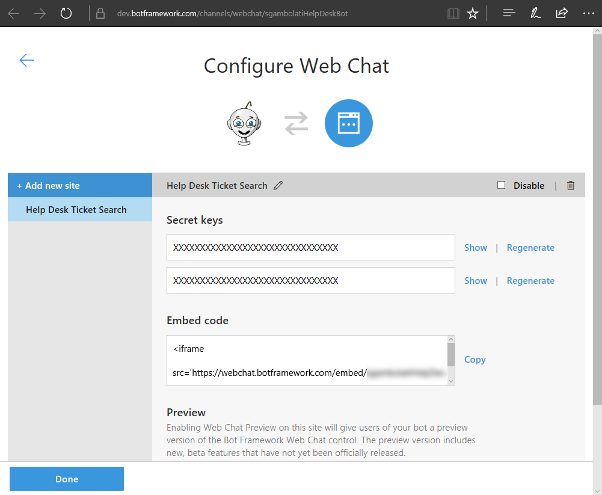
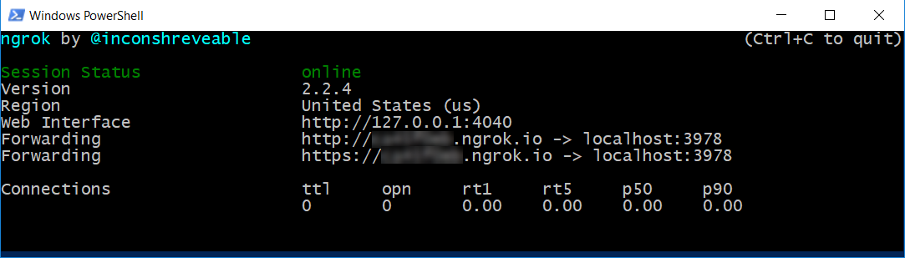
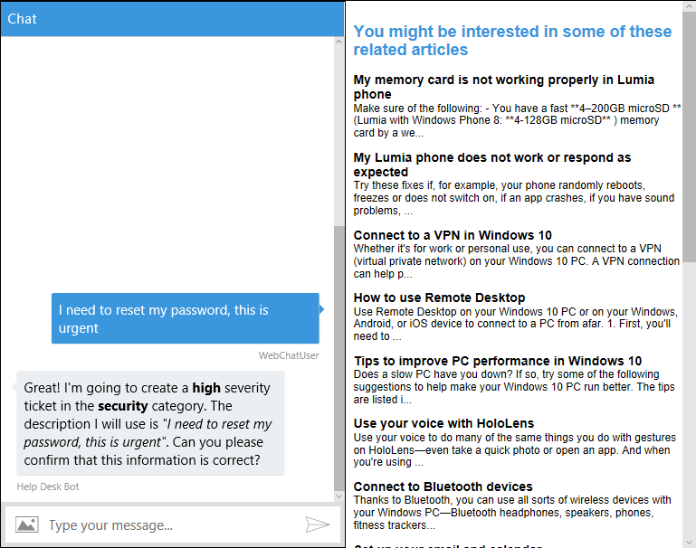
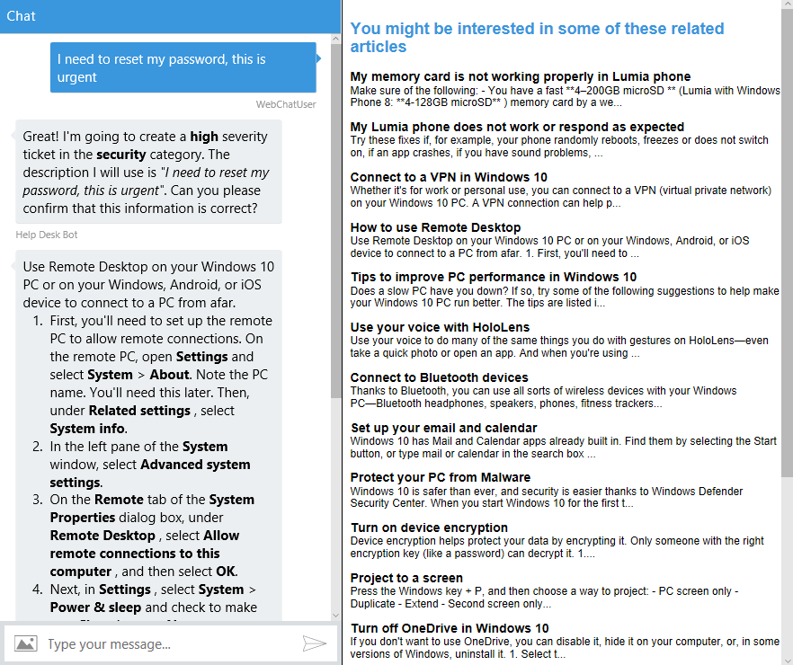

# 演習 8: バックチャネルを通したイベントの送受信 (Node.js)

## 概要

バックチャネル メカニズムを使用すると、ユーザーからは見えない情報をクライアント
アプリとボットがやり取りできます。たとえば、クライアントのタイム ゾーンの要求や
GPS の位置情報の読み取り、Web
ページでのユーザーの操作内容などがあります。ボットがユーザーをガイドして、Web
フォームの一部に自動的に記入することなどもできます。バックチャネルは、JavaScript
クライアント
アプリとボットの隔たりを埋める役割を果たします。このメカニズムは、Direct Line
API を使用して実装します。この API
を使用すると、クライアントとボットの間でアクティビティを送受信できます。

この演習では、アプリに Web ページを追加します。ボットと Web
ページはバックチャネル
メカニズムを使用して通信を行います。ボットはユーザーのチケットを Web
ページに送信し、Web
ページではそのチケットに関連するサポート技術情報の記事を表示します。目標は、人間のスーパーバイザー
エージェントが会話を監視し、Web
ページを使用してユーザーに役立つ記事があるかどうかを判断し、チケットの作成を回避できるようにすることです。ユーザーが記事を見つけたら、スーパーバイザー
エージェントはその記事をクリックし、ユーザーとボットの会話で表示します。

Bot Framework
のドキュメントでは、[バックチャネルの仕組み](https://docs.microsoft.com/en-us/bot-framework/nodejs/bot-builder-nodejs-backchannel)の詳細を説明しています。

[こちらのフォルダー](https://github.com/GeekTrainer/help-desk-bot-lab/blob/develop/Node/exercise8-BackChannel)内には、この演習のステップの完了結果として得られるコードを含むソリューションが入っています。このソリューションは、演習を進めるにあたってさらにヒントが必要な場合に、ガイダンスとして使用できます。これを使用するには、まず
npm install を実行して、.env
ファイルに値を入力しておく必要があることを忘れないでください。

この図は、この演習のコンポーネントを簡単に示しています。

## 前提条件

この演習を完了するには、以下のソフトウェアが必要です。

-   [最新の Node.js と NPM](https://nodejs.org/ja/download/)

-   [Visual Studio Code](https://code.visualstudio.com/download) (推奨) や
    Visual Studio 2017 Community 以上などのコード エディター

-   [Bot Framework Emulator](https://emulator.botframework.com/) (en-US
    ロケールで構成されていることを確認してください)

-   ローカル開発用 [ngrok](https://ngrok.com/)

## タスク 1: ボットの Web チャット チャネルへの新しいサイトの追加

1.  [Bot Framework ポータル](https://dev.botframework.com/)にサインインします。

2.  [My bots] ボタンをクリックし、編集するボットをクリックします。

>   **注:** この演習では、Bot Framework
>   ポータルにボットが既に登録されていることを前提としています。登録していない場合は、[演習
>   5](https://github.com/GeekTrainer/help-desk-bot-lab/blob/develop/Node/exercise5-Deployment.md)
>   の説明を参照してください。

1.  Web チャット チャネルの [編集] (

    

    ) リンクをクリックします。開いたウィンドウで [Add new site]
    をクリックします。サイト名 (例: ヘルプ デスク チケット検索) を入力します。

>   

1.  [完了] をクリックすると、次のページが表示されます。**秘密鍵**が 2
    つあることに注意してください。後で使用できるように、いずれか 1
    つを保存しておきます。[完了] をクリックします。

>   

## タスク 2: 埋め込み済み Web チャットによる HTML ページの追加

このタスクでは、Web Chat コントロールと、ボットに event
メッセージを送受信するコードが含まれるアプリに HTML
ページを追加します。次に、event アクティビティをボットから Web ページに送信する
BackChannel 機能を追加します。

1.  前の演習から得られたアプリを開きます。または、[exercise7-HandOffToHuman](https://github.com/GeekTrainer/help-desk-bot-lab/blob/develop/Node/exercise7-HandOffToHuman)
    フォルダーにあるアプリを使用することもできます。

>   **注:**
>   あらかじめ提供しているソリューションを使用する場合は、必ず以下の値を置き換えてください。

-   **{LuisModelEndpointUrl}** プレースホルダーを、使用しているモデル URL
    に置き換えます

-   **{textAnalyticsKey}** を、自分が使用している Text Analytics
    キーに置き換えます (演習 6 で説明しています)。

-   **{searchIndexName}** と **{searchIndexKey}** を、自分の Search
    インデックス名とキーに置き換えます (演習 4 で説明しています)。

-   **MICROSOFT\_APP\_ID** と **MICROSOFT\_APP\_PASSWORD** を、Bot Framework
    ポータルからのボットの値に置き換えます

1.  ソリューションのルート フォルダーに web-ui
    という名前の新規フォルダーを作成します。そのフォルダーに、[assets](https://github.com/GeekTrainer/help-desk-bot-lab/blob/develop/assets)
    フォルダーの[default.htm](https://github.com/GeekTrainer/help-desk-bot-lab/blob/develop/assets/exercise8-BackChannel/default.htm)
    ファイルをコピーします。

2.  [botchat.js script
    element](https://github.com/GeekTrainer/help-desk-bot-lab/blob/develop/assets/exercise8-BackChannel/default.htm#L52)
    の下に、以下のコードを含む新しいスクリプト要素を追加します。このコードでは、Web
    Channel Secret で **DirectLine** オブジェクトを作成し、WebChat
    コントロールをそのページに登録します。{DIRECTLINE\_SECRET}
    プレースホルダーを、これまでに取得した秘密鍵で置き換え、{BOT\_ID}
    プレースホルダーをボット処理 ID (例: *help-desk-bot*) で置き換えます。

3.  \<script\>

4.  var botConnection = new BotChat.DirectLine({

5.  secret: '{DIRECTLINE\_SECRET}'

6.  });

7.  var resPanel = document.getElementById('results');

8.  BotChat.App({

9.  botConnection: botConnection,

10. user: { id: 'WebChatUser' },

11. bot: { id: '{BOT\_ID}' },

12. locale: 'en-us',

13. }, document.getElementById('bot'));

>   \</script\>

>   **注:** [オープンソースの Web Chat
>   コントロール](https://github.com/Microsoft/BotFramework-WebChat)は、[Direct
>   Line API](https://docs.botframework.com/en-us/restapi/directline3/#navtitle)
>   を使用してボットと通信を行います。Direct Line API
>   を使用することで、activities
>   をクライアントとボットの間で送受信できます。最も一般的な型のアクティビティは
>   message ですが、その他の型もあります。たとえば、typing
>   型のアクティビティは、ユーザーが入力していること、またはボットが応答のコンパイル作業中であることを示します。

1.  同じスクリプト要素で、event アクティビティを受信するためのボット
    アクティビティ リスナーを追加し、記事リストを表示します。

>   **注:** Web Chat コントロールは、type="event"
>   のアクティビティを自動的に無視します。これにより、ページはボットと、ボットはページと直接通信を行うことができます。

>   botConnection.activity\$

>   .filter(function (activity) {

>   return activity.type === 'event' && activity.name === 'searchResults';

>   })

>   .subscribe(function (activity) {

>   updateSearchResults(activity.value)

>   });

>   function updateSearchResults(results) {

>   resPanel.innerHTML = '';

>   results.forEach(function (result) {

>   resPanel.appendChild(createSearchResult(result));

>   });

>   }

>   function createSearchResult(result) {

>   var el = document.createElement('div');

>   el.innerHTML = '\<h3\>' + result.title + '\</h3\>' +

>   '\<p\>' + result.text.substring(0, 140) + '...\</p\>';

>   return el;

>   }

>   **注:** わかりやすくするため、ユーザーとの会話を含む Web Chat
>   コントロールと検索結果は同じページに表示します。ただし、この 2
>   つはそれぞれ別々に扱うことが理想的です。エージェントが監視と推奨記事の送信ができるように、スーパーバイザー
>   Web サイトには進行中の会話のリストを表示する必要があります。

## タスク 3: ボットを更新して event アクティビティを Web アプリに送信

このタスクではevent メッセージをボットと送受信する機能を追加します。

1.  **app.js** を開きます。次の require
    ステートメントをファイルの冒頭に追加します。

>   const path = require('path');

1.  var bot = new builder.UniversalBot(...);
    の行の上に、次のコードを追加します。このコードでは、*Restify* で
    web-ui/default.htm ファイルを既定の Web
    ページとして使用するように指定します。

2.  server.get(/**\\/**?.\*/, restify.serveStatic({

3.  directory: path.join(\_\_dirname, 'web-ui'),

4.  default: 'default.htm'

>   }));

1.  **SubmitTicket**
    ダイアログのウォーターフォールの最初のステップで、session.dialogData.description
    でメッセージを保存した場所のすぐ下に、次のコードを追加します。このコードでは、**サポート技術情報**を検索して
    event アクティビティと検索結果を Web ページに送信します。

2.  azureSearchQuery(\`search=\${encodeURIComponent(session.message.text)}\`,
    (err, result) =\> {

3.  if (err \|\| !result.value) return;

4.  var event = createEvent('searchResults', result.value,
    session.message.address);

5.  session.send(event);

>   });

1.  createEvent 関数を追加します。この関数は、event 型のバックチャネル
    メッセージを作成し、値としてクエリを実行します。

2.  const createEvent = (eventName, value, address) =\> {

3.  var msg = new builder.Message().address(address);

4.  msg.data.type = 'event';

5.  msg.data.name = eventName;

6.  msg.data.value = value;

7.  return msg;

>   };

## タスク 4: ボットから Web アプリへのバックチャネル メッセージのテスト

1.  コンソールからアプリを実行します (nodemon app.js)。

2.  *ngrok* をダウンロードした新しいコンソール
    ウィンドウが開き、そのウィンドウで ngrok http 3978 と入力します。3978
    は、ボットを実行しているポート番号であることに注意してください。別のポート番号を使用している場合は、変更します。次に、転送先の
    **https** URL も保存しておきます。

>   

>   **注:** ngrok を使用することで、ローカル コンピューター上で実行している Web
>   サーバーをインターネットに公開できます。ngrok で、Web
>   サーバーがリッスンしているポートを指定します。開始すると、ターミナルの UI
>   と、トンネルのパブリック URL
>   およびトンネルを通じて行われる接続についてのその他のステータスとメトリック情報が表示されます。

1.  [Bot Framework ポータル](https://dev.botframework.com/)にサインインします。

2.  [My bots] ボタンをクリックし、次に、編集するボットをクリックします。[設定]
    タブをクリックして、メッセージのエンドポイント URL を更新します
    (/api/messages を忘れずに保持してください)。[変更の保存]
    ボタンをクリックします。

3.  Web ブラウザでボットの URL に移動します (いつもどおり
    <http://localhost:3978/>です)。Web Chat コントロールで、「I need to reset my
    password, this is urgent」(急いでパスワードを変更する必要があります)
    と入力します。Web Chat
    コントロールで、チケット確認メッセージが通常どおりに表示されます。入力した説明に応じて、右側に記事リストが表示されることを確認してください。

>   

## タスク 5: Web ページを更新して event メッセージをボットに送信

1.  **default.htm** ファイルを開きます。ファイル冒頭の \<style\>
    セクションで、\#results h3 セレクタ―を次の CSS で置き換えます。

2.  \#results h3 {

3.  margin-top: 0;

4.  margin-bottom: 0;

5.  cursor: pointer;

>   }

1.  createSearchResult
    関数を次のコードで更新します。このコードは、ユーザーが記事のタイトルをクリックすると、event
    アクティビティをボットにポストします。

2.  function createSearchResult(result) {

3.  var el = document.createElement('div');

4.  el.innerHTML = '\<h3\>' + result.title + '\</h3\>' +

5.  '\<p\>' + result.text.substring(0, 140) + '...\</p\>';

6.  el.getElementsByTagName('h3')[0]

7.  .addEventListener('click', function () {

8.  botConnection

9.  .postActivity({

10. type: 'event',

11. value: this.textContent.trim(),

12. from: { id: 'user' },

13. name: 'showDetailsOf'

14. })

15. .subscribe(function (id) {

16. console.log('event sent', id);

17. });

18. });

19. return el;

>   }

## タスク 6: ボットを更新して event アクティビティを受信

1.  **app.js** ファイルを開き、以下のイベント
    リスナー登録を追加します。これは、ユーザーが記事のタイトルをクリックすると呼び出されます。この関数は、要求された文字列でサポート技術情報の記事のタイトルを検索し、結果を
    **Web Chat コントロール**でユーザーに送信します。

2.  bot.on(\`event\`, function (event) {

3.  var msg = new builder.Message().address(event.address);

4.  msg.data.textLocale = 'en-us';

5.  if (event.name === 'showDetailsOf') {

6.  azureSearchQuery('\$filter=' + encodeURIComponent(\`title eq
    '\${event.value}'\`), (error, result) =\> {

7.  if (error \|\| !result.value[0]) {

8.  msg.data.text = 'Sorry, I could not find that article.';

9.  } else {

10. msg.data.text = result.value[0].text;

11. }

12. bot.send(msg);

13. });

14. }

>   });

>   **注:** [イベント
>   リスナー](https://docs.botframework.com/en-us/node/builder/chat-reference/classes/_botbuilder_d_.universalbot.html#on)
>   の詳細については、Bot Framework のドキュメントを参照してください。

## タスク 7: アプリからボットへのバックチャネル メッセージのテスト

1.  ボットが引き続き実行されていることを確認します (nodemon app.js)。ngrok
    についても同様に確認します (ngrok http 3978)。

2.  右側のいずれかの記事のタイトルをクリックすると、Web Chat
    コントロールに記事のコンテンツが表示されます。

>   
